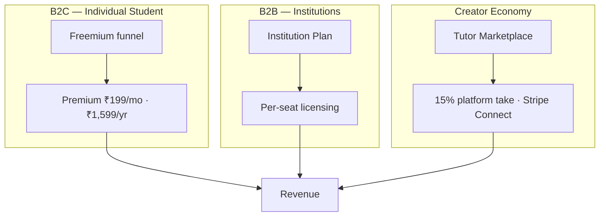
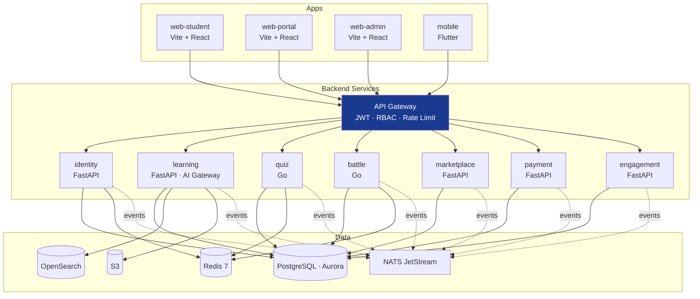

# Master Business Requirements Document
## Adaptive Learning Platform — Full Rebuild

| | |
|---|---|
| **Document** | Master BRD — Platform Rebuild |
| **Version** | 0.1 (DRAFT) |
| **Date** | 2026-05-27 |
| **Status** | Draft — Awaiting Stakeholder Review |
| **Standards** | BABOK v3 · ISO/IEC/IEEE 29148:2018 · ISO 25010 · PMBOK 7 · TOGAF 10 |
| **Classification** | CONFIDENTIAL — Internal Use Only |
| **Supersedes** | `docs/00_requirements/02_BRD_v2_Adaptive_Learning_Platform.docx` (v2.0) — preserved for historical reference |

---

## 1. Executive Summary

### 1.1 Business Problem

India's competitive examination market — NEET, JEE, UPSC, CBSE — serves **3M+ aspirants annually** but remains fragmented across offline coaching (no scale), generic e-learning (no personalisation), and static question banks (no adaptation). Students lack a single intelligent platform that:

- adapts to their **individual** strengths and weaknesses,
- measures their **readiness** continuously, and
- guides them to **the single best next action** every day.

### 1.2 Why a Rebuild

The current implementation accumulated structural debt across 33 spec documents, 6 design migrations (Aurora v1 → Aurora v2 → Vidya v3), 29 ADRs, and 11 → 7 services. Symptoms reported by the product owner:

- **Confusion** about what is in/out of scope per surface
- **Many items not working properly** (UI inconsistencies, broken flows)
- **Drift** between documentation and code

The rebuild's goal is **not** to change product vision — the vision and personas remain unchanged from BRD v2 — but to:

1. **Re-establish a single source of truth** per app and service.
2. **Cut surfaces to the actual repo state** (4 apps, target 5–6 services per ADR-0005).
3. **Sequence the build** so each deliverable is independently shippable and testable.

### 1.3 Vision Statement

> "To be the most intelligent and personalised exam-preparation platform in India — one that knows each student as an individual, adapts to their strengths and weaknesses in real time, and guides them confidently from their first practice question to exam day and beyond."

### 1.4 Strategic Objectives

| # | Objective | Business Outcome | KPI |
|---|-----------|------------------|-----|
| SO-01 | **Adaptive personalisation** | Dynamically adjust difficulty and topic per student | +15 readiness pts in 60 days (Phase 1) |
| SO-02 | **Exam-readiness measurement** | Continuously updated 0–100 readiness score per learner | 100% premium users get score by Day 14 |
| SO-03 | **Guided study journeys** | Eliminate decision fatigue — surface best next action | DAU returns daily 5+ days/week |
| SO-04 | **Content quality governance** | All content passes human moderation | 95% < 48 hr SLA |
| SO-05 | **Institutional scalability** | Schools/coaching centres as B2B customers | 10 institutions in Phase 1 |
| SO-06 | **Creator economy** | Tutors/experts earn through marketplace | 100 active tutors by month 12 |
| SO-07 | **Mobile-first reach** | Native Android + iOS via Flutter | 60%+ sessions from mobile |
| SO-08 | **Global readiness** | Architecture supports expansion from Phase 2 | i18n-ready by launch |

### 1.5 Key Performance Indicators

| KPI | Phase 1 Target (M0–M6) | Phase 2 Target (M6–M18) |
|-----|------------------------|--------------------------|
| Monthly Active Users (MAU) | 5,000 | 100,000 |
| Free → Premium Conversion | 8% | 15% |
| Avg Quiz Completion Rate | > 70% | > 85% |
| Institution Accounts | 10 | 100 |
| Active Marketplace Tutors | 25 | 250 |
| Content Moderation SLA (48 hr approval) | 95% | 99% within 24 hr |
| API Uptime | 99.9% | 99.95% |
| p95 Quiz Response Latency | < 300 ms | < 200 ms |

---

## 2. Business Context

### 2.1 Market Opportunity

- NEET aspirants: 2M+ annually
- JEE aspirants: 1.5M+ annually
- UPSC aspirants: 900K+ annually
- CBSE (Class 8–12): 30M+ annually
- Total Indian EdTech market: USD 10.4B by 2025

### 2.2 Competitive Positioning

| Competitor Type | Strength | Weakness | Our Differentiator |
|---|---|---|---|
| Offline coaching | Deep expertise, human mentoring | No scale, costly | Scale × intelligence × affordability |
| YouTube / generic e-learning | Free, wide reach | No structure, no assessment | Structured adaptive learning |
| Static question banks | Volume | No adaptation, no analytics | Adaptive engine + readiness score |
| Generic LMS | Institutional features | Not exam-specific | Built for competitive-exam patterns |

### 2.3 Delivery Roadmap

| Phase | Window | Scope Anchor |
|-------|--------|--------------|
| **Phase 1 — Foundation** | M0–M6 | Identity, web-student, mobile, learning (engine + content), quiz, payment, web-admin (moderator basics). Freemium live. |
| **Phase 2 — Depth** | M6–M12 | Marketplace (tutors), engagement (community, gamification), battle, full web-portal, full web-admin, institution onboarding |
| **Phase 3 — Intelligence** | M12–M18 | AI Gateway maturity (auto-authoring, vision, translation), advanced readiness model, parent portal |
| **Phase 4 — Scale** | M18–M36 | Global expansion (2 markets), 5+ languages, white-label licensing |

---

## 3. Stakeholders

### 3.1 Stakeholder Register

| Stakeholder | Type | Engagement | Primary Interest |
|---|---|---|---|
| **Student (Individual)** | Primary User | Consult + Inform | Exam readiness, personalised learning |
| **Student (Institution)** | Primary User | Consult + Inform | Assigned coursework + extra practice |
| **Expert / Teacher** | Primary User | Collaborate | Content contribution, reputation, marketplace earnings |
| **Moderator** | Internal Operator | Manage Closely | Content quality, platform safety |
| **Platform Admin** | Internal Operator | Manage Closely | Health, revenue, compliance |
| **Institution Admin** | B2B Customer | Manage Closely | Batch performance, ROI |
| **Business Owner / Exec Sponsor** | Executive | Manage Closely | Strategy, revenue, growth |
| **Engineering** | Delivery | Collaborate | Feasibility, clear specs |
| **Regulatory Bodies** | External | Monitor | Data privacy, ed-compliance |

### 3.2 RACI — Key Decisions

| Decision | Business Owner | Product | Engineering | Inst. Admin | Moderator |
|---|---|---|---|---|---|
| Platform vision & strategy | **A** | R | C | I | I |
| Feature prioritisation | C | **R/A** | C | I | I |
| Exam syllabus configuration | A | R | I | C | I |
| Content approval | I | I | I | I | **R/A** |
| Institution onboarding | A | R | I | C | I |
| Subscription pricing | A | R | I | I | I |
| Adaptive algorithm design | I | R | **A** | I | I |
| Data privacy / compliance | A | R | C | I | I |

### 3.3 User Personas

| Persona | Profile | Primary Goal | Key Pain Point Solved |
|---|---|---|---|
| **Aryan** — self-driven NEET aspirant | 18 yr, mobile-first | Get into medical college | "Is my study working? Am I ready?" |
| **Priya** — institution student | 17 yr, in coaching | Keep up with class + extra practice | "Coaching content isn't personalised to my gaps." |
| **Dr. Sharma** — expert/teacher | Physics PhD | Share knowledge, build reputation, earn | "No quality platform pays for my content." |
| **Rahul** — institution admin | Manages 500 students | Monitor batch performance | "I can't see where my batch is struggling." |
| **Maya** — moderator | Internal ops | Approve content within SLA | "Manual review queue is opaque." |
| **Ravi** — platform admin | Internal ops | Keep platform healthy | "No single dashboard for platform health." |

---

## 4. Architecture Overview (TOGAF-Aligned)

### 4.1 Business Architecture

### 4.2 Application Architecture (C4 L2 — Target State)

### 4.3 Surface → Service Matrix

Defines which app talks to which service (full integration matrix in [04_integration_matrix](../04_integration_matrix/)).

| App | identity | learning | quiz | battle | marketplace | payment | engagement |
|---|---|---|---|---|---|---|---|
| **web-student** | ✅ auth | ✅ content + adapt | ✅ practice/test/mock | ✅ play | ✅ browse/book | ✅ subscribe | ✅ notif/community |
| **web-portal** | ✅ auth | ✅ authoring | ❌ | ❌ | ✅ tutor profile/sessions | ✅ payouts | ✅ comm + msgs |
| **web-admin** | ✅ user mgmt | ✅ moderation | ✅ blueprint mgmt | ✅ ops | ✅ tutor approval | ✅ billing ops | ✅ broadcast |
| **mobile** | ✅ auth | ✅ content + adapt | ✅ practice/test | ✅ play | ✅ browse | ✅ subscribe | ✅ notif |

### 4.4 Technology Stack

| Layer | Tech | Rationale |
|---|---|---|
| Web | Vite + React 18 + TypeScript + Vidya design system v3 | Three SPA apps (per ADR-0003); fast HMR; not SSR (internal-tool + auth-gated) |
| Mobile | Flutter 3.x | Cross-platform per ADR-0002 |
| API services (BFF + business) | Python 3.12 + FastAPI + Pydantic v2 | Speed of dev, async, typed |
| Low-latency services | Go 1.22 (stdlib net/http) | Quiz + Battle hot paths |
| Primary DB | PostgreSQL 15 (Aurora) | ACID; 9 logical schemas, one per service domain |
| Cache + sessions | Redis 7 Cluster | Hot lookups, IRT state, leaderboards |
| Search | OpenSearch 2.x | Content search |
| Object store | S3 + CloudFront | Media, exports |
| Messaging | NATS JetStream | Inter-service events |
| AI Gateway | Anthropic / OpenAI / Google / Llama (provider-agnostic, per ADR-0019) | Authoring, eval, translation, vision |
| Orchestration | AWS EKS (ap-south-1) · Karpenter · ArgoCD | GitOps |
| IaC | Terraform + Terragrunt | |
| Observability | LGTM (Loki / Grafana / Tempo / Mimir) | |
| Payments | Stripe + Stripe Connect (Express) | Per ADR-0004, ADR-0007 |

---

## 5. Functional Scope

The full functional surface is decomposed into **11 doc packages** (4 apps + 7 services). Each app/service has its own BRD with deep-dive requirements. This section summarises the top-level scope.

### 5.1 Scope by App

#### 5.1.1 web-student (Vidya)

The primary B2C learner surface. Covers:
- Onboarding (signup, exam selection, screening assessment)
- Home / today's mission
- Study (subjects, topics, concepts, content)
- Practice (quick, focused, mock, PYQ drill, revision, syllabus coverage)
- Battles (real-time competitive)
- Marketplace (browse tutors, book sessions)
- Analytics (readiness score, weak areas, time spent)
- Notifications, settings, profile

Full BRD → [10_apps/web-student/01_brd.md](../../10_apps/web-student/01_brd.md)

#### 5.1.2 web-portal (Vidya Portal)

Expert/teacher/tutor surface. Covers:
- Expert onboarding + KYC (Stripe Identity per ADR-0006)
- Content authoring (questions, lessons)
- Quality dashboards (acceptance rate, kappa scores)
- Tutor profile + availability
- Live session management (real-time signalling via NATS + Daily.co per ADR-0009)
- Earnings + payouts

Full BRD → [10_apps/web-portal/01_brd.md](../../10_apps/web-portal/01_brd.md)

#### 5.1.3 web-admin (Vidya Admin)

Internal-ops surface. Covers:
- User management (search, suspend, impersonate-with-audit)
- Content moderation queue
- Exam/blueprint configuration
- Institution onboarding + management
- Marketplace tutor approval + KYC review
- Billing operations (refunds, disputes)
- Feature flag management (per ADR-0001)
- Platform health dashboards

Full BRD → [10_apps/web-admin/01_brd.md](../../10_apps/web-admin/01_brd.md)

#### 5.1.4 mobile (Vidya Mobile, Flutter)

Mobile-first B2C learner surface. Functional parity with web-student for top user journeys, plus:
- Offline practice (download content)
- Push notifications (FCM/APNS)
- Daily mission widget
- Camera-based question scan (Phase 3 — AI vision)

Full BRD → [10_apps/mobile/01_brd.md](../../10_apps/mobile/01_brd.md)

### 5.2 Scope by Service

#### 5.2.1 identity

Auth, accounts, sessions, RBAC, OTP, password reset, social login, JWT issuance, token refresh, device binding. Owns `auth_schema`.

#### 5.2.2 learning

The product's intelligence core. Houses:
- Content domain (subjects, topics, concepts, items, blueprints) — per ADR-0012
- Adaptive engine (9-dimension multi-parameter model) — per ADR-0017
- Question type handlers (22 types × 4 evaluation modes) — per ADR-0018
- AI Gateway (5 touchpoints: authoring, quality_check, evaluation, translation, vision) — per ADR-0019
- Spaced repetition (SM-2 + EWA) — per ADR-0014
- Error-pattern classification — per ADR-0016
- Rank prediction — per ADR-0015
- Recommendation algorithm — per ADR-0011
- Localisation

Owns `content_schema`, `adaptive_schema`. Largest service.

#### 5.2.3 quiz

Quiz/test orchestration in Go. Builds sessions from blueprints, scores responses, owns the resolution contract (per ADR-0018) — never marks, only `status × matched_count × total_count × per_part × evaluation_mode × evaluator_metadata`. Owns `quiz_schema`.

#### 5.2.4 battle

Real-time multiplayer battles in Go. WebSocket fanout, matchmaking, anti-cheat, ladder. Per ADR-0027. Owns `battle_schema`.

#### 5.2.5 marketplace

Tutor marketplace, creator economy, session bookings. Stripe Connect (Express, 15% take rate, weekly payout) per ADR-0007. Pricing bands per ADR-0008. Owns `marketplace_schema`.

#### 5.2.6 payment

Subscriptions, billing, invoices, refunds. Stripe checkout per ADR-0004. Owns `payment_schema`.

#### 5.2.7 engagement

Notifications (email/push/in-app), community (threads, comments), gamification (XP, streaks, badges), broadcasts. Owns `engagement_schema`.

> ⚠ **Service count exceeds ADR-0005 ceiling (6).** The rebuild must resolve this. Recommended path: fold `engagement` into `learning` (notifications) and `marketplace` (community + reviews). See [00_platform/07_roadmap_wbs](../07_roadmap_wbs/).

---

## 6. Non-Functional Requirements (Summary)

Full NFR catalogue → [00_platform/05_nfr/nfr.md](../05_nfr/nfr.md)

| Category | Requirement | Target |
|---|---|---|
| **Performance** | p95 quiz response | < 300 ms (Phase 1) |
| | p95 page load (student) | < 2.5 s |
| | p99 battle action latency | < 150 ms |
| **Scalability** | Concurrent users (Phase 1) | 10,000 |
| | Concurrent users (Phase 5) | 1,000,000 |
| **Availability** | API uptime | 99.9% (Phase 1) → 99.95% (Phase 2) |
| **Security** | Auth | OAuth2 + JWT + refresh rotation; bcrypt cost 12 |
| | Encryption | TLS 1.3 in transit; AES-256 at rest; field-level for PII |
| | Compliance | DPDPA (India) · GDPR (Phase 2) · PCI-DSS (Stripe-tokenised) |
| **Usability** | WCAG | 2.1 AA |
| | Localisation | English + Hindi at launch; 5+ languages by Phase 3 |
| **Reliability** | RPO / RTO | 15 min / 1 hr |
| **Observability** | Tracing | OpenTelemetry across all services |
| **Cost** | Unit economics | < ₹40 infra cost / MAU |

---

## 7. Constraints & Assumptions

### 7.1 Constraints

- **C-01** Service ceiling = 6 (ADR-0005). New domains land as modules.
- **C-02** Three web apps (ADR-0003). No 4th SPA without ADR.
- **C-03** Flutter for mobile (ADR-0002). No native iOS/Android until Phase 4+.
- **C-04** Stripe for checkout + Connect (ADR-0004, 0007). No alternatives in Phase 1.
- **C-05** All content human-moderated before student exposure (ADR pending — was implicit in BRD v2).
- **C-06** Resolution contract from quiz never returns marks (ADR-0018).
- **C-07** AI Gateway is provider-agnostic; per-criterion Cohen's kappa auto-pause at < 0.7 (ADR-0019).
- **C-08** Vidya design system v3 (ADR-0034) is mandatory across all 4 apps.

### 7.2 Assumptions

- **A-01** Team size 12 (3 BE / 2 FE / 2 Mobile / 1 DevOps / 1 ML / 1 QA Lead / 1 Designer / 1 Tech Lead) — same as BRD v2 baseline.
- **A-02** AWS access procured (ap-south-1).
- **A-03** Stripe India onboarding completed before Phase 1 launch.
- **A-04** Initial content seed (1,000 NEET / 1,000 JEE / 500 UPSC questions) provided by content team before launch.

### 7.3 Dependencies (External)

| ID | Dependency | Owner | Required By |
|----|------------|-------|-------------|
| D-01 | Stripe India merchant approval | Finance | Phase 1 Week 8 |
| D-02 | AI provider contracts (Anthropic, OpenAI) | Eng leadership | Phase 1 Week 4 |
| D-03 | Twilio (OTP) | DevOps | Phase 1 Week 2 |
| D-04 | FCM + APNS (push) | Mobile | Phase 1 Week 6 |
| D-05 | Daily.co (tutor video) | Marketplace squad | Phase 2 Week 2 |
| D-06 | OpenAPI 3.1 published per service | Each service squad | Per sprint |

---

## 8. Risk Register (Top 10)

| ID | Risk | Likelihood | Impact | Mitigation | Owner |
|----|------|-----------|--------|------------|-------|
| R-01 | Content seed unavailable at launch | Med | High | Pre-launch content sprint M-2; AI-assisted authoring fallback | Content + Eng |
| R-02 | Adaptive engine under-performs vs heuristic baseline | Med | High | Maintain heuristic shadow scoring; A/B per cohort | ML |
| R-03 | Marketplace fraud (fake tutors) | Med | High | Stripe Identity KYC + manual review + rating threshold | Marketplace squad |
| R-04 | Stripe approval delayed | Low | High | Razorpay fallback prototyped (kept in spike doc) | Finance |
| R-05 | Mobile review (App Store) rejection | Med | Med | Pre-submission privacy review; staged rollout | Mobile |
| R-06 | Service-count breach (7 vs 6) becomes structural | High | Med | Resolve in rebuild Phase 1; fold engagement | Architecture |
| R-07 | Design system drift (Aurora ↔ Vidya artefacts) | High | Med | Single design tokens package; lint enforcement | Design + FE |
| R-08 | LLM cost overruns | Med | Med | AI Gateway hard caps; per-tenant quotas; provider failover | Eng leadership |
| R-09 | Data residency for global expansion | Low | High | Architecture supports multi-region; defer GDPR Phase 2 | Architecture + Legal |
| R-10 | Founder/PO bandwidth (clarity drift) | High | High | This rebuild doc pack; weekly architecture review | Tech Lead |

Full risk register → [30_appendices/risk_register.md](../../30_appendices/risk_register.md) (TODO)

---

## 9. Traceability

Every functional requirement in this BRD is decomposed into:
1. **App/Service BRD** — per surface
2. **Requirements catalogue** — FR/NFR IDs
3. **User stories** — Epic → Feature → Story
4. **WBS** — Work packages with estimates

Master traceability matrix → [30_appendices/traceability_matrix.md](../../30_appendices/traceability_matrix.md) (TODO)

---

## 10. Approval

| Role | Name | Signature | Date |
|------|------|-----------|------|
| Business Owner / Sponsor | _Pending_ | | |
| Product Owner | _Pending_ | | |
| Tech Lead | _Pending_ | | |
| Design Lead | _Pending_ | | |
| QA Lead | _Pending_ | | |
