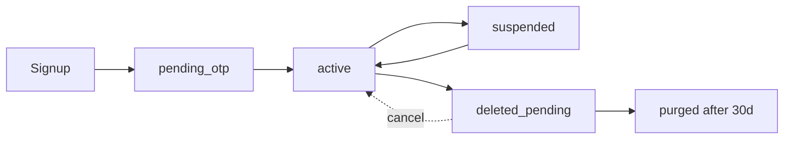
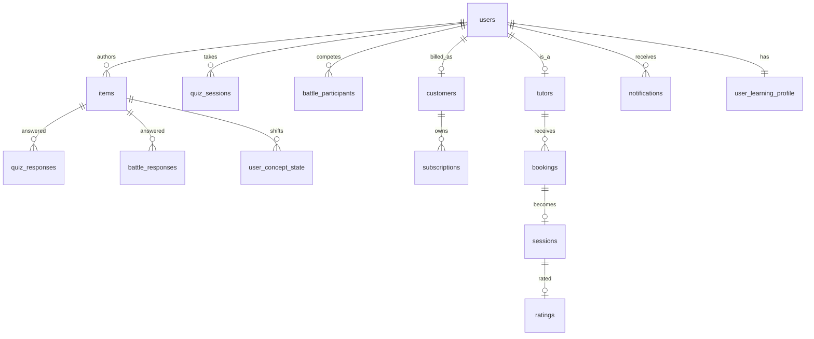

# Platform Data Model Overview

**Status:** DRAFT v0.1 · 2026-05-27
**Anchored to:** Each service's `06_data_model.md`

This file is the **cross-service view** — schemas, ownership, no cross-schema FK. For detailed per-service tables, follow the links.

---

## 1. Schema Map

| Schema | Owner | Purpose |
|---|---|---|
| `auth_schema` | identity | Users, credentials, sessions, RBAC, audit ([detail](../../20_services/identity/06_data_model.md)) |
| `content_schema` | learning | Subjects, topics, concepts, items, blueprints, moderation ([detail](../../20_services/learning/06_data_model.md)) |
| `adaptive_schema` | learning | User mastery state, screening, SM-2, error patterns, recommendations, AI Gateway ([detail](../../20_services/learning/06_data_model.md)) |
| `quiz_schema` | quiz | Sessions, responses, results, idempotency keys ([detail](../../20_services/quiz/06_data_model.md)) |
| `battle_schema` | battle | Matches, ratings, replays, anomalies ([detail](../../20_services/battle/06_data_model.md)) |
| `marketplace_schema` | marketplace | Tutors, KYC, availability, bookings, sessions, reviews, earnings, disputes ([detail](../../20_services/marketplace/06_data_model.md)) |
| `payment_schema` | payment | Customers, subscriptions, invoices, charges, refunds, disputes, webhook events ([detail](../../20_services/payment/06_data_model.md)) |
| `engagement_schema` | engagement | Notifications, prefs, community, gamification, broadcasts ([detail](../../20_services/engagement/06_data_model.md)) |

**Total:** 8 schemas across 7 services (learning owns 2 schemas — content + adaptive).

## 2. Cross-Service References

**Rule:** No cross-schema FK. Cross-service references are by user_id (or other natural id) and validated by APIs at the boundary.

| From | Field | References (logically) | Validation |
|---|---|---|---|
| `content_schema.items.author_id` | uuid | `auth_schema.users.id` | API-layer check; soft validation |
| `adaptive_schema.user_concept_state.user_id` | uuid | `auth_schema.users.id` | API-layer + DPDPA purge job |
| `quiz_schema.quiz_sessions.user_id` | uuid | `auth_schema.users.id` | API-layer |
| `battle_schema.battle_participants.user_id` | uuid | `auth_schema.users.id` | API-layer |
| `marketplace_schema.tutors.user_id` | uuid | `auth_schema.users.id` | API-layer |
| `marketplace_schema.bookings.student_user_id`, `tutor_user_id` | uuid | `auth_schema.users.id` | API-layer |
| `payment_schema.customers.user_id` | uuid | `auth_schema.users.id` | API-layer |
| `engagement_schema.notifications.user_id` | uuid | `auth_schema.users.id` | API-layer |
| `content_schema.items.concept_ids[]` | uuid[] | `content_schema.concepts.id` | Same schema FK (allowed) |
| `quiz_schema.quiz_session_items.item_id` | uuid | `content_schema.items.id` | API-layer |
| `marketplace_schema.earnings.session_id` | uuid | `marketplace_schema.sessions.id` | Same schema FK |

## 3. Identity (User ID) Lifecycle

When a user is **purged** (DPDPA):
1. identity publishes `user.purged` event.
2. Each consumer service marks rows as purged or anonymises:
   - learning: anonymise mastery state; preserve aggregate analytics
   - quiz: anonymise sessions; preserve aggregates
   - marketplace: preserve financial records (legal); anonymise PII
   - payment: preserve financial records (7 yr legal); anonymise PII
   - engagement: delete prefs + community contributions (or anonymise per policy)
3. Audit-log retention overrides delete (legal hold).

## 4. Aurora Postgres Topology

| Cluster | Schemas | Notes |
|---|---|---|
| `alp-aurora-primary` | all 8 | Multi-AZ; writer + 2 readers Phase 1 |
| Replicas | per-service read traffic if needed | Phase 2 |
| Backups | Aurora continuous + manual snapshots | Daily |
| Encryption | AES-256 at rest; TLS in transit | KMS-managed |
| PITR | 35 days | |

**Why one cluster:** simpler ops; budget-friendly Phase 1. Per-service clusters only if hot-spotting demands it (revisit Phase 2).

**Schema-level isolation:** each service connects with its own DB role bound to its schema; `REVOKE` on others. Prevents cross-schema queries even if app code tries.

## 5. Redis Topology

| Cluster | Used by | Purpose |
|---|---|---|
| `alp-redis-cluster` | identity, quiz, battle, learning, marketplace | OTP, rate-limit, sessions, hot state, embeddings cache |
| Persistence | RDB snapshots + AOF | |
| Failover | Sentinel; multi-AZ | |

## 6. NATS JetStream

| Stream | Subjects | Retention |
|---|---|---|
| `IDENTITY_EVENTS` | `user.*` | 7 days |
| `LEARNING_EVENTS` | `learning.*` | 7 days |
| `QUIZ_EVENTS` | `quiz.*` | 30 days (analytics replay) |
| `BATTLE_EVENTS` | `battle.*` | 7 days |
| `MARKETPLACE_EVENTS` | `marketplace.*` | 30 days |
| `PAYMENT_EVENTS` | `payment.*` | 30 days (financial replay) |
| `DLQ` | `*.dlq` | indefinite |

## 7. S3 + CloudFront

| Bucket | Used by | Content |
|---|---|---|
| `alp-content-media` | learning | Item images/videos + concept media |
| `alp-tutor-photos` | marketplace | Tutor profile photos |
| `alp-data-exports` | identity, learning | User data exports (DPDPA) |
| `alp-dispute-evidence` | marketplace | Dispute evidence uploads |
| `alp-immutable-audit` | identity | Audit log immutable copy (object-lock) |

CloudFront fronts `alp-content-media` for global edge cache.

## 8. OpenSearch

| Index | Used by | Content |
|---|---|---|
| `alp-catalog` | learning | Subjects/topics/concepts/items full-text |
| `alp-tutors` | marketplace | Tutor profiles with filters |
| `alp-community` | engagement | Threads + comments (Phase 2) |

## 9. Data Boundaries & Privacy

| Class | Where stored | At-rest | In transit |
|---|---|---|---|
| **Email, phone** | `auth_schema.users` | Aurora at-rest AES-256 (KMS); field-level encryption Phase 2 | TLS 1.3 |
| **Password** | `auth_schema.credentials.password_hash` | bcrypt cost 12; never logged | — |
| **Refresh token** | `auth_schema.refresh_tokens.token_hash` | SHA-256 only | TLS 1.3 |
| **OTP** | `auth_schema.otps.code_hash` + Redis | SHA-256 only | TLS 1.3 |
| **Payment card** | NEVER our DB | Stripe-tokenised | TLS to Stripe |
| **Tutor bank** | NEVER our DB | Stripe Connect | TLS to Stripe |
| **KYC docs** | Stripe Identity (we don't store) | their infra | TLS |
| **Quiz responses** | `quiz_schema.quiz_responses` | Aurora at-rest | TLS |
| **Audit events** | `auth_schema.audit_events` + immutable S3 nightly copy | hash-chained | TLS |
| **Embeddings** | `adaptive_schema.item_embeddings` (pgvector) | Aurora at-rest | TLS |

## 10. ERD Overview (Cross-Service)

Note: this ERD spans schemas — drawn here for understanding, **not** an FK structure in the database.

---

## 11. Migrations & Schema Evolution

| Rule | Enforced by |
|---|---|
| Append-only migrations | code review |
| Always include downgrade | code review |
| Add column nullable → backfill → set NOT NULL (3-step) | pattern |
| No destructive DROP without ADR | code review |
| Schema changes published with API version bump if user-facing | per service contract |

## 12. Backup & DR

| Asset | RPO | RTO | Strategy |
|---|---|---|---|
| Aurora | 15 min | 1 hr | Continuous + manual snapshots; multi-AZ |
| Redis | 1 hr (caches mostly) | minutes (rebuild) | RDB + AOF; replicas |
| S3 | versioning ON | n/a | Cross-region replication for `alp-immutable-audit` |
| OpenSearch | nightly | 2 hr | Snapshot to S3 |
| NATS JetStream | retention as above | minutes | Replicated streams |

Phase 2: warm DR region in `ap-south-1` second AZ trio.
