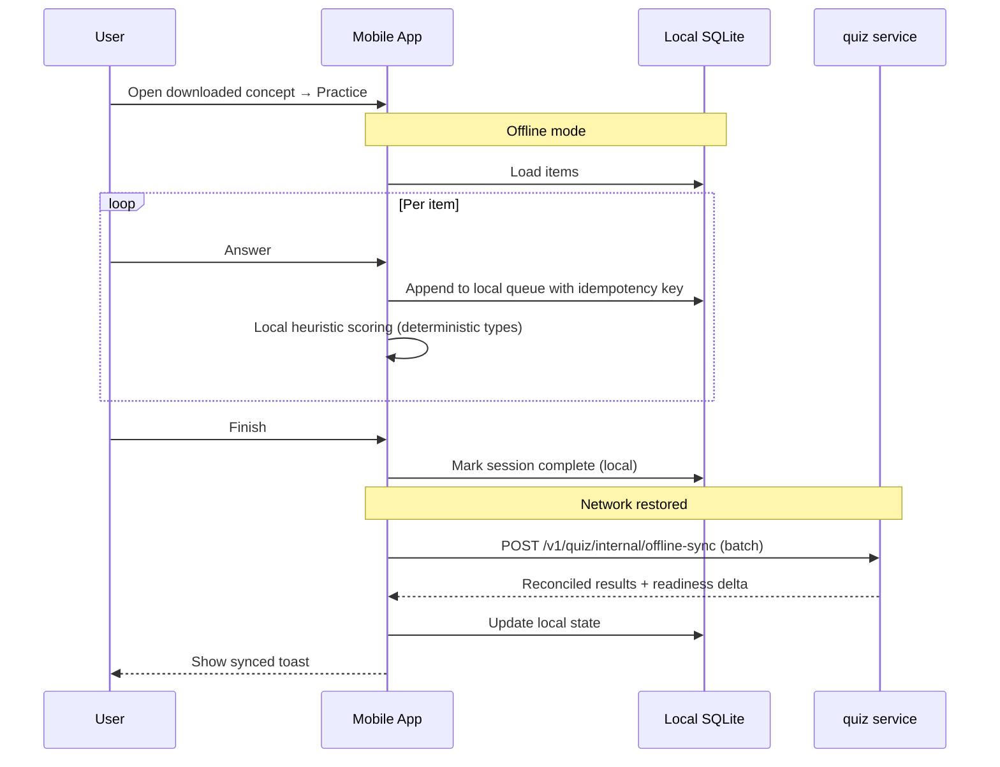
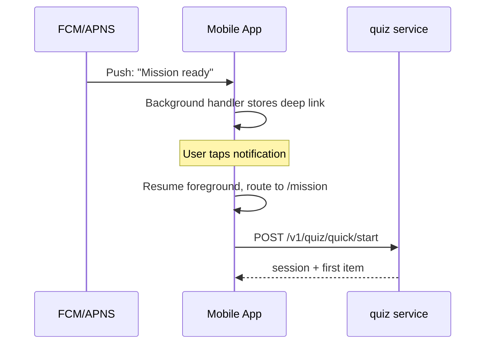

# User Stories — mobile (Vidya Mobile, Flutter)

**Anchored to:** [Requirements](./02_requirements.md) · [BRD](./01_brd.md)

**ID convention:** `E-MB-NN` Epic · `F-MB-NN.MM` Feature · `S-MB-NN.MM.KK` Story · `AC-NN` Acceptance Criterion

**Estimate scale:** Fibonacci SP (1/2/3/5/8/13)

---

## Epic Map

| Epic | Title | Stories | SP | Phase | P |
|------|-------|---------|----|-------|---|
| E-MB-01 | Auth & Account (incl Biometric) | 14 | 78 | 1 | P0 |
| E-MB-02 | Onboarding | 7 | 30 | 1 | P0 |
| E-MB-03 | Home & Today's Mission | 8 | 28 | 1 | P0 |
| E-MB-04 | Study & **Offline Content** | 9 | 45 | 1 | P0 |
| E-MB-05 | Practice (Online + **Offline + Sync**) | 14 | 92 | 1 | P0 |
| E-MB-06 | Battle | 7 | 41 | 2 | P1 |
| E-MB-07 | Marketplace | 6 | 38 | 2 | P1 |
| E-MB-08 | Analytics | 8 | 32 | 1–2 | P0/P1 |
| E-MB-09 | Push & In-App Notif | 8 | 36 | 1 | P0 |
| E-MB-10 | Community & Gamification | 6 | 28 | 1–2 | P1 |
| E-MB-11 | Payments | 8 | 40 | 1 | P0 |
| E-MB-12 | Settings & Storage Mgmt | 11 | 33 | 1 | P0 |
| E-MB-13 | Camera Scan | 5 | 25 | 3 | P2 |
| E-MB-14 | Lifecycle & Resilience | 6 | 30 | 1 | P0 |
| E-MB-15 | Crash & Telemetry | 4 | 12 | 1 | P0 |
| E-MB-XC | Cross-Cutting | 14 | 40 | 1 | P0 |
| **TOTAL** | | **125** | **628** | | |

---

## E-MB-01 — Auth & Account

### S-MB-01.01 — Sign up with email + password

**Priority:** P0 · **Estimate:** 5 SP · **Maps to:** FR-MB-01-01

**Acceptance Criteria**
1. Signup screen with Email, Password, Confirm, ToS.
2. Real-time validation: email format, password rules (≥10 chars, upper/digit/symbol).
3. Submit → `POST /v1/identity/signup`; on success → OTP screen.
4. Duplicate email → inline error with "Sign in" link.
5. 5xx → toast + idempotent retry button.
6. Spinner during request; double-submit prevented.
7. Form survives screen rotation + brief background (≤ 30 s).
8. Keyboard avoidance — input stays visible above keyboard.

**Negative:** invalid email · weak password · ToS unchecked · 429 from server · network off.

**API:** `POST /v1/identity/signup` (idempotency-key from `Uuid.v4()`).

**QA:** Patrol E2E on both platforms; airplane-mode mid-submit recovers.

**DoD:** unit + widget tests ≥ 80%; i18n strings extracted; Sentry events fire; tested on Pixel 4a + iPhone SE.

### S-MB-01.07 — Biometric unlock (Face ID / Touch ID / Android biometric)

**Priority:** P0 · **Estimate:** 8 SP · **Maps to:** FR-MB-01-07

**As** a returning user **I want** to unlock the app with biometrics **so that** I don't enter my password every time.

**Acceptance Criteria**
1. After first successful login, prompt: "Enable Face ID/Touch ID for faster sign-in?"
2. If accepted → bind refresh token (encrypted via Keystore/Keychain).
3. On next launch → biometric prompt; success → silent token refresh → home.
4. Biometric failure 3× → fallback to password.
5. Settings has toggle to disable biometric.
6. iOS: prompt uses LocalAuthentication framework; Android: BiometricPrompt API.
7. Biometric data never leaves device.
8. Device lock change (PIN reset etc.) invalidates biometric binding — user re-binds.
9. Backgrounded > 5 min → re-prompt biometric.

**Negative:** biometric not enrolled · cancelled · hardware unavailable.

**API:** `POST /v1/identity/biometric/bind { device_id, biometric_proof_hash }`.

**QA:** real-device matrix (Face ID, Touch ID, Pixel fingerprint, Pixel face); simulator mocks.

**DoD:** Keystore/Keychain isolation verified; refresh token never plaintext; pen-test green.

### S-MB-01.13 — Login rate-limit + offline-aware UI

**Priority:** P0 · **Estimate:** 5 SP

(Full structure per template.)

(Stories S-MB-01.02..06, 08–12, 14: covered in table form similar to web-student E-WS-01; each maps to identical FR-MB-01-XX requirements.)

---

## E-MB-02 — Onboarding

| ID | Story | P | SP | Maps to FR |
|---|---|---|---|---|
| S-MB-02.01 | Select exam | P0 | 5 | FR-MB-02-01 |
| S-MB-02.02 | Baseline screening | P0 | 8 | FR-MB-02-02 |
| S-MB-02.03 | Resume onboarding next launch | P0 | 5 | FR-MB-02-03 |
| S-MB-02.04 | Skip screening | P1 | 3 | FR-MB-02-04 |
| S-MB-02.05 | Profile completion meter | P1 | 3 | FR-MB-02-05 |
| S-MB-02.06 | First-run permission prompts (in-context) | P0 | 3 | FR-MB-02-06 |
| S-MB-02.07 | Change exam later | P0 | 3 | FR-MB-02-07 |

**Detailed — S-MB-02.06: In-context permissions**

**As** Aryan **I want** to grant notification + storage permissions only when relevant **so that** I'm not bombarded with system dialogs at first launch.

**Acceptance Criteria**
1. Notification permission asked AFTER first practice completion ("Want a reminder tomorrow to keep your streak?").
2. Storage / photo permission asked when user taps "Download for offline" the first time.
3. Camera permission asked when user opens Camera-Scan (Phase 3).
4. If denied, soft-explain how to re-enable from Settings; no blocking.
5. iOS: NSUserNotificationsUsageDescription string clear + localized.
6. Android 13+: POST_NOTIFICATIONS runtime permission handled.
7. State persisted: if asked + denied, do not re-prompt for 30 days.

---

## E-MB-03 — Home & Today's Mission

| ID | Story | P | SP |
|---|---|---|---|
| S-MB-03.01 | Today's Mission card | P0 | 5 |
| S-MB-03.02 | Readiness summary card | P0 | 5 |
| S-MB-03.03 | Continue last quiz | P0 | 3 |
| S-MB-03.04 | Streak widget | P1 | 3 |
| S-MB-03.05 | Weak-areas list | P0 | 5 |
| S-MB-03.06 | Mock reminder banner | P1 | 2 |
| S-MB-03.07 | Pull-to-refresh | P0 | 3 |
| S-MB-03.08 | Skeleton state | P0 | 2 |

---

## E-MB-04 — Study & Offline Content

| ID | Story | P | SP |
|---|---|---|---|
| S-MB-04.01 | Subject/Topic/Concept browse | P0 | 5 |
| S-MB-04.02 | Concept view | P0 | 3 |
| S-MB-04.03 | Content viewer | P0 | 8 |
| S-MB-04.04 | Bookmark | P1 | 3 |
| S-MB-04.05 | Private note | P1 | 5 |
| S-MB-04.06 | **Download for offline** | P0 | 8 |
| S-MB-04.07 | Manage downloads | P0 | 5 |
| S-MB-04.08 | Auto-evict oldest | P1 | 3 |
| S-MB-04.09 | Offline-ready badge on concept tiles | P0 | 3 |

**Detailed — S-MB-04.06: Download for offline**

**As** Aryan **I want** to download a concept (content + practice items) for offline use **so that** I can study on the metro without data.

**Acceptance Criteria**
1. "Download" button on concept screen shows estimated size.
2. Tap → progress bar; resumable on network drop; queueable (3 max concurrent).
3. Stores: concept HTML/markdown + media (LRU-cached) + N practice items (default 30) in SQLite.
4. Storage cap enforced (default 200 MB); LRU eviction when cap reached.
5. Settings → Downloads shows: total used, per-concept breakdown, "Remove" action.
6. Download metadata: `{concept_id, downloaded_at, size_bytes, item_count}`.
7. Encrypted at rest where required (PII none, but use AES-encrypted store for parity with web).
8. WiFi-only toggle (default ON).
9. Failed downloads: retry exponential backoff; user notified.
10. Offline-ready concepts visually marked with a downloaded-cloud icon in any list.

**API:** `GET /v1/learning/concepts/{id}/offline-bundle` returns signed manifest + media URLs. CDN for media.

**Data:** local SQLite tables `downloaded_concepts`, `downloaded_items`, `download_queue`.

**QA:** Patrol — toggle airplane mode mid-download → resumes on reconnect; storage-cap test.

**DoD:** size telemetry; cache hit rate dashboard; offline-mode E2E green.

---

## E-MB-05 — Practice (Online + Offline + Sync) — CRITICAL EPIC

| ID | Story | P | SP |
|---|---|---|---|
| S-MB-05.01 | Quick Practice (online) | P0 | 8 |
| S-MB-05.02 | Focused Practice (online) | P0 | 8 |
| S-MB-05.03 | Mock Test (timed) | P0 | 13 |
| S-MB-05.04 | PYQ Drill | P0 | 5 |
| S-MB-05.05 | Revision (spaced-rep) | P1 | 8 |
| S-MB-05.06 | **Offline practice on downloaded concepts** | P0 | 13 |
| S-MB-05.07 | **Buffered answers survive app kill** | P0 | 8 |
| S-MB-05.08 | **Reconnect → sync (idempotent)** | P0 | 8 |
| S-MB-05.09 | **Background safe → foreground resume** | P0 | 5 |
| S-MB-05.10 | 22 question-type renderers | P0 | 13 |
| S-MB-05.11 | Flag/report question | P1 | 3 |
| S-MB-05.12 | Detailed results | P0 | 5 |
| S-MB-05.13 | Mock section/topic breakdown | P0 | 5 |
| S-MB-05.14 | Rank prediction | P2 | 5 |

**Detailed — S-MB-05.06: Offline practice**

**As** Aryan **I want** to practice items from downloaded concepts when offline **so that** I can use commute time without data.

**Acceptance Criteria**
1. "Practice" CTA on downloaded concept opens local quiz.
2. Items served from local SQLite; engine local-only (no server calls).
3. Item rendering identical to online.
4. Answers stored locally with timestamp + idempotency key.
5. Local heuristic scoring per ADR-0018 (deterministic types only; AI-assisted types skipped offline).
6. On reconnect, queued answers flushed in order via `POST /v1/quiz/internal/offline-sync` (idempotent).
7. Server returns reconciled state + readiness delta.
8. Conflict policy: server wins (OQ-MB-02 documented).
9. UI shows "Practising offline — will sync when you're back online."

**API:** `POST /v1/quiz/internal/offline-sync { session_batch: [...] }`.

**QA:** real-device airplane mode end-to-end.

---

## E-MB-06 — Battle (Phase 2)

| ID | Story | P | SP |
|---|---|---|---|
| S-MB-06.01 | Matchmaking + cancel | P1 | 5 |
| S-MB-06.02 | WS connection mgmt | P1 | 8 |
| S-MB-06.03 | Question fanout render | P1 | 5 |
| S-MB-06.04 | Disconnect grace + forfeit | P1 | 5 |
| S-MB-06.05 | Post-battle screen | P1 | 5 |
| S-MB-06.06 | Leaderboard | P2 | 5 |
| S-MB-06.07 | Background → forfeit | P0 | 8 |

---

## E-MB-07 — Marketplace (Phase 2)

| ID | Story | P | SP |
|---|---|---|---|
| S-MB-07.01 | Tutor browse | P1 | 8 |
| S-MB-07.02 | Tutor profile | P1 | 5 |
| S-MB-07.03 | Book session | P1 | 8 |
| S-MB-07.04 | Booking confirmation | P1 | 3 |
| S-MB-07.05 | Daily.co embedded session | P1 | 8 |
| S-MB-07.06 | Post-session rating | P1 | 5 |

---

## E-MB-08 — Analytics

| ID | Story | P | SP |
|---|---|---|---|
| S-MB-08.01 | Readiness panel | P0 | 5 |
| S-MB-08.02 | Live update post-quiz | P0 | 3 |
| S-MB-08.03 | Weak-area drill | P0 | 5 |
| S-MB-08.04 | Time-spent chart | P1 | 3 |
| S-MB-08.05 | Accuracy trends | P0 | 3 |
| S-MB-08.06 | Error-pattern view | P1 | 5 |
| S-MB-08.07 | Rank prediction | P2 | 5 |
| S-MB-08.08 | Cohort percentile | P2 | 5 |

---

## E-MB-09 — Push & In-App Notifications

| ID | Story | P | SP |
|---|---|---|---|
| S-MB-09.01 | FCM Android setup | P0 | 5 |
| S-MB-09.02 | APNS iOS setup | P0 | 5 |
| S-MB-09.03 | Token registration with server | P0 | 3 |
| S-MB-09.04 | Push consent UX | P0 | 5 |
| S-MB-09.05 | Deep link from push | P0 | 5 |
| S-MB-09.06 | In-app notif centre | P0 | 5 |
| S-MB-09.07 | Notif preferences | P1 | 5 |
| S-MB-09.08 | Suppress during quiz | P0 | 3 |

---

## E-MB-10 — Community & Gamification

| ID | Story | P | SP |
|---|---|---|---|
| S-MB-10.01 | Browse threads | P1 | 5 |
| S-MB-10.02 | Post + comment | P1 | 8 |
| S-MB-10.03 | Report comment | P1 | 3 |
| S-MB-10.04 | XP system | P1 | 3 |
| S-MB-10.05 | Streak + shield | P1 | 5 |
| S-MB-10.06 | Badge unlocks | P1 | 4 |

---

## E-MB-11 — Payments

| ID | Story | P | SP |
|---|---|---|---|
| S-MB-11.01 | Subscribe via Stripe WebView | P0 | 8 |
| S-MB-11.02 | Receipt verification on return | P0 | 5 |
| S-MB-11.03 | Entitlement flip (< 60 s) | P0 | 5 |
| S-MB-11.04 | Cancel subscription | P0 | 3 |
| S-MB-11.05 | Invoice list | P1 | 3 |
| S-MB-11.06 | Failed-charge banner | P0 | 5 |
| S-MB-11.07 | Paywall component | P0 | 5 |
| S-MB-11.08 | iOS StoreKit flow (OQ-MB-01) | P2 | 6 |

---

## E-MB-12 — Settings & Storage

| ID | Story | P | SP |
|---|---|---|---|
| S-MB-12.01 | Edit profile | P0 | 3 |
| S-MB-12.02 | Change exam | P0 | 3 |
| S-MB-12.03 | Language toggle | P0 | 2 |
| S-MB-12.04 | Notif prefs | P1 | 3 |
| S-MB-12.05 | Biometric toggle | P0 | 3 |
| S-MB-12.06 | Device list | P1 | 3 |
| S-MB-12.07 | Downloads management | P0 | 5 |
| S-MB-12.08 | Storage cap setting | P1 | 3 |
| S-MB-12.09 | Download my data | P1 | 3 |
| S-MB-12.10 | Delete account | P0 | 2 |
| S-MB-12.11 | Diagnostics info | P0 | 3 |

---

## E-MB-13 — Camera Scan (Phase 3)

| ID | Story | P | SP |
|---|---|---|---|
| S-MB-13.01 | Capture image | P2 | 5 |
| S-MB-13.02 | Crop + enhance | P2 | 5 |
| S-MB-13.03 | Upload + AI Gateway vision | P2 | 8 |
| S-MB-13.04 | Display extracted Q + answer + explain | P2 | 5 |
| S-MB-13.05 | Save scan to history | P2 | 2 |

---

## E-MB-14 — Lifecycle & Resilience

| ID | Story | P | SP |
|---|---|---|---|
| S-MB-14.01 | Background-during-quiz preserves state | P0 | 8 |
| S-MB-14.02 | Low-memory handler | P0 | 5 |
| S-MB-14.03 | Network handoff transparent | P0 | 5 |
| S-MB-14.04 | Airplane mode banner + queue | P0 | 5 |
| S-MB-14.05 | Force-update gate | P0 | 5 |
| S-MB-14.06 | Root/jailbreak detection | P1 | 2 |

---

## E-MB-15 — Crash & Telemetry

| ID | Story | P | SP |
|---|---|---|---|
| S-MB-15.01 | Sentry/Crashlytics integration | P0 | 3 |
| S-MB-15.02 | Performance traces | P0 | 3 |
| S-MB-15.03 | Custom events | P0 | 3 |
| S-MB-15.04 | Analytics opt-out | P1 | 3 |

---

## E-MB-XC — Cross-Cutting

| ID | Story | P | SP |
|---|---|---|---|
| S-MB-XC.01 | Design tokens enforcement (lint rule) | P0 | 3 |
| S-MB-XC.02 | Material 3 + Cupertino bridge | P0 | 3 |
| S-MB-XC.03 | Auth-guarded router | P0 | 3 |
| S-MB-XC.04 | Global error boundary | P0 | 3 |
| S-MB-XC.05 | Toast/Snackbar system | P0 | 2 |
| S-MB-XC.06 | Empty-state library | P0 | 2 |
| S-MB-XC.07 | Pagination utility | P0 | 3 |
| S-MB-XC.08 | Lazy image + thumbnails | P0 | 3 |
| S-MB-XC.09 | i18n (en + hi) | P0 | 5 |
| S-MB-XC.10 | Touch-target lint | P0 | 2 |
| S-MB-XC.11 | Dark mode | P1 | 5 |
| S-MB-XC.12 | Haptic feedback | P1 | 2 |
| S-MB-XC.13 | Deep link router | P0 | 5 |
| S-MB-XC.14 | Feature flag client | P0 | 3 |

---

## Flow Diagrams

### Offline practice → sync on reconnect

### Push notification → quiz deep link

