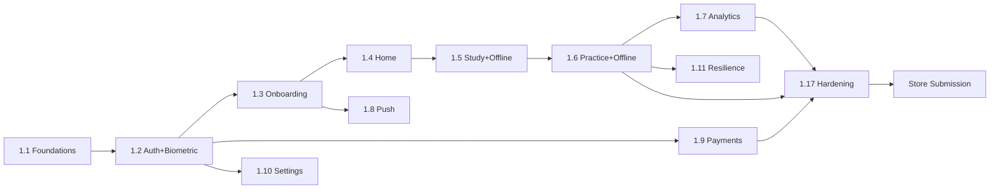

# Work Breakdown Structure — mobile (Vidya Mobile, Flutter)

**Anchored to:** [Stories](./03_user_stories.md) · [Requirements](./02_requirements.md) · [BRD](./01_brd.md)

**Estimation basis:** Two-pizza team (2 Mobile + 0.5 design + 0.25 QA). Velocity: **20 SP / 2-wk sprint** (Flutter shared codebase but iOS/Android dual verification adds overhead).

**Phase 1 effort:** ~430 SP. Phase 2 effort: ~150 SP. Phase 3: ~25 SP. **Total ~628 SP.**

With Phase 1 = ~430 SP → **22 sprints (~10 months)** for the two-pizza team. Slightly longer than web-student because of platform-dual verification + offline complexity. To compress to 6 months for parity launch, add 1 mobile engineer (3 total) → ~15 sprints.

---

## WBS Hierarchy

```
1.0 mobile (Phase 1 + 2 + 3)
├── 1.1 Foundations & Platform Setup
├── 1.2 Auth & Account (incl Biometric)
├── 1.3 Onboarding
├── 1.4 Home & Today's Mission
├── 1.5 Study & Offline Content
├── 1.6 Practice (Online + Offline + Sync) — CRITICAL
├── 1.7 Analytics
├── 1.8 Push & Notifications
├── 1.9 Payments
├── 1.10 Settings & Storage Mgmt
├── 1.11 Lifecycle & Resilience
├── 1.12 Crash & Telemetry
├── 1.13 Battle (Phase 2)
├── 1.14 Marketplace (Phase 2)
├── 1.15 Community & Gamification (Phase 1.5–2)
├── 1.16 Camera Scan (Phase 3)
└── 1.17 Hardening & Store Submission
```

---

## 1.1 Foundations & Platform Setup (S0–S2)

| WP ID | Activity | SP | Depends | Acceptance |
|------|----------|----|---------|------------|
| WP-MB-1.1.1 | Flutter project + `alp_design_tokens` package wired | 3 | Vidya v3 Dart pkg | `flutter run` shows token-themed sample |
| WP-MB-1.1.2 | Riverpod 2 + go_router setup | 3 | 1.1.1 | Sample route + provider |
| WP-MB-1.1.3 | API client (openapi-generator Dart) + dio interceptors | 5 | OpenAPI from BE | 401 triggers refresh |
| WP-MB-1.1.4 | Auth-guarded router with deep-link table | 3 | 1.1.2, 1.1.3 | Deep link to /quiz works after login |
| WP-MB-1.1.5 | Secure storage (flutter_secure_storage) wired | 3 | — | Token persists across kill |
| WP-MB-1.1.6 | Local SQLite (drift) bootstrap | 3 | — | Sample CRUD |
| WP-MB-1.1.7 | Material 3 + Cupertino bridge widgets | 5 | 1.1.1 | Switcher shows native feel both platforms |
| WP-MB-1.1.8 | Toast/Snackbar/Empty primitives | 5 | 1.1.1 | Storybook screen |
| WP-MB-1.1.9 | i18n framework + en/hi seed | 5 | — | Lang toggle live |
| WP-MB-1.1.10 | Forms + validation (reactive_forms or local Zod-equiv) | 3 | — | Sample signup |
| WP-MB-1.1.11 | CI: Flutter + iOS + Android matrix builds | 8 | Apple/Google certs | Both binaries built in CI |
| WP-MB-1.1.12 | Fastlane pipelines | 8 | 1.1.11 + provisioning | Signed builds to TestFlight + Internal Track |
| WP-MB-1.1.13 | Sentry + Firebase Performance | 5 | — | Errors land in dashboard |
| WP-MB-1.1.14 | Feature flag client SDK | 3 | ADR-0001 platform | Sample flag toggles UI |
| WP-MB-1.1.15 | Patrol E2E scaffolding | 3 | 1.1.11 | 1 baseline test runs |
| **Sub-total** | | **65** | | |

**Milestone M-MB-1.1:** Foundations + CI green — Week 4.

---

## 1.2 Auth & Account (S2–S5)

| WP | Story | SP | Dep |
|----|-------|----|----|
| WP-MB-1.2.1 | Signup email — S-MB-01.01 | 5 | 1.1, identity API |
| WP-MB-1.2.2 | OTP verify | 3 | 1.2.1 |
| WP-MB-1.2.3 | Sign-in email | 5 | 1.2.1 |
| WP-MB-1.2.4 | Sign-in phone OTP | 5 | identity |
| WP-MB-1.2.5 | Sign-in Google (native SDK) | 5 | identity OAuth |
| WP-MB-1.2.6 | Sign-in Apple (iOS) | 5 | identity OAuth |
| WP-MB-1.2.7 | Forgot/reset password | 5 | 1.2.1 |
| WP-MB-1.2.8 | **Biometric bind + unlock** | 8 | 1.1.5 + Keystore/Keychain |
| WP-MB-1.2.9 | Silent refresh + lifecycle | 5 | 1.1.3 |
| WP-MB-1.2.10 | Sign out + token revoke | 2 | identity |
| WP-MB-1.2.11 | Device list + revoke | 5 | identity |
| WP-MB-1.2.12 | Delete account | 5 | identity |
| WP-MB-1.2.13 | Rate-limit UX + retry | 5 | identity |
| WP-MB-1.2.14 | Cert pinning on auth | 3 | dio_certificate_pinning |
| **Sub-total** | | **66** | (MFA deferred Phase 2) |

**Milestone M-MB-1.2:** Auth + biometric in TestFlight + Internal Track — Week 10.

---

## 1.3 Onboarding (S5–S6)

| WP | Story | SP |
|----|-------|----|
| WP-MB-1.3.1 | Exam selection | 5 |
| WP-MB-1.3.2 | Baseline screening | 8 |
| WP-MB-1.3.3 | Resume onboarding | 5 |
| WP-MB-1.3.4 | Skip screening | 3 |
| WP-MB-1.3.5 | Profile completion meter | 3 |
| WP-MB-1.3.6 | In-context permissions | 3 |
| WP-MB-1.3.7 | Change exam later | 3 |
| **Sub-total** | | **30** |

---

## 1.4 Home & Today's Mission (S6–S7)

| WP | Story | SP |
|----|-------|----|
| WP-MB-1.4.1 | Today's Mission card | 5 |
| WP-MB-1.4.2 | Readiness summary | 5 |
| WP-MB-1.4.3 | Continue last quiz | 3 |
| WP-MB-1.4.4 | Streak widget | 3 |
| WP-MB-1.4.5 | Weak-areas list | 5 |
| WP-MB-1.4.6 | Mock reminder | 2 |
| WP-MB-1.4.7 | Pull-to-refresh | 3 |
| WP-MB-1.4.8 | Skeleton state | 2 |
| **Sub-total** | | **28** |

---

## 1.5 Study & Offline Content (S7–S9)

| WP | Story | SP |
|----|-------|----|
| WP-MB-1.5.1 | Subject/Topic/Concept browse | 5 |
| WP-MB-1.5.2 | Concept view | 3 |
| WP-MB-1.5.3 | Content viewer | 8 |
| WP-MB-1.5.4 | Bookmark | 3 |
| WP-MB-1.5.5 | Note | 5 |
| WP-MB-1.5.6 | **Download for offline** | 8 |
| WP-MB-1.5.7 | Manage downloads | 5 |
| WP-MB-1.5.8 | LRU eviction | 3 |
| WP-MB-1.5.9 | Offline-ready badge | 3 |
| **Sub-total** | | **43** |

---

## 1.6 Practice — CRITICAL (S9–S14)

| WP | Story | SP |
|----|-------|----|
| WP-MB-1.6.1 | Quick Practice (online) | 8 |
| WP-MB-1.6.2 | Focused Practice | 8 |
| WP-MB-1.6.3 | Mock Test (timed) | 13 |
| WP-MB-1.6.4 | PYQ Drill | 5 |
| WP-MB-1.6.5 | Revision (spaced-rep) | 8 |
| WP-MB-1.6.6 | **Offline practice** | 13 |
| WP-MB-1.6.7 | **Buffered answer queue** | 8 |
| WP-MB-1.6.8 | **Sync on reconnect** | 8 |
| WP-MB-1.6.9 | **Background-safe + foreground resume** | 5 |
| WP-MB-1.6.10 | 22 type renderers | 13 |
| WP-MB-1.6.11 | Flag question | 3 |
| WP-MB-1.6.12 | Detailed results | 5 |
| WP-MB-1.6.13 | Mock breakdown | 5 |
| **Sub-total** | | **102** |

**Milestone M-MB-1.6:** Online + offline practice loop — Week 20.

---

## 1.7 Analytics (S14–S15)

| WP | Story | SP |
|----|-------|----|
| WP-MB-1.7.1..1.7.8 | All E-MB-08 stories | 32 |
| **Sub-total** | | **32** |

---

## 1.8 Push & Notifications (S6–S7 in parallel with 1.4)

| WP | Story | SP |
|----|-------|----|
| WP-MB-1.8.1 | FCM Android | 5 |
| WP-MB-1.8.2 | APNS iOS | 5 |
| WP-MB-1.8.3 | Token reg with server | 3 |
| WP-MB-1.8.4 | Consent UX | 5 |
| WP-MB-1.8.5 | Deep link from push | 5 |
| WP-MB-1.8.6 | In-app notif centre | 5 |
| WP-MB-1.8.7 | Prefs | 5 |
| WP-MB-1.8.8 | Suppress in quiz | 3 |
| **Sub-total** | | **36** |

---

## 1.9 Payments (S15–S16)

| WP | Story | SP |
|----|-------|----|
| WP-MB-1.9.1 | Stripe WebView flow | 8 |
| WP-MB-1.9.2 | Receipt verification | 5 |
| WP-MB-1.9.3 | Entitlement flip | 5 |
| WP-MB-1.9.4 | Cancel sub | 3 |
| WP-MB-1.9.5 | Invoices | 3 |
| WP-MB-1.9.6 | Failed-charge banner | 5 |
| WP-MB-1.9.7 | Paywall component | 5 |
| WP-MB-1.9.8 | StoreKit (deferred) | 6 (Phase 2) |
| **Sub-total Phase 1** | | **34** |

---

## 1.10 Settings & Storage (S16–S17)

| WP | Story | SP |
|----|-------|----|
| WP-MB-1.10.1..1.10.11 | All E-MB-12 stories | 33 |
| **Sub-total** | | **33** |

---

## 1.11 Lifecycle & Resilience (continuous, focus S17)

| WP | Story | SP |
|----|-------|----|
| WP-MB-1.11.1 | Background during quiz | 8 |
| WP-MB-1.11.2 | Low memory | 5 |
| WP-MB-1.11.3 | Network handoff | 5 |
| WP-MB-1.11.4 | Airplane banner + queue | 5 |
| WP-MB-1.11.5 | Force-update gate | 5 |
| WP-MB-1.11.6 | Root/jailbreak detection | 2 |
| **Sub-total** | | **30** |

---

## 1.12 Crash & Telemetry (S1 + ongoing)

**Sub-total = 12 SP** (E-MB-15 stories).

---

## 1.13 Battle (Phase 2)

**Sub-total = 41 SP.**

---

## 1.14 Marketplace (Phase 2)

**Sub-total = 38 SP.**

---

## 1.15 Community & Gamification

**Sub-total = 28 SP** (Phase 1.5 — XP/streak/badges; Phase 2 — community).

---

## 1.16 Camera Scan (Phase 3)

**Sub-total = 25 SP.**

---

## 1.17 Hardening & Store Submission (S18–S19)

| WP | Activity | SP |
|----|----------|----|
| WP-MB-1.17.1 | Cross-device matrix (5 Android, 4 iOS) | 8 |
| WP-MB-1.17.2 | Crash-free 99.5% verification (1-week soak) | 5 |
| WP-MB-1.17.3 | Apple App Review prep + submission | 5 |
| WP-MB-1.17.4 | Google Play Console + Internal → Closed → Open | 5 |
| WP-MB-1.17.5 | Privacy nutrition labels + data-safety form | 5 |
| WP-MB-1.17.6 | Bundle-size + cold-start tuning | 5 |
| WP-MB-1.17.7 | Pen-test mobile-specific (cert pin, biometric, secure storage) | 5 |
| WP-MB-1.17.8 | Pre-launch checklist sign-offs | 3 |
| **Sub-total** | | **41** |

---

## Timeline (Gantt-Lite)

```
Sprint   1   2   3   4   5   6   7   8   9  10  11  12  13  14  15  16  17  18  19  20-25
Phase    1   1   1   1   1   1   1   1   1   1   1   1   1   1   1   1   1   1   1   2
1.1 Found ▓▓ ▓▓
1.2 Auth         ▓▓ ▓▓ ▓▓ ▓▓
1.3 Onboard                    ▓▓ ▓▓
1.4 Home                              ▓▓
1.8 Push                              ▓▓ ▓▓
1.5 Study                                  ▓▓ ▓▓
1.6 Pract                                          ▓▓ ▓▓ ▓▓ ▓▓ ▓▓ ▓▓
1.7 Anal                                                                      ▓▓
1.9 Pay                                                                          ▓▓ ▓▓
1.10 Set                                                                              ▓▓
1.11 Resil [continuous]
1.12 Tel  [continuous]
1.17 Harden                                                                              ▓▓ ▓▓
1.13 Bat                                                                                              ▓▓
1.14 Mkt                                                                                                  ▓▓
1.15 Comm/Gam                                                                                                ▓▓
1.16 Cam                                                                                                       (Ph3)
```

---

## Dependency DAG



---

## Capacity & Risk

| Item | Value | Note |
|---|---|---|
| Team | 2 Mobile + 0.5 design + 0.25 QA | Per Master BRD §7 |
| Velocity | 20 SP / sprint | -2 SP vs web due to dual-platform verification |
| Phase 1 SP | 430 | Excluding Battle, Marketplace, Community (Phase 2) |
| Phase 1 sprints | ~22 sprints (~10 months) | Tight for 6-month launch |
| Recommendation | Add 1 mobile engineer to compress to 15 sprints | |
| Buffer | 20% | Real-device debugging, store-review delays |
| Top risks | Store rejection · Offline sync edge cases · OS upgrades | See [BRD §10](./01_brd.md#10-risks-top-5) |

---

## Definition of Done (Surface)

Mobile is **launchable for Phase 1** when:

- ✅ All P0 stories shipped with `integration_test` + Patrol coverage
- ✅ All NFR-MB-* verified
- ✅ Crash-free rate ≥ 99.5% (1-week soak in TestFlight + Internal Track)
- ✅ Cold-start P50 < 2.0 s on Pixel 4a
- ✅ APK ≤ 30 MB · IPA ≤ 40 MB
- ✅ Apple App Review pass on first submission
- ✅ Google Play 10%→50%→100% staged rollout completed
- ✅ Feature flags wired for every Phase 2 feature
- ✅ Privacy nutrition labels + DPDPA compliance attested
- ✅ Real-device offline-mode chaos test passes
