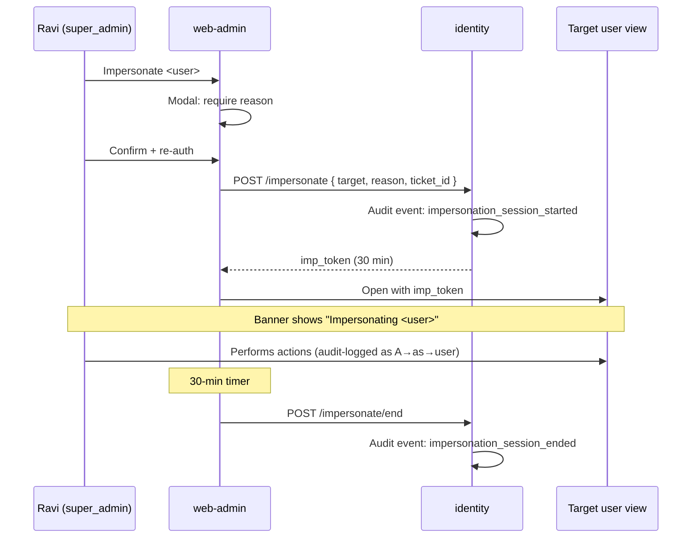

# User Stories — web-admin (Vidya Admin)

**Anchored to:** [Requirements](./02_requirements.md) · [BRD](./01_brd.md)

---

## Epic Map

| Epic | Title | Stories | SP | Phase | P |
|------|-------|---------|----|-------|---|
| E-WA-01 | Admin Auth (SSO + MFA) | 6 | 28 | 1 | P0 |
| E-WA-02 | User Mgmt | 12 | 48 | 1–2 | P0/P1 |
| E-WA-03 | Content Moderation | 13 | 65 | 1 | P0 |
| E-WA-04 | Exam & Blueprint Config | 7 | 30 | 1 | P0 |
| E-WA-05 | Institution Mgmt | 7 | 30 | 2 | P1 |
| E-WA-06 | Marketplace Ops | 8 | 30 | 2 | P1 |
| E-WA-07 | Billing Ops | 9 | 32 | 1 | P0 |
| E-WA-08 | Feature Flags | 7 | 24 | 1 | P0 |
| E-WA-09 | Platform Health | 6 | 18 | 1 | P0 |
| E-WA-10 | Broadcast | 6 | 22 | 2 | P1 |
| E-WA-11 | Audit Log | 6 | 22 | 1 | P0 |
| E-WA-12 | AI Gateway Control | 7 | 28 | 1 | P0 |
| E-WA-13 | Settings | 3 | 9 | 1 | P0 |
| E-WA-XC | Cross-Cutting | 12 | 30 | 1 | P0 |
| **TOTAL** | | **109** | **416** | | |

Phase 1 ≈ 260 SP · Phase 2 ≈ 140 SP.

---

## E-WA-01 — Admin Auth (SSO + MFA)

### S-WA-01.01 — SSO login

**P:** P0 · **SP:** 8 · **Maps to:** FR-WA-01-01

**As** Ravi **I want** to sign in via my organisation's SSO **so that** I don't manage a separate password.

**AC**
1. Login page has single "Sign in with SSO" button.
2. Redirects to SSO IdP (OQ-WA-01).
3. On IdP success → returns to admin app → fetches profile + role from identity service.
4. First-time login → forced MFA enrollment.
5. Role-based home (super_admin / admin / moderator / institution_admin → different dashboards).
6. SAML or OIDC supported per IdP choice.
7. No fallback email/password login allowed.

**API:** `GET /v1/identity/sso/redirect`, `POST /v1/identity/sso/callback`.

**DoD:** SSO E2E with sandbox IdP; manual confirm with prod IdP; audit log shows login event.

### S-WA-01.02 — Hardware MFA enrollment

**P:** P0 · **SP:** 8 · **Maps to:** FR-WA-01-02

(TOTP or FIDO2/WebAuthn; replaces a backup code option.)

| ID | Story | P | SP |
|---|---|---|---|
| S-WA-01.03 | Session timeouts (idle + absolute) | P0 | 3 |
| S-WA-01.04 | IP allowlist enforcement | P1 | 5 |
| S-WA-01.05 | Sign out | P0 | 2 |
| S-WA-01.06 | Re-auth for sensitive actions | P0 | 3 |

---

## E-WA-02 — User Management

| ID | Story | P | SP |
|---|---|---|---|
| S-WA-02.01 | Search users | P0 | 5 |
| S-WA-02.02 | View profile (read-only) | P0 | 3 |
| S-WA-02.03 | Suspend user (reason + duration) | P0 | 5 |
| S-WA-02.04 | Unsuspend | P0 | 2 |
| S-WA-02.05 | Force password reset | P0 | 3 |
| S-WA-02.06 | View sessions/devices | P0 | 3 |
| S-WA-02.07 | Revoke session/device | P0 | 3 |
| S-WA-02.08 | Initiate account deletion | P0 | 5 |
| S-WA-02.09 | **Impersonate (read/write per OQ-WA-04)** | P1 | 13 |
| S-WA-02.10 | View subscription state | P0 | 3 |
| S-WA-02.11 | Copy reset link | P0 | 2 |
| S-WA-02.12 | VIP flag | P2 | 3 |

**Detailed — S-WA-02.09: Impersonate**

**As** Ravi **I want** to view the app as a specific user **so that** I can debug their problem.

**AC**
1. Action: "Impersonate" available only to super_admin role.
2. Modal: require reason (≥ 30 chars), reference ticket ID optional.
3. On confirm → opens new tab/window with target user's view; persistent banner "Impersonating <user>".
4. Session limited to 30 min; banner shows countdown.
5. Read-only vs full per OQ-WA-04; full mode requires re-auth.
6. All actions in impersonated session audit-logged as "Ravi → as → <user>".
7. End impersonation explicitly via banner button.
8. Auto-expiry → impersonated session ends; admin redirected to user view.
9. User is notified by email "Admin Ravi viewed your account at <time> for ticket #XYZ" (consent disclosure).

**API:** `POST /v1/identity/impersonate { target_user_id, reason }` → returns impersonation_token.

**Data:** `audit_events` rows tagged `impersonation_session_id`.

**Negative:** non-super_admin denied · target user has stricter privacy flag → denied · simultaneous impersonate sessions allowed?

---

## E-WA-03 — Content Moderation (Phase 1's largest epic)

| ID | Story | P | SP |
|---|---|---|---|
| S-WA-03.01 | Moderation queue with filters | P0 | 8 |
| S-WA-03.02 | Take next item (round-robin lock) | P0 | 5 |
| S-WA-03.03 | Approve item | P0 | 5 |
| S-WA-03.04 | Reject with reason | P0 | 5 |
| S-WA-03.05 | Request revision with feedback | P0 | 5 |
| S-WA-03.06 | Auto-save review state | P0 | 5 |
| S-WA-03.07 | View author history | P0 | 3 |
| S-WA-03.08 | Kappa drift dashboard | P1 | 5 |
| S-WA-03.09 | AI Gateway auto-pause alert + override | P0 | 5 |
| S-WA-03.10 | Re-assign item | P1 | 3 |
| S-WA-03.11 | Bulk-approve trusted authors | P2 | 5 |
| S-WA-03.12 | SLA timer per item | P0 | 5 |
| S-WA-03.13 | Queue burst-capacity dashboard | P1 | 6 |

**Detailed — S-WA-03.02: Take next item**

**As** Maya **I want** to receive the next pending item from the queue **so that** I don't pick what others are working on.

**AC**
1. "Start reviewing" button.
2. Server uses optimistic lock with TTL 20 min.
3. Item locked to my user_id; others see "in review by Maya".
4. Page refresh / browser crash → lock held 20 min then released.
5. Lock release event when I submit decision.
6. Per-type queue (MCQ / numeric / etc.) selectable.
7. If queue empty → "Caught up!" state.

**API:** `POST /v1/learning/moderation/next-item { type_filter, lock_ttl_sec }`.

**Data:** `learning_schema.moderation_locks (item_id, moderator_id, locked_at, expires_at)`.

---

## E-WA-04 — Exam & Blueprint Config

| ID | Story | P | SP |
|---|---|---|---|
| S-WA-04.01 | Create exam | P0 | 5 |
| S-WA-04.02 | Edit exam metadata | P0 | 3 |
| S-WA-04.03 | Manage syllabus tree | P0 | 8 |
| S-WA-04.04 | Create blueprint | P0 | 5 |
| S-WA-04.05 | PYQ ingestion | P0 | 5 |
| S-WA-04.06 | Syllabus versioning | P1 | 3 |
| S-WA-04.07 | Preview as student | P1 | 2 |

---

## E-WA-05 — Institution Management (Phase 2)

| ID | Story | P | SP |
|---|---|---|---|
| S-WA-05.01 | Create institution | P1 | 5 |
| S-WA-05.02 | Seat license CRUD | P1 | 5 |
| S-WA-05.03 | Assign institution admin | P1 | 3 |
| S-WA-05.04 | Batch/cohort CRUD | P1 | 5 |
| S-WA-05.05 | Batch dashboard | P1 | 5 |
| S-WA-05.06 | CSV seat invite | P1 | 5 |
| S-WA-05.07 | Institution reporting | P2 | 2 |

---

## E-WA-06 — Marketplace Ops

| ID | Story | P | SP |
|---|---|---|---|
| S-WA-06.01 | Tutor application queue | P1 | 5 |
| S-WA-06.02 | Approve/reject tutor | P1 | 3 |
| S-WA-06.03 | KYC status review | P1 | 3 |
| S-WA-06.04 | Disputes queue | P1 | 3 |
| S-WA-06.05 | Resolve dispute | P1 | 5 |
| S-WA-06.06 | Ban tutor | P1 | 3 |
| S-WA-06.07 | Pricing bands config | P1 | 5 |
| S-WA-06.08 | Payout failure dashboard | P1 | 3 |

---

## E-WA-07 — Billing Ops

| ID | Story | P | SP |
|---|---|---|---|
| S-WA-07.01 | Search subscriptions | P0 | 5 |
| S-WA-07.02 | Subscription detail | P0 | 3 |
| S-WA-07.03 | Issue refund | P0 | 5 |
| S-WA-07.04 | Cancel subscription | P0 | 3 |
| S-WA-07.05 | Disputes | P0 | 3 |
| S-WA-07.06 | MRR/ARR | P0 | 3 |
| S-WA-07.07 | Retention dashboard | P1 | 3 |
| S-WA-07.08 | Failed-charge dashboard | P0 | 3 |
| S-WA-07.09 | Coupons | P2 | 4 |

---

## E-WA-08 — Feature Flags

| ID | Story | P | SP |
|---|---|---|---|
| S-WA-08.01 | List flags | P0 | 3 |
| S-WA-08.02 | Toggle on/off | P0 | 3 |
| S-WA-08.03 | Set rollout % | P0 | 3 |
| S-WA-08.04 | Target tenant/cohort | P0 | 5 |
| S-WA-08.05 | Change history | P0 | 3 |
| S-WA-08.06 | Two-step confirm prod | P0 | 3 |
| S-WA-08.07 | Auto-rollback (Phase 2) | P1 | 4 |

---

## E-WA-09 — Platform Health

| ID | Story | P | SP |
|---|---|---|---|
| S-WA-09.01 | SLO dashboard panel | P0 | 5 |
| S-WA-09.02 | Error rate dashboard | P0 | 3 |
| S-WA-09.03 | Latency dashboard | P0 | 3 |
| S-WA-09.04 | Cost per MAU | P1 | 3 |
| S-WA-09.05 | Alert feed | P0 | 2 |
| S-WA-09.06 | Status indicator | P0 | 2 |

---

## E-WA-10 — Broadcast

| ID | Story | P | SP |
|---|---|---|---|
| S-WA-10.01 | Compose | P1 | 5 |
| S-WA-10.02 | Target audience | P1 | 5 |
| S-WA-10.03 | Schedule | P1 | 3 |
| S-WA-10.04 | Preview | P1 | 3 |
| S-WA-10.05 | Send/cancel | P1 | 3 |
| S-WA-10.06 | History + metrics | P1 | 3 |

---

## E-WA-11 — Audit Log

| ID | Story | P | SP |
|---|---|---|---|
| S-WA-11.01 | Search by actor/action/target | P0 | 5 |
| S-WA-11.02 | Filter by time | P0 | 3 |
| S-WA-11.03 | Export CSV/JSON | P1 | 3 |
| S-WA-11.04 | Retention enforcement | P0 | 5 |
| S-WA-11.05 | Tamper-evident chain | P0 | 5 |
| S-WA-11.06 | Self-view | P1 | 1 |

---

## E-WA-12 — AI Gateway Control

| ID | Story | P | SP |
|---|---|---|---|
| S-WA-12.01 | Status per touchpoint × provider | P0 | 5 |
| S-WA-12.02 | Override auto-pause | P0 | 3 |
| S-WA-12.03 | Switch provider | P0 | 5 |
| S-WA-12.04 | Cost cap | P0 | 3 |
| S-WA-12.05 | Kappa threshold | P0 | 3 |
| S-WA-12.06 | Volume + cost trend | P1 | 5 |
| S-WA-12.07 | Drift alerts | P0 | 4 |

---

## E-WA-13 — Settings

| ID | Story | P | SP |
|---|---|---|---|
| S-WA-13.01 | Profile | P0 | 3 |
| S-WA-13.02 | MFA mgmt | P0 | 3 |
| S-WA-13.03 | Language (P3) | P3 | 3 |

---

## E-WA-XC — Cross-Cutting

12 stories, 30 SP — mirrors E-WS-XC patterns with admin-specifics (impersonation banner, two-step confirm primitive).

---

## Flow Diagrams

### Impersonate with audit

