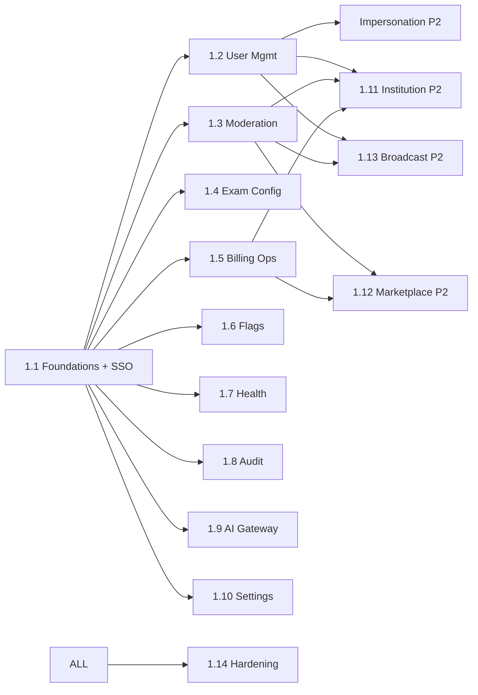

# Work Breakdown Structure — web-admin (Vidya Admin)

**Anchored to:** [Stories](./03_user_stories.md) · [BRD](./01_brd.md)

**Estimation basis:** 1 FE + 0.25 design + 0.25 QA (internal tool, smaller team). Velocity: **16 SP / 2-wk sprint**.

**Phase 1:** ~260 SP → ~16 sprints (~8 months). Phase 2: ~140 SP → ~9 sprints.

---

## WBS Hierarchy

```
1.0 web-admin
├── 1.1 Foundations & SSO Auth
├── 1.2 User Management
├── 1.3 Content Moderation (largest)
├── 1.4 Exam & Blueprint Config
├── 1.5 Billing Ops
├── 1.6 Feature Flags
├── 1.7 Platform Health
├── 1.8 Audit Log
├── 1.9 AI Gateway Control
├── 1.10 Settings
├── 1.11 Institution Mgmt (Phase 2)
├── 1.12 Marketplace Ops (Phase 2)
├── 1.13 Broadcast (Phase 2)
└── 1.14 Hardening
```

---

## 1.1 Foundations & SSO Auth (S0–S2) · 50 SP

| WP | Activity | SP |
|----|----------|----|
| WP-WA-1.1.1 | Vite + React + Vidya v3 | 3 |
| WP-WA-1.1.2 | RBAC-aware routing | 5 |
| WP-WA-1.1.3 | API client | 5 |
| WP-WA-1.1.4 | **SSO flow (OQ-WA-01)** | 8 |
| WP-WA-1.1.5 | Hardware MFA enrollment | 8 |
| WP-WA-1.1.6 | Session timeouts (idle + abs) | 3 |
| WP-WA-1.1.7 | IP allowlist UI | 5 |
| WP-WA-1.1.8 | Re-auth modal for sensitive actions | 3 |
| WP-WA-1.1.9 | Two-step confirm primitive | 3 |
| WP-WA-1.1.10 | Audit event emitter (client) | 3 |
| WP-WA-1.1.11 | Sentry + OTel | 3 |
| WP-WA-1.1.12 | Lighthouse + a11y + bundle gates | 2 |

## 1.2 User Mgmt (S2–S5) · 48 SP

Per E-WA-02 stories.

## 1.3 Content Moderation (S5–S10) · 65 SP — CRITICAL

Per E-WA-03 stories. Largest Phase 1 chunk.

## 1.4 Exam & Blueprint Config (S10–S11) · 30 SP

Per E-WA-04.

## 1.5 Billing Ops (S11–S12) · 32 SP

Per E-WA-07.

## 1.6 Feature Flags (S12) · 24 SP

Per E-WA-08.

## 1.7 Platform Health (S13) · 18 SP

Per E-WA-09.

## 1.8 Audit Log (S13) · 22 SP

Per E-WA-11.

## 1.9 AI Gateway Control (S14) · 28 SP

Per E-WA-12.

## 1.10 Settings (S14) · 9 SP

Per E-WA-13.

**Phase 1 milestone — end of S15:** Admin can SSO + MFA login, manage users, run moderation queue, configure exams/blueprints, issue refunds, manage flags, see health, view audit, control AI Gateway. **~260 SP, 16 sprints.**

---

## Phase 2

| WP | Section | SP |
|----|---------|----|
| 1.11 | Institution Mgmt | 30 |
| 1.12 | Marketplace Ops | 30 |
| 1.13 | Broadcast | 22 |
| 1.2 cont | Impersonation (deferred) | 13 |
| 1.3 cont | Kappa drift dashboard, queue burst | 11 |
| 1.6 cont | Auto-rollback flag | 4 |
| 1.7 cont | Cost-per-MAU dashboard | 3 |
| 1.9 cont | Volume/cost trends | 5 |

---

## 1.14 Hardening (S25) · 25 SP

| WP | Activity | SP |
|----|----------|----|
| WP-WA-1.14.1 | Pen-test (CRITICAL for admin) | 8 |
| WP-WA-1.14.2 | Audit log integrity verification | 5 |
| WP-WA-1.14.3 | Impersonation flow security review | 5 |
| WP-WA-1.14.4 | SSO failure-mode testing | 3 |
| WP-WA-1.14.5 | Compliance attestation | 2 |
| WP-WA-1.14.6 | Sign-offs | 2 |

---

## Timeline

```
Sprint  1   2   3   4   5   6   7   8   9  10  11  12  13  14  15  16  17  18  19  20  21  22  23  24  25
Phase   1   1   1   1   1   1   1   1   1   1   1   1   1   1   1   1   2   2   2   2   2   2   2   2   -
1.1 Auth ▓▓ ▓▓
1.2 Users      ▓▓ ▓▓ ▓▓
1.3 Mod                    ▓▓ ▓▓ ▓▓ ▓▓ ▓▓
1.4 Exam                                     ▓▓
1.5 Bill                                        ▓▓
1.6 Flags                                         ▓▓
1.7 Health                                           ▓▓
1.8 Audit                                            ▓▓
1.9 AI                                                  ▓▓
1.10 Set                                                ▓▓
                                                          |--- Phase 1 end ---|
1.11 Inst                                                    ▓▓ ▓▓
1.12 Mkt                                                          ▓▓ ▓▓
1.13 Brd                                                                ▓▓
1.14 Hard                                                                              ▓▓
```

---

## Dependency DAG



---

## Capacity & Risk

| Item | Value | Note |
|---|---|---|
| Team | 1 FE + 0.25 design + 0.25 QA | Internal tool — leaner |
| Velocity | 16 SP / sprint | |
| Phase 1 SP | 260 | |
| Phase 1 duration | ~16 sprints (~8 months) | |
| Phase 2 SP | 140 | |
| Phase 2 duration | ~9 sprints | |
| Buffer | 25% | Security review + impersonation legal-rev |
| Top risks | Compromised admin (R-WA-01) · Mod queue backlog (R-WA-02) · Flag mis-toggle (R-WA-03) | See [BRD §10](./01_brd.md#10-risks) |

---

## Definition of Done

Web-admin Phase 1 is **Done** when:

- ✅ All P0 stories shipped + tests
- ✅ NFRs verified (esp NFR-WA-08..15 audit + RBAC)
- ✅ Mod queue handles 200 items/day < 24 hr SLA
- ✅ SSO + MFA working end-to-end with prod IdP
- ✅ Audit log tamper-evident + retention enforced
- ✅ Pen-test passed (CRITICAL)
- ✅ Feature flag UI used to gate every Phase 2 capability
- ✅ Refund flow tested end-to-end with Stripe sandbox
