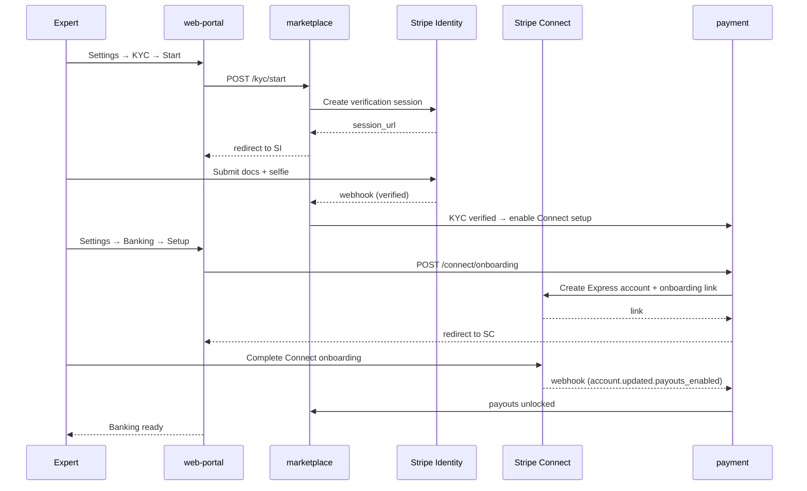
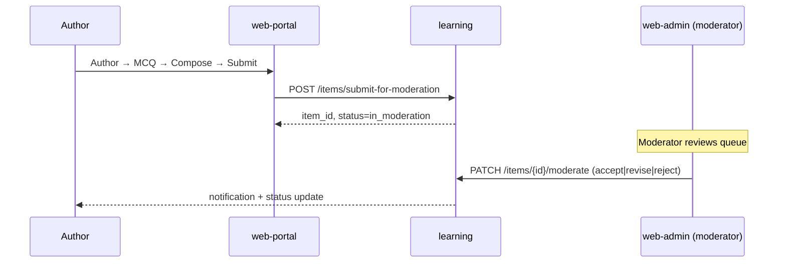

# User Stories — web-portal (Vidya Portal)

**Anchored to:** [Requirements](./02_requirements.md) · [BRD](./01_brd.md)

**ID convention:** `E-WP-NN` Epic · `S-WP-NN.MM.KK` Story · `AC-NN` Acceptance Criterion

---

## Epic Map

| Epic | Title | Stories | SP | Phase | P |
|------|-------|---------|----|-------|---|
| E-WP-01 | Auth & Expert Onboarding | 9 | 38 | 1 | P0 |
| E-WP-02 | KYC | 6 | 22 | 1–2 | P0/P1 |
| E-WP-03 | Single-Item Authoring | 13 | 78 | 1–2 | P0 |
| E-WP-04 | AI Draft Panel | 8 | 32 | 2 | P1 |
| E-WP-05 | Bulk Authoring | 9 | 38 | 1 | P0 |
| E-WP-06 | Quality Dashboards | 7 | 22 | 1–2 | P0/P1 |
| E-WP-07 | Tutor Profile | 8 | 26 | 2 | P1 |
| E-WP-08 | Availability Calendar | 6 | 22 | 2 | P1 |
| E-WP-09 | Live Session Mgmt | 8 | 38 | 2 | P1 |
| E-WP-10 | Earnings & Payouts | 8 | 32 | 2 | P1 |
| E-WP-11 | Disputes | 5 | 18 | 2 | P1 |
| E-WP-12 | Author Analytics | 4 | 14 | 2 | P1 |
| E-WP-13 | Teacher Cohort View | 5 | 22 | 2 | P1 |
| E-WP-14 | Settings | 7 | 21 | 1–2 | P0 |
| E-WP-XC | Cross-Cutting | 14 | 36 | 1 | P0 |
| **TOTAL** | | **117** | **459** | | |

Phase 1 ≈ 180 SP · Phase 2 ≈ 270 SP · Phase 3 ≈ 9 SP.

---

## E-WP-01 — Auth & Expert Onboarding

### S-WP-01.01 — Expert signup with intent flag

**Priority:** P0 · **Estimate:** 5 SP · **Maps to:** FR-WP-01-01, 03

**As** Dr. Sharma **I want** to sign up as an expert (not a student) **so that** I'm routed to the expert onboarding flow.

**Acceptance Criteria**
1. Signup page has "I am a..." toggle (Student / Expert/Teacher/Tutor).
2. Expert choice routes to expert-signup form (extra fields: subjects, qualifications).
3. Submit → `POST /v1/identity/signup` with `intent=expert`.
4. Account created with `role=expert_applicant`.
5. Lands on "Application in progress" screen.
6. Existing student account can apply to become expert via Settings → "Become an expert".
7. Cannot author content until application approved.

**Negative:** duplicate email; weak password; missing required application fields.

**API:** `POST /v1/identity/signup { intent: "expert" }` → `POST /v1/marketplace/applications`.

**Data:** `users.role = expert_applicant`, `marketplace.applications` row.

**DoD:** Playwright E2E; admin approval flow tested end-to-end.

### S-WP-01.04 — Submit expert application

**Priority:** P0 · **Estimate:** 8 SP · **Maps to:** FR-WP-01-04

Standard structure: subjects multi-select, qualifications repeater (max 5), sample work uploader (max 3 files, 10 MB each), motivation text (≥ 200 chars).

| ID | Story | P | SP |
|---|---|---|---|
| S-WP-01.02 | Sign in (email + OAuth) | P0 | 5 |
| S-WP-01.03 | Application status visible | P0 | 3 |
| S-WP-01.05 | Admin transition activates expert | P0 | 5 |
| S-WP-01.06 | Sign out, refresh, reset | P0 | 5 |
| S-WP-01.07 | Device list + revoke | P1 | 5 |
| S-WP-01.08 | Convert existing student → expert applicant | P1 | 3 |
| S-WP-01.09 | Account deletion (with payout block) | P0 | 3 |

---

## E-WP-02 — KYC

| ID | Story | P | SP |
|---|---|---|---|
| S-WP-02.01 | Start KYC via Stripe Identity | P0 | 8 |
| S-WP-02.02 | Show KYC status | P0 | 3 |
| S-WP-02.03 | Webhook reflects in UI < 60 s | P0 | 3 |
| S-WP-02.04 | On rejection, actionable reason | P1 | 3 |
| S-WP-02.05 | Annual re-verify reminder | P1 | 3 |
| S-WP-02.06 | Block payouts if KYC not verified | P0 | 2 |

**Detailed — S-WP-02.01: Start KYC flow**

**As** Dr. Sharma **I want** to complete KYC **so that** I can receive payouts.

**Acceptance Criteria**
1. Settings → "KYC verification" → "Start" → opens Stripe Identity hosted page (link out new tab or embedded modal).
2. On return from Stripe, UI shows status = "in_progress".
3. Webhook from Stripe Identity sets status to "verified" or "rejected"; UI reflects within 60 s via polling or push.
4. On verified → unlocks payout setup.
5. On rejected → shows actionable reason from Stripe (e.g. "Document blurry").
6. KYC PII never displayed in our UI; only status.

---

## E-WP-03 — Single-Item Authoring

| ID | Story | P | SP |
|---|---|---|---|
| S-WP-03.01 | Pick question type | P0 | 3 |
| S-WP-03.02 | Type-specific editor (MCQ-single) | P0 | 8 |
| S-WP-03.03 | Type-specific editors (other 4 Phase 1 types) | P0 | 13 |
| S-WP-03.04 | All remaining types (Phase 2) | P1 | 13 |
| S-WP-03.05 | Rich text + LaTeX | P0 | 8 |
| S-WP-03.06 | Image upload | P0 | 5 |
| S-WP-03.07 | Video embed | P0 | 3 |
| S-WP-03.08 | Multi-part items | P0 | 5 |
| S-WP-03.09 | Tagging (concept/Bloom/difficulty/exam) | P0 | 5 |
| S-WP-03.10 | Preview-as-student | P0 | 5 |
| S-WP-03.11 | Auto-save draft | P0 | 5 |
| S-WP-03.12 | Submit + receive moderation result | P0 | 5 |
| S-WP-03.13 | Resubmit after revision | P0 | 3 |

**Detailed — S-WP-03.02: Author MCQ-single (1-of-4)**

**As** Dr. Sharma **I want** to write an MCQ with 4 options **so that** students can practice with it.

**Acceptance Criteria**
1. Editor shows: stem field (rich text), 4 option fields (rich text), correct-answer radio, explanation field.
2. Each option supports image upload.
3. LaTeX renders in stem, options, and explanation.
4. Must select exactly 1 correct option.
5. Min 50 chars stem; min 1 char per option; explanation min 30 chars.
6. Tag required: ≥ 1 concept + Bloom + difficulty + ≥ 1 exam.
7. Preview button renders item exactly as student sees it (with shuffled options).
8. Save Draft → `POST /v1/learning/items/draft`.
9. Submit → `POST /v1/learning/items/submit-for-moderation`.
10. After submit, item appears in "Pending Moderation" with status updates.
11. Author cannot edit submitted item until moderation rejects/asks for revision.

**API:** `POST /v1/learning/items/draft`, `POST /v1/learning/items/submit-for-moderation`.

**Data:** `content_schema.items` (status enum: draft, submitted, in_moderation, accepted, revise, rejected).

---

## E-WP-04 — AI Draft Panel (Phase 2)

| ID | Story | P | SP |
|---|---|---|---|
| S-WP-04.01 | "Draft with AI" CTA | P1 | 3 |
| S-WP-04.02 | Prompt seeded with type/topic/difficulty/Bloom | P1 | 3 |
| S-WP-04.03 | AI returns draft (< 8 s p95) | P1 | 5 |
| S-WP-04.04 | Author edits then submits | P0 | 5 |
| S-WP-04.05 | Provider + model badge shown | P1 | 3 |
| S-WP-04.06 | Daily quota enforced | P1 | 5 |
| S-WP-04.07 | Quota usage visible | P1 | 3 |
| S-WP-04.08 | AI-drafted metadata recorded | P0 | 5 |

---

## E-WP-05 — Bulk Authoring

| ID | Story | P | SP |
|---|---|---|---|
| S-WP-05.01 | Download CSV template per type | P0 | 3 |
| S-WP-05.02 | Upload CSV + client preview | P0 | 5 |
| S-WP-05.03 | Server-side validation | P0 | 5 |
| S-WP-05.04 | Validation report download | P0 | 3 |
| S-WP-05.05 | Dryrun | P0 | 5 |
| S-WP-05.06 | Commit ingest | P0 | 5 |
| S-WP-05.07 | Batch status tracker | P0 | 5 |
| S-WP-05.08 | 1000-item cap Phase 1 / 5000 Phase 2 | P0 | 3 |
| S-WP-05.09 | XLSX support | P1 | 4 |

---

## E-WP-06 — Quality Dashboards

| ID | Story | P | SP |
|---|---|---|---|
| S-WP-06.01 | Acceptance rate panel | P0 | 5 |
| S-WP-06.02 | Revision rate panel | P0 | 3 |
| S-WP-06.03 | Drill into rejected (with reasons) | P0 | 3 |
| S-WP-06.04 | Kappa per criterion (Phase 2) | P1 | 3 |
| S-WP-06.05 | Top topics authored | P1 | 2 |
| S-WP-06.06 | Trend chart | P1 | 3 |
| S-WP-06.07 | Peer-comparison (opt-in) | P2 | 3 |

---

## E-WP-07 — Tutor Profile

| ID | Story | P | SP |
|---|---|---|---|
| S-WP-07.01 | Edit bio (rich text) | P1 | 3 |
| S-WP-07.02 | Subjects taught | P1 | 3 |
| S-WP-07.03 | Languages | P1 | 2 |
| S-WP-07.04 | Hourly rate (within band) | P1 | 5 |
| S-WP-07.05 | Profile photo | P1 | 3 |
| S-WP-07.06 | Qualifications repeater | P1 | 3 |
| S-WP-07.07 | Public preview | P1 | 3 |
| S-WP-07.08 | Completion meter | P1 | 4 |

---

## E-WP-08 — Availability Calendar

| ID | Story | P | SP |
|---|---|---|---|
| S-WP-08.01 | Recurring weekly availability | P1 | 5 |
| S-WP-08.02 | One-off exceptions | P1 | 3 |
| S-WP-08.03 | Slot length config | P1 | 3 |
| S-WP-08.04 | Lead time config | P1 | 3 |
| S-WP-08.05 | TZ display | P0 | 3 |
| S-WP-08.06 | iCal feed | P2 | 5 |

---

## E-WP-09 — Live Session Mgmt

| ID | Story | P | SP |
|---|---|---|---|
| S-WP-09.01 | Today's sessions panel | P1 | 5 |
| S-WP-09.02 | Join T-5 min activation | P1 | 3 |
| S-WP-09.03 | Daily.co embed | P1 | 8 |
| S-WP-09.04 | Session notes pre/post | P1 | 5 |
| S-WP-09.05 | Timer | P1 | 3 |
| S-WP-09.06 | Whiteboard (OQ) | P2 | 8 |
| S-WP-09.07 | Auto-end at slot + grace | P1 | 3 |
| S-WP-09.08 | Mark no-show + partial pay | P1 | 3 |

**Detailed — S-WP-09.03: Daily.co session embed**

**As** Dr. Sharma **I want** to join the tutoring session inside the portal **so that** I don't switch tools.

**Acceptance Criteria**
1. "Join" button activates T-5 min before slot.
2. Click → modal opens with Daily.co room URL (server-generated, JWT-protected).
3. Daily.co JS SDK embedded; permissions (mic/cam) asked in-context.
4. Tutor + student see each other on join.
5. Session controls: mute, camera off, screen share (Phase 2), leave.
6. Heartbeat to marketplace service every 30 s while live.
7. On end: confirm dialog ("End session?") → if confirmed → marketplace records duration.
8. Connection drop → reconnect attempt 30 s; if fails → notify both parties.
9. Browser compat: Chrome/Edge/Firefox/Safari last 2 majors.

**API:** `POST /v1/marketplace/sessions/{id}/room` (returns Daily.co URL + JWT).

---

## E-WP-10 — Earnings & Payouts

| ID | Story | P | SP |
|---|---|---|---|
| S-WP-10.01 | Earnings dashboard | P1 | 5 |
| S-WP-10.02 | Pending vs paid balance | P1 | 3 |
| S-WP-10.03 | Payout history | P1 | 3 |
| S-WP-10.04 | Stripe Connect onboarding link | P1 | 5 |
| S-WP-10.05 | Re-link Connect | P1 | 3 |
| S-WP-10.06 | Tax docs | P2 | 5 |
| S-WP-10.07 | Currency choice (Phase 2) | P2 | 3 |
| S-WP-10.08 | Payout failed handling | P0 | 5 |

---

## E-WP-11 — Disputes

| ID | Story | P | SP |
|---|---|---|---|
| S-WP-11.01 | Dispute list | P1 | 3 |
| S-WP-11.02 | Dispute detail | P1 | 3 |
| S-WP-11.03 | Submit evidence | P1 | 5 |
| S-WP-11.04 | Status timeline | P1 | 3 |
| S-WP-11.05 | Resolution affects payout | P1 | 4 |

---

## E-WP-12 — Author Analytics

| ID | Story | P | SP |
|---|---|---|---|
| S-WP-12.01 | Submitted/accepted/rejected counts | P1 | 3 |
| S-WP-12.02 | Avg review time | P1 | 3 |
| S-WP-12.03 | Student engagement per item | P1 | 5 |
| S-WP-12.04 | Top topics + earnings | P1 | 3 |

---

## E-WP-13 — Teacher Cohort View

| ID | Story | P | SP |
|---|---|---|---|
| S-WP-13.01 | Cohort list | P1 | 3 |
| S-WP-13.02 | Batch progress dashboard | P1 | 8 |
| S-WP-13.03 | Drill into student (read-only) | P1 | 5 |
| S-WP-13.04 | CSV export | P2 | 3 |
| S-WP-13.05 | Read-only RBAC enforcement | P0 | 3 |

---

## E-WP-14 — Settings

| ID | Story | P | SP |
|---|---|---|---|
| S-WP-14.01 | Profile | P0 | 3 |
| S-WP-14.02 | Banking | P1 | 3 |
| S-WP-14.03 | Re-verify KYC | P1 | 3 |
| S-WP-14.04 | Notif prefs | P1 | 3 |
| S-WP-14.05 | Language | P0 | 2 |
| S-WP-14.06 | A11y | P0 | 3 |
| S-WP-14.07 | Delete account | P0 | 4 |

---

## E-WP-XC — Cross-Cutting

Mirrors E-WS-XC — 14 stories, 36 SP. See [requirements §FA-XC](./02_requirements.md#cross-cutting-fa-xc).

---

## Flow Diagrams

### KYC + Stripe Connect onboarding (end-to-end)

### Author MCQ → moderation outcome

