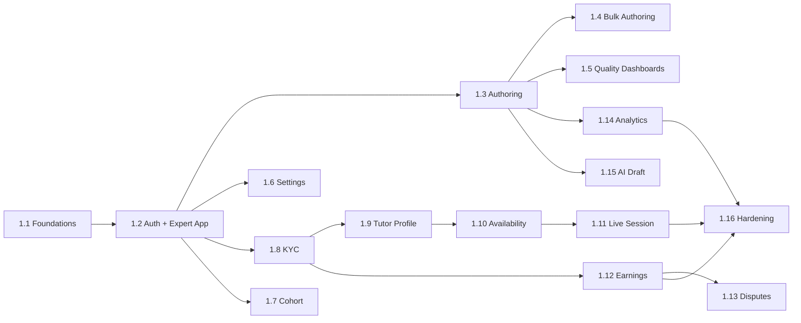

# Work Breakdown Structure — web-portal (Vidya Portal)

**Anchored to:** [Stories](./03_user_stories.md) · [Requirements](./02_requirements.md) · [BRD](./01_brd.md)

**Estimation basis:** 1.5 FE + 0.25 design + 0.25 QA (smaller team than web-student; expert surface is lower volume). Velocity: **18 SP / 2-wk sprint**.

**Phase 1 effort:** ~180 SP → **~10 sprints (~20 weeks)** · Phase 2: ~270 SP → ~15 sprints · Phase 3: ~9 SP.

---

## WBS Hierarchy

```
1.0 web-portal (Phase 1 + 2 + 3)
├── 1.1 Foundations
├── 1.2 Auth & Expert Onboarding
├── 1.3 Authoring — Single Item
├── 1.4 Bulk Authoring
├── 1.5 Quality Dashboards
├── 1.6 Settings
├── 1.7 Teacher Cohort View (Phase 2)
├── 1.8 KYC (Stripe Identity)
├── 1.9 Tutor Profile
├── 1.10 Availability Calendar
├── 1.11 Live Session Mgmt (Daily.co)
├── 1.12 Earnings & Payouts (Stripe Connect)
├── 1.13 Disputes
├── 1.14 Author Analytics
├── 1.15 AI Draft Panel (Phase 2)
└── 1.16 Hardening
```

---

## 1.1 Foundations (S0–S1) · 30 SP

| WP | Activity | SP |
|----|----------|----|
| WP-WP-1.1.1 | Vite + React + TS + Vidya v3 | 3 |
| WP-WP-1.1.2 | Routing + RBAC guard (role=expert/tutor) | 3 |
| WP-WP-1.1.3 | API client + interceptors | 5 |
| WP-WP-1.1.4 | TipTap + KaTeX editor primitives | 8 |
| WP-WP-1.1.5 | Forms (RHF + Zod) | 3 |
| WP-WP-1.1.6 | CI: Lighthouse + a11y + bundle | 5 |
| WP-WP-1.1.7 | Sentry + OTel | 3 |

## 1.2 Auth & Expert Onboarding (S1–S3) · 38 SP

Per E-WP-01 stories.

## 1.3 Authoring — Single Item (S3–S8) · 78 SP — largest Phase 1 chunk

| WP | Activity | SP |
|----|----------|----|
| WP-WP-1.3.1 | Type picker | 3 |
| WP-WP-1.3.2 | MCQ-single editor | 8 |
| WP-WP-1.3.3 | MCQ-multiple, fill-in, numeric, match (P1 set) | 13 |
| WP-WP-1.3.4 | All remaining type editors (Phase 2) | 13 |
| WP-WP-1.3.5 | Rich text + LaTeX | 8 |
| WP-WP-1.3.6 | Image upload | 5 |
| WP-WP-1.3.7 | Video embed | 3 |
| WP-WP-1.3.8 | Multi-part | 5 |
| WP-WP-1.3.9 | Tagging | 5 |
| WP-WP-1.3.10 | Preview-as-student | 5 |
| WP-WP-1.3.11 | Auto-save draft | 5 |
| WP-WP-1.3.12 | Submit + moderation result | 5 |

## 1.4 Bulk Authoring (S8–S9) · 38 SP

Per E-WP-05 stories.

## 1.5 Quality Dashboards (S9–S10) · 22 SP

Per E-WP-06 stories.

## 1.6 Settings (S10) · 21 SP

Per E-WP-14 stories.

**Phase 1 milestone — end of S10:** Experts can sign up, submit application, get approved, author MCQ-single + 4 other types, bulk upload via CSV, see quality dashboard. Foundation for Phase 2.

---

## Phase 2 Work Packages (S11–S25)

| WP | Section | SP |
|----|---------|----|
| 1.8 | KYC (E-WP-02) | 22 |
| 1.9 | Tutor Profile (E-WP-07) | 26 |
| 1.10 | Availability Calendar (E-WP-08) | 22 |
| 1.11 | Live Session — Daily.co (E-WP-09) | 38 |
| 1.12 | Earnings & Payouts (E-WP-10) | 32 |
| 1.13 | Disputes (E-WP-11) | 18 |
| 1.14 | Author Analytics (E-WP-12) | 14 |
| 1.15 | AI Draft Panel (E-WP-04) | 32 |
| 1.7 | Teacher Cohort View (E-WP-13) | 22 |
| 1.3 cont | Remaining 17 question type editors | 13 |
| 1.4 cont | XLSX support + 5000-item batches | 4 |

**Phase 2 milestone — end of S25:** Full marketplace surface live for tutors. AI Draft live.

---

## 1.16 Hardening (S26) · 25 SP

| WP | Activity | SP |
|----|----------|----|
| WP-WP-1.16.1 | Full a11y audit | 5 |
| WP-WP-1.16.2 | Load test (1000 concurrent authors) | 5 |
| WP-WP-1.16.3 | Lighthouse pass | 5 |
| WP-WP-1.16.4 | Pen-test (KYC + Connect surfaces) | 5 |
| WP-WP-1.16.5 | RUM dashboards | 3 |
| WP-WP-1.16.6 | Sign-offs | 2 |

---

## Timeline (Gantt-Lite)

```
Sprint   1  2  3  4  5  6  7  8  9 10 11 12 13 14 15 16 17 18 19 20 21 22 23 24 25 26
Phase    1  1  1  1  1  1  1  1  1  1  2  2  2  2  2  2  2  2  2  2  2  2  2  2  2  -
1.1 Found ▓▓ ▓▓
1.2 Auth        ▓▓ ▓▓
1.3 Author              ▓▓ ▓▓ ▓▓ ▓▓ ▓▓
1.4 Bulk                                  ▓▓
1.5 Quality                                  ▓▓
1.6 Setting                                     ▓▓
                                                   |--- Phase 1 ends ---|
1.8 KYC                                                ▓▓ ▓▓
1.9 Tutor Pr                                                 ▓▓ ▓▓
1.10 Avail                                                         ▓▓
1.11 Session                                                          ▓▓ ▓▓
1.12 Earn                                                                   ▓▓ ▓▓
1.13 Disp                                                                          ▓▓
1.14 Anal                                                                             ▓▓
1.15 AI Draft                                                                            ▓▓ ▓▓
1.7 Cohort                                                                                     ▓▓
1.16 Harden                                                                                         ▓▓
```

---

## Dependency DAG



---

## Capacity & Risk

| Item | Value | Note |
|---|---|---|
| Team | 1.5 FE + 0.25 design + 0.25 QA | Per Master BRD §7 |
| Velocity | 18 SP / sprint | Smaller team |
| Phase 1 SP | 180 | Foundation + authoring + bulk + quality + settings |
| Phase 1 duration | ~10 sprints (~5 months) | Aligns with platform Phase 1 |
| Phase 2 SP | 270 | |
| Phase 2 duration | ~15 sprints | |
| Buffer | 20% | Editor edge cases, KYC unknowns |
| Top risks | Editor perf (R-WP-01), KYC rejection (R-WP-02), AI kappa (R-WP-03) | See [BRD §10](./01_brd.md#10-risks) |

---

## Definition of Done

Web-portal Phase 1 is **Done** when:

- ✅ All P0 Phase 1 stories shipped with passing tests
- ✅ NFR-WP-* verified by CI gates
- ✅ 10 pilot experts onboarded via real flows
- ✅ Lighthouse ≥ 85 perf · ≥ 95 a11y on author + dashboard
- ✅ Sentry + RUM live
- ✅ Feature flags wired for Phase 2 capabilities
- ✅ Pen-test on KYC + auth surfaces passed
