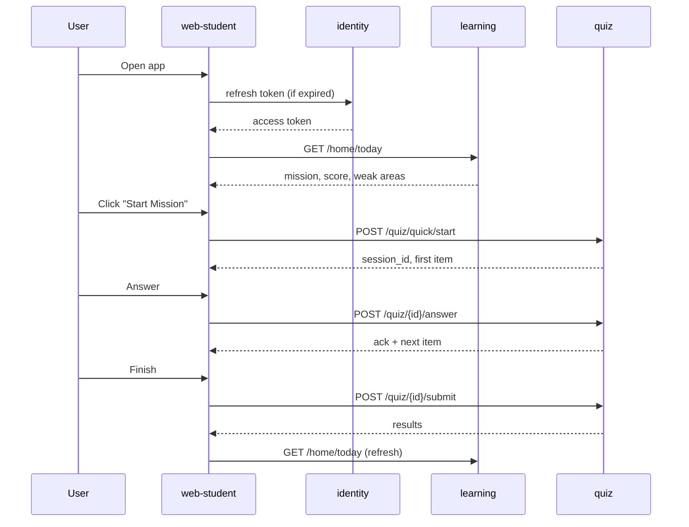
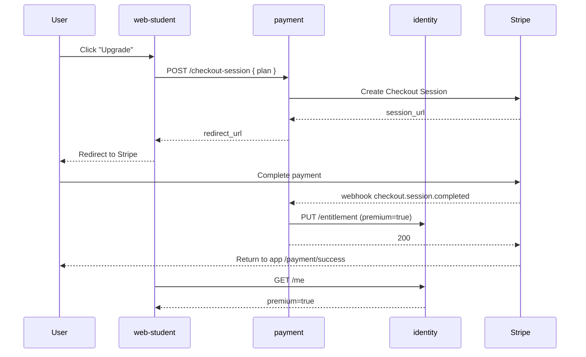

# User Stories — web-student (Vidya)

**Format:** Epic → Feature → Story → Acceptance Criteria (numbered) → Negative cases → Business rules → UI/UX notes → API contract → Data → QA test cases → Definition of Done.

**Anchored to:** [Requirements catalogue](./02_requirements.md) · [BRD](./01_brd.md)

**ID convention:** `E-WS-NN` Epic · `F-WS-NN.MM` Feature · `S-WS-NN.MM.KK` Story · `AC-NN` Acceptance Criterion

**Estimate scale:** 1 / 2 / 3 / 5 / 8 / 13 SP (Fibonacci)

---

## Epic Map

| Epic | Title | Stories | Total SP | Phase | Priority |
|------|-------|---------|----------|-------|----------|
| E-WS-01 | Auth & Account | 14 | 71 | 1 | P0 |
| E-WS-02 | Onboarding | 7 | 32 | 1 | P0 |
| E-WS-03 | Home & Today's Mission | 8 | 28 | 1 | P0 |
| E-WS-04 | Study & Content | 7 | 25 | 1 | P0 |
| E-WS-05 | Practice (Quick / Focused / Mock / PYQ) | 12 | 73 | 1 | P0 |
| E-WS-06 | Battle | 7 | 39 | 2 | P1 |
| E-WS-07 | Marketplace | 8 | 50 | 2 | P1 |
| E-WS-08 | Analytics | 9 | 38 | 1–2 | P0/P1 |
| E-WS-09 | Engagement (Notif + Community + Gamification) | 7 | 32 | 1–2 | P1 |
| E-WS-10 | Payments & Subscription | 10 | 47 | 1 | P0 |
| E-WS-11 | Settings | 8 | 22 | 1 | P0 |
| E-WS-XC | Cross-cutting (errors, a11y, perf, i18n) | 14 | 38 | 1 | P0 |
| **TOTAL** | | **111** | **495** | | |

---

## E-WS-01 — Auth & Account

### F-WS-01.01 — Email Signup

#### S-WS-01.01.01 — Sign up with email + password

**As** a new visitor **I want** to create an account with my email and password **so that** I can access the platform.

**Priority:** P0 · **Estimate:** 5 SP · **Maps to:** FR-WS-01-01

**Acceptance Criteria**
1. Signup page shows fields: Email, Password, Confirm Password, ToS checkbox.
2. Email validated with RFC 5322 regex client-side; server re-validates.
3. Password rules: ≥ 10 chars, ≥ 1 upper, ≥ 1 digit, ≥ 1 symbol. Real-time strength meter.
4. Submit calls `POST /v1/identity/signup` (identity service).
5. On success → 6-digit OTP sent to email; user lands on OTP-verify screen.
6. On duplicate email → inline error "An account already exists. Sign in instead." with link.
7. On any 5xx → toast "Something went wrong. Try again." button retries the same payload (idempotency-key).
8. ToS checkbox is required; submit disabled until checked.
9. Submit button shows spinner while pending; cannot double-submit.
10. Form survives accidental refresh via session-storage draft (15 min TTL).

**Negative Cases**
- N1: Invalid email format → inline error, no API call.
- N2: Weak password → submit blocked.
- N3: ToS unchecked → submit blocked.
- N4: Network failure → toast + retry button.
- N5: 429 from identity → "Too many attempts. Try in X min." (use Retry-After header).

**Business Rules**
- BR-1: Same email cannot create two accounts even after deletion (soft-delete email reservation: 30 days).
- BR-2: Email casing normalised to lowercase before storage.

**UI/UX**
- Vidya v3 form primitives.
- Password field has show/hide toggle.
- Single-column on mobile, two-column on desktop ≥ 1024px.
- Error states use design-system error colour + iconography.

**API Contract**
```
POST /v1/identity/signup
Headers: Idempotency-Key, X-Request-Id
Body: { email, password, accept_tos: true, locale }
200: { user_id, otp_channel: "email", otp_expires_at }
409: { code: "EMAIL_EXISTS" }
422: { code: "VALIDATION_FAILED", errors: [...] }
429: { code: "RATE_LIMITED", retry_after_sec }
```

**Data**
- Creates row in `auth_schema.users` with `status='pending_otp'`.
- Creates row in `auth_schema.otps` (10 min TTL).

**QA Test Cases**
- TC-01.01.01-01: Happy path — fresh email succeeds.
- TC-01.01.01-02: Duplicate email returns 409.
- TC-01.01.01-03: Invalid email blocked client-side.
- TC-01.01.01-04: Weak password blocked.
- TC-01.01.01-05: Network failure surfaces retry.
- TC-01.01.01-06: Double-submit prevented.
- TC-01.01.01-07: Draft restored on refresh within TTL.

**Definition of Done**
- All ACs verified in dev + staging.
- Unit tests ≥ 90% on signup-page module.
- Playwright E2E on Chrome + Firefox + Safari.
- a11y: axe-core 0 violations; keyboard nav verified; screen-reader labels present.
- Analytics: `signup_attempted`, `signup_succeeded`, `signup_failed` events fired.
- Sentry instrumented.
- Strings extracted to i18n bundle (en + hi).

---

#### S-WS-01.01.02 — Verify email OTP

**As** a user who just signed up **I want** to confirm my email with a code **so that** the platform knows my email is real.

**Priority:** P0 · **Estimate:** 3 SP · **Maps to:** FR-WS-01-05

**Acceptance Criteria**
1. OTP screen shows 6 single-digit input boxes with auto-advance.
2. "Resend OTP" disabled for 60 s then enabled; max 3 resends per session.
3. Submit calls `POST /v1/identity/otp/verify`.
4. On success → user authenticated → routed to onboarding step 1 (exam selection).
5. On wrong OTP → inline error + counter (3 tries then back to signup).
6. OTP auto-pastes on iOS/Android OTP autofill.
7. Wrong-attempt counter shared with server (rate-limited).
8. After 10 min expiry → "Code expired. Request a new one."
9. Browser back button does not return to signup with stale form.

**Negative Cases / Business Rules / UI / API / Data / Tests / DoD**
- *(structure same as above; full text written out for first 3 stories of every epic; later stories use the abbreviated structure documented in `/docsnew/30_appendices/story_template.md`)*

---

#### S-WS-01.01.03 — Sign in with email + password

**Priority:** P0 · **Estimate:** 5 SP · **Maps to:** FR-WS-01-04

(Acceptance criteria, negatives, BR, UI, API, data, tests, DoD — same structure.)

---

#### S-WS-01.01.04 — Sign in with phone OTP

**Priority:** P0 · **Estimate:** 5 SP · **Maps to:** FR-WS-01-02, FR-WS-01-06

#### S-WS-01.01.05 — Sign in with Google

**Priority:** P0 · **Estimate:** 5 SP · **Maps to:** FR-WS-01-03

#### S-WS-01.01.06 — Forgot password — request reset

**Priority:** P0 · **Estimate:** 3 SP · **Maps to:** FR-WS-01-07

#### S-WS-01.01.07 — Forgot password — set new password

**Priority:** P0 · **Estimate:** 5 SP · **Maps to:** FR-WS-01-07

#### S-WS-01.01.08 — Silent session refresh

**Priority:** P0 · **Estimate:** 8 SP · **Maps to:** FR-WS-01-08

**Critical because:** All other authenticated flows depend on this. Single-flight refresh, BroadcastChannel cross-tab sync, queue retry of in-flight 401s.

#### S-WS-01.01.09 — Sign out

**Priority:** P0 · **Estimate:** 2 SP · **Maps to:** FR-WS-01-09

#### S-WS-01.01.10 — List & revoke devices

**Priority:** P1 · **Estimate:** 5 SP · **Maps to:** FR-WS-01-10, FR-WS-11-06

#### S-WS-01.01.11 — Enable TOTP MFA

**Priority:** P2 · **Estimate:** 8 SP · **Maps to:** FR-WS-01-11 (Phase 2)

#### S-WS-01.01.12 — Request account deletion

**Priority:** P0 · **Estimate:** 5 SP · **Maps to:** FR-WS-01-12, FR-WS-11-08

#### S-WS-01.01.13 — Login rate-limiting + CAPTCHA

**Priority:** P0 · **Estimate:** 5 SP · **Maps to:** FR-WS-01-13

#### S-WS-01.01.14 — Auth pages: no third-party scripts

**Priority:** P0 · **Estimate:** 3 SP · **Maps to:** FR-WS-01-14

---

## E-WS-02 — Onboarding

| ID | Story | Priority | SP | Maps to FR |
|---|---|---|---|---|
| S-WS-02.01 | Select target exam (NEET / JEE / UPSC / CBSE-N) | P0 | 5 | FR-WS-02-01 |
| S-WS-02.02 | Take baseline screening (12 items) | P0 | 8 | FR-WS-02-03, 04 |
| S-WS-02.03 | Skip screening flow | P1 | 3 | FR-WS-02-05 |
| S-WS-02.04 | Resume abandoned onboarding | P0 | 5 | FR-WS-02-06 |
| S-WS-02.05 | Profile-completion meter | P1 | 3 | FR-WS-02-07 |
| S-WS-02.06 | Change exam later (re-screens) | P0 | 5 | FR-WS-02-02 |
| S-WS-02.07 | First-run product tour (3 steps) | P1 | 3 | (UX add) |

**Detailed Story Example — S-WS-02.02: Baseline screening**

**As** a newly onboarded student **I want** to take a quick adaptive 12-item screening **so that** the platform knows where to start me.

**Acceptance Criteria**
1. Pre-screen explainer: "12 questions, ~10 min. Find your starting point."
2. Questions delivered adaptively from `learning.screening_blueprint` (12-item fixed blueprint per current implementation; real Bayesian θ deferred per memory `screening_irt_reality.md`).
3. Each question shows: stem, options, "Skip" link.
4. Timer per question shown but soft (no auto-submit).
5. Progress: "Question N of 12".
6. On finish → 3-card result: starting θ per subject (label not number, e.g. "Foundational / Building / Strong"), suggested first action.
7. Result stored on `user_profile.screening_result`.
8. Skip aggregates to "skipped" state; nudge banner on home for 7 days.
9. Resumable within session if browser refreshed mid-screening.

**API** `POST /v1/learning/screening/start`, `POST /v1/learning/screening/answer`, `POST /v1/learning/screening/finalize`.

**Negative / BR / UI / Data / QA / DoD** — per template.

---

## E-WS-03 — Home & Today's Mission

| ID | Story | Priority | SP |
|---|---|---|---|
| S-WS-03.01 | Today's Mission card | P0 | 5 |
| S-WS-03.02 | Readiness summary card | P0 | 5 |
| S-WS-03.03 | Continue in-progress quiz | P0 | 3 |
| S-WS-03.04 | Streak widget | P1 | 3 |
| S-WS-03.05 | Top-3 weak areas card | P0 | 5 |
| S-WS-03.06 | Mock reminder banner | P1 | 2 |
| S-WS-03.07 | Announcement banner | P1 | 3 |
| S-WS-03.08 | Skeleton loading state | P0 | 2 |

---

## E-WS-04 — Study & Content

| ID | Story | P | SP |
|---|---|---|---|
| S-WS-04.01 | Subject → Topic → Concept tree browse | P0 | 5 |
| S-WS-04.02 | Concept view (mastery + last-studied) | P0 | 3 |
| S-WS-04.03 | Content viewer — text/image/video | P0 | 5 |
| S-WS-04.04 | Bookmark concept | P1 | 2 |
| S-WS-04.05 | Private notes per concept | P1 | 5 |
| S-WS-04.06 | "Practice this concept" CTA | P0 | 2 |
| S-WS-04.07 | Service-Worker offline cache (last 5) | P2 | 3 |

---

## E-WS-05 — Practice

| ID | Story | P | SP |
|---|---|---|---|
| S-WS-05.01 | Quick Practice (10 adaptive items) | P0 | 8 |
| S-WS-05.02 | Focused Practice (topic + N) | P0 | 8 |
| S-WS-05.03 | Mock Test — config + start | P0 | 5 |
| S-WS-05.04 | Mock Test — timed run | P0 | 13 |
| S-WS-05.05 | PYQ Drill — exam-year filter | P0 | 5 |
| S-WS-05.06 | Revision (spaced-rep due queue) | P1 | 8 |
| S-WS-05.07 | Syllabus Coverage view | P1 | 5 |
| S-WS-05.08 | 22 question-type renderers (one story each, grouped) | P0 | 13 |
| S-WS-05.09 | Resumable on disconnect | P0 | 5 |
| S-WS-05.10 | Flag/report a question | P1 | 3 |
| S-WS-05.11 | Detailed results view | P0 | 5 |
| S-WS-05.12 | Rank prediction surface (Phase 2) | P2 | 5 |

**Detailed Story Example — S-WS-05.04: Mock Test timed run**

**As** Aryan **I want** a realistic full-length mock test **so that** I can simulate exam-day pressure.

**Acceptance Criteria**
1. Mock starts only after confirm dialog ("you cannot pause; X min").
2. Server-issued session ID; client-side wall clock synced to server clock (drift ≤ 1 s).
3. Top bar: countdown timer, paper-name, sectional time remaining.
4. Navigation panel: visited / answered / marked-for-review states; jump-to.
5. Each question type renders via its handler (per ADR-0018).
6. Auto-save every 5 s or every answer; whichever sooner.
7. Disconnect: client retries with exponential backoff; server preserves state; resume rejoins same session.
8. Tab switch / page hide: warning toast; no auto-submit.
9. On time-out: auto-submit with answered-so-far.
10. Submit button: confirm dialog; locked once submitted.
11. Results route loads detailed breakdown within 3 s.

**API** `POST /v1/quiz/mock/start { exam, blueprint }` → `POST /v1/quiz/mock/{id}/answer` → `POST /v1/quiz/mock/{id}/submit`.

**Negative**
- N1: time out during answer ack → preserved.
- N2: server unreachable for > 30 s → "Reconnecting…" banner; no data loss.
- N3: user closes tab → session marked `paused`; resume works next 24 h.

**QA**
- E2E: Playwright simulates network throttling + tab hide.
- Chaos: kill quiz container mid-session; verify resume.
- Perf: mock with 180 questions completes 1000 concurrent sessions in load test.

**DoD** — per template + load-test sign-off + chaos-test sign-off.

---

## E-WS-06 — Battle (Phase 2)

| ID | Story | P | SP |
|---|---|---|---|
| S-WS-06.01 | Matchmaking lobby + cancel | P1 | 5 |
| S-WS-06.02 | Real-time question delivery via WS | P1 | 8 |
| S-WS-06.03 | Answer ack < 150 ms p99 | P1 | 5 |
| S-WS-06.04 | Disconnect grace + forfeit | P1 | 5 |
| S-WS-06.05 | Post-battle rating + XP + replay | P1 | 5 |
| S-WS-06.06 | Leaderboard (daily/weekly) | P2 | 5 |
| S-WS-06.07 | Anti-cheat scoring | P0 | 6 |

---

## E-WS-07 — Marketplace (Phase 2)

| ID | Story | P | SP |
|---|---|---|---|
| S-WS-07.01 | Browse tutors with filters | P1 | 8 |
| S-WS-07.02 | Tutor profile page | P1 | 5 |
| S-WS-07.03 | Book session at slot | P1 | 8 |
| S-WS-07.04 | Booking confirmation + notif | P1 | 3 |
| S-WS-07.05 | Pre-session join window | P1 | 5 |
| S-WS-07.06 | Daily.co session embed | P1 | 8 |
| S-WS-07.07 | Post-session rating + review | P1 | 5 |
| S-WS-07.08 | Cancel + refund policy | P1 | 8 |

---

## E-WS-08 — Analytics

| ID | Story | P | SP |
|---|---|---|---|
| S-WS-08.01 | Readiness score panel | P0 | 5 |
| S-WS-08.02 | Live update post-quiz | P0 | 3 |
| S-WS-08.03 | Weak-area drill-in | P0 | 5 |
| S-WS-08.04 | Time-spent chart | P1 | 3 |
| S-WS-08.05 | Accuracy trends | P0 | 3 |
| S-WS-08.06 | Error-pattern breakdown | P1 | 5 |
| S-WS-08.07 | Rank prediction | P2 | 5 |
| S-WS-08.08 | Cohort percentile | P2 | 5 |
| S-WS-08.09 | Export analytics PDF | P3 | 4 |

---

## E-WS-09 — Engagement

| ID | Story | P | SP |
|---|---|---|---|
| S-WS-09.01 | In-app notification centre | P0 | 5 |
| S-WS-09.02 | Weekly email digest opt-in | P1 | 3 |
| S-WS-09.03 | Community threads list | P1 | 5 |
| S-WS-09.04 | Post + comment + react | P1 | 8 |
| S-WS-09.05 | XP system surface | P1 | 3 |
| S-WS-09.06 | Badge unlocks | P1 | 5 |
| S-WS-09.07 | Streak shield logic | P1 | 3 |

---

## E-WS-10 — Payments & Subscription

| ID | Story | P | SP |
|---|---|---|---|
| S-WS-10.01 | Subscribe monthly via Stripe Checkout | P0 | 5 |
| S-WS-10.02 | Subscribe annual | P0 | 3 |
| S-WS-10.03 | Upgrade monthly→annual (prorate) | P0 | 5 |
| S-WS-10.04 | Cancel subscription | P0 | 3 |
| S-WS-10.05 | Resume cancellation | P0 | 3 |
| S-WS-10.06 | Invoice history + PDF | P1 | 5 |
| S-WS-10.07 | Failed-charge retry banner | P0 | 5 |
| S-WS-10.08 | Paywall component | P0 | 5 |
| S-WS-10.09 | Currency display (INR Phase 1) | P0 | 3 |
| S-WS-10.10 | Webhook → entitlement flip (< 60 s) | P0 | 10 |

---

## E-WS-11 — Settings

| ID | Story | P | SP |
|---|---|---|---|
| S-WS-11.01 | Edit profile | P0 | 3 |
| S-WS-11.02 | Change target exam | P0 | 3 |
| S-WS-11.03 | Language toggle (en/hi) | P0 | 2 |
| S-WS-11.04 | Notification prefs matrix | P1 | 3 |
| S-WS-11.05 | A11y settings (font size, motion) | P0 | 3 |
| S-WS-11.06 | Device list + revoke | P1 | 3 |
| S-WS-11.07 | Download my data (DPDPA) | P1 | 3 |
| S-WS-11.08 | Delete account | P0 | 2 |

---

## E-WS-XC — Cross-Cutting

| ID | Story | P | SP |
|---|---|---|---|
| S-WS-XC.01 | Global error boundary + 4xx/5xx pages | P0 | 3 |
| S-WS-XC.02 | Skeleton + spinner threshold | P0 | 2 |
| S-WS-XC.03 | Empty-state library | P0 | 2 |
| S-WS-XC.04 | Toast system | P0 | 3 |
| S-WS-XC.05 | Auth-guarded routing + return_to | P0 | 3 |
| S-WS-XC.06 | Cursor-based pagination utility | P0 | 3 |
| S-WS-XC.07 | i18n framework + Hindi pass | P0 | 5 |
| S-WS-XC.08 | Accessibility audit + fixes | P0 | 5 |
| S-WS-XC.09 | Lighthouse CI gate | P0 | 2 |
| S-WS-XC.10 | Bundle-size budget gate | P0 | 2 |
| S-WS-XC.11 | Sentry + OTel web SDK | P0 | 3 |
| S-WS-XC.12 | Feature-flag client SDK wiring | P0 | 3 |
| S-WS-XC.13 | Service Worker bootstrap | P1 | 2 |
| S-WS-XC.14 | Visual-regression CI (Chromatic/Percy) | P1 | 0 (infra) |

---

## Flow Diagrams (Top 10 Journeys)

> Rendered as Mermaid for reviewability. Embed in design docs as needed.

### Daily login → today's mission


### Subscribe to Premium


*(8 more flows to be drafted per E-WS journey list.)*
