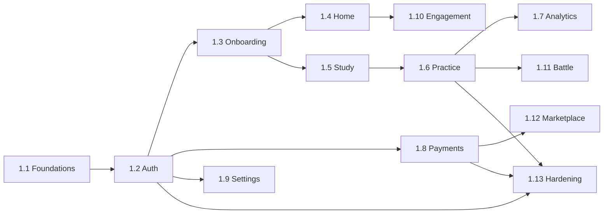

# Work Breakdown Structure — web-student (Vidya)

**Anchored to:** [Stories](./03_user_stories.md) · [Requirements](./02_requirements.md) · [BRD](./01_brd.md)

**Estimation basis:** Two pizza team (2 FE engineers + 0.5 designer + 0.25 QA). Velocity assumed **22 SP / sprint** (2-week sprint, blended).

**Phase 1 effort:** 495 SP across all 12 epics. With cross-cutting infra burn-in (~80 SP) absorbed early, **Phase 1 web-student = ~14 sprints (~28 weeks / ~6.5 months)** for the two-pizza team. This aligns with the Master BRD Phase 1 window.

> WBS uses standard format: `Work Package → Activities → Estimate → Dependencies → Acceptance`.

---

## WBS Hierarchy

```
1.0 web-student (Phase 1+2)
├── 1.1 Foundations & Cross-Cutting
├── 1.2 Auth & Account
├── 1.3 Onboarding
├── 1.4 Home & Today's Mission
├── 1.5 Study & Content
├── 1.6 Practice (Quick / Focused / Mock / PYQ)
├── 1.7 Analytics
├── 1.8 Payments & Subscription
├── 1.9 Settings
├── 1.10 Engagement (Notif + Community + Gamification)
├── 1.11 Battle (Phase 2)
├── 1.12 Marketplace (Phase 2)
└── 1.13 Hardening & Launch
```

---

## 1.1 Foundations & Cross-Cutting (S0–S1)

**Goal:** ground rails — bootstrap, design system, CI, observability — before any feature code lands.

| WP ID | Activity | SP | Depends on | Owner | Acceptance |
|------|----------|----|------------|-------|------------|
| 1.1.1 | Vite + React + TS skeleton + Vidya v3 design tokens wired | 3 | Vidya v3 package | FE | `pnpm dev` launches; sample button uses design tokens |
| 1.1.2 | Routing (react-router v6) + lazy chunks | 2 | 1.1.1 | FE | Top-level routes load split chunks |
| 1.1.3 | Auth-guarded routing + `return_to` | 3 | 1.1.2, identity SDK | FE | Protected route redirects unauth → /login?return_to=... |
| 1.1.4 | API client (openapi-typescript-fetch) + interceptors | 5 | OpenAPI from BE | FE | Generated types compile; 401 triggers single-flight refresh |
| 1.1.5 | React Query + Zustand setup | 2 | 1.1.4 | FE | Sample query + sample store |
| 1.1.6 | Error boundary + 4xx/5xx pages | 3 | 1.1.2 | FE | Forced exception → boundary captures |
| 1.1.7 | Toast / Skeleton / Empty-state primitives | 5 | Vidya v3 | FE | All three live in Storybook |
| 1.1.8 | i18n framework + Hindi seed | 5 | — | FE + Loc | Language toggle works end-to-end on Home |
| 1.1.9 | Forms (RHF + Zod) + validated email/password example | 3 | 1.1.4 | FE | Sample signup form |
| 1.1.10 | Lighthouse CI gate (PR job) | 2 | 1.1.1 | DevOps + FE | PR fails when Perf < 80 |
| 1.1.11 | Bundle-size budget gate | 2 | 1.1.1 | DevOps + FE | PR fails when initial > 200 KB gz |
| 1.1.12 | a11y CI (axe-core) + visual regression | 5 | 1.1.7 | QA + FE | PR fails on a11y or visual diff |
| 1.1.13 | Sentry + OTel web SDK | 3 | 1.1.1 | DevOps | Errors land in Sentry dashboard |
| 1.1.14 | Feature flag client SDK wiring | 3 | ADR-0001 platform | FE | Sample flag toggles Home banner |
| 1.1.15 | Playwright E2E scaffolding | 3 | 1.1.4 | QA | Baseline 1 test runs in CI |
| **Sub-total 1.1** | | **49** | | | |

**Milestone M-1.1: Foundations Done** — Week 4.

---

## 1.2 Auth & Account (S1–S3)

| WP ID | Story | SP | Dep | Acceptance |
|------|-------|----|----|------------|
| 1.2.1 | Signup (email+password) — S-WS-01.01.01 | 5 | 1.1, identity API | Happy path + 5 negatives pass |
| 1.2.2 | OTP verify (email) — S-WS-01.01.02 | 3 | 1.2.1 | Auto-advance + resend cooldown |
| 1.2.3 | Sign in (email) — S-WS-01.01.03 | 5 | 1.2.1 | Rate-limit honoured |
| 1.2.4 | Sign in (phone OTP) — S-WS-01.01.04 | 5 | 1.2.3 | OTP via Twilio happy + 429 path |
| 1.2.5 | Sign in (Google) — S-WS-01.01.05 | 5 | identity OAuth | Account-link case verified |
| 1.2.6 | Forgot password (request) — S-WS-01.01.06 | 3 | 1.2.1 | Email link valid 30 min |
| 1.2.7 | Forgot password (reset) — S-WS-01.01.07 | 5 | 1.2.6 | Old sessions invalidated |
| 1.2.8 | Silent refresh + cross-tab sync — S-WS-01.01.08 | 8 | 1.1.4 | BroadcastChannel verified |
| 1.2.9 | Sign out — S-WS-01.01.09 | 2 | 1.2.8 | Refresh token revoked server-side |
| 1.2.10 | Device list + revoke — S-WS-01.01.10 | 5 | identity API | Revoke kicks sessions |
| 1.2.11 | Delete account — S-WS-01.01.12 | 5 | identity API | Soft delete + 30-day grace |
| 1.2.12 | Login rate-limit UI — S-WS-01.01.13 | 5 | identity API | CAPTCHA after 3 fails |
| 1.2.13 | Auth pages: no 3rd-party scripts — S-WS-01.01.14 | 3 | CSP infra | CSP report verifies |
| **Sub-total 1.2** | | **59** | | (TOTP MFA deferred to Phase 2) |

**Milestone M-1.2: Auth Complete** — Week 8.

---

## 1.3 Onboarding (S3)

| WP | Story | SP | Dep |
|----|-------|----|-----|
| 1.3.1 | Exam selection — S-WS-02.01 | 5 | 1.2.2 |
| 1.3.2 | Baseline screening flow — S-WS-02.02 | 8 | learning screening API |
| 1.3.3 | Skip screening — S-WS-02.03 | 3 | 1.3.2 |
| 1.3.4 | Resume onboarding — S-WS-02.04 | 5 | 1.3.1 |
| 1.3.5 | Profile-completion meter — S-WS-02.05 | 3 | 1.3.1 |
| 1.3.6 | Change exam (re-screens) — S-WS-02.06 | 5 | 1.3.2 |
| 1.3.7 | Product tour — S-WS-02.07 | 3 | 1.3.1 |
| **Sub-total 1.3** | | **32** | |

---

## 1.4 Home & Today's Mission (S4)

| WP | Story | SP | Dep |
|----|-------|----|-----|
| 1.4.1 | Today's Mission card | 5 | learning recommendation API |
| 1.4.2 | Readiness summary card | 5 | learning analytics API |
| 1.4.3 | Continue in-progress quiz | 3 | quiz history API |
| 1.4.4 | Streak widget | 3 | engagement API |
| 1.4.5 | Top-3 weak areas card | 5 | learning API |
| 1.4.6 | Mock reminder banner | 2 | learning API |
| 1.4.7 | Announcement banner | 3 | engagement API |
| 1.4.8 | Skeleton loading | 2 | 1.1.7 |
| **Sub-total 1.4** | | **28** | |

---

## 1.5 Study & Content (S5)

| WP | Story | SP | Dep |
|----|-------|----|-----|
| 1.5.1 | Subject/Topic/Concept browse | 5 | learning catalog |
| 1.5.2 | Concept view | 3 | learning |
| 1.5.3 | Content viewer (text/image/video) | 5 | learning S3 |
| 1.5.4 | Bookmark | 2 | learning |
| 1.5.5 | Private notes | 5 | learning |
| 1.5.6 | "Practice this concept" CTA | 2 | 1.6 |
| 1.5.7 | Offline cache (SW) | 3 | 1.1.13 |
| **Sub-total 1.5** | | **25** | |

---

## 1.6 Practice (S6–S9) — the largest chunk

| WP | Story | SP | Dep |
|----|-------|----|-----|
| 1.6.1 | Quick Practice | 8 | quiz API |
| 1.6.2 | Focused Practice | 8 | quiz API |
| 1.6.3 | Mock — config + start | 5 | quiz API |
| 1.6.4 | Mock — timed run (CRITICAL) | 13 | 1.6.3, server clock sync |
| 1.6.5 | PYQ Drill | 5 | quiz + learning |
| 1.6.6 | Revision (spaced-rep) — Phase 1.5 | 8 | learning SM-2 |
| 1.6.7 | Syllabus Coverage | 5 | learning |
| 1.6.8 | 22 question-type renderers | 13 | Type Handler protocol per ADR-0018 |
| 1.6.9 | Resumable on disconnect | 5 | server-authoritative session |
| 1.6.10 | Flag / report question | 3 | engagement |
| 1.6.11 | Detailed results view | 5 | quiz |
| 1.6.12 | Rank prediction surface | 5 | learning Phase 2 |
| **Sub-total 1.6** | | **83** | |

**Milestone M-1.6: Practice Loop Live** — Week 20.

---

## 1.7 Analytics (S10)

| WP | Story | SP |
|----|-------|----|
| 1.7.1 | Readiness score panel | 5 |
| 1.7.2 | Live update post-quiz | 3 |
| 1.7.3 | Weak-area drill | 5 |
| 1.7.4 | Time-spent chart | 3 |
| 1.7.5 | Accuracy trends | 3 |
| 1.7.6 | Error-pattern view | 5 |
| 1.7.7 | Rank prediction | 5 |
| 1.7.8 | Cohort percentile | 5 |
| 1.7.9 | Export PDF | 4 |
| **Sub-total 1.7** | | **38** |

---

## 1.8 Payments & Subscription (S11)

| WP | Story | SP |
|----|-------|----|
| 1.8.1..1.8.10 | All 10 stories per E-WS-10 | 47 |
| **Sub-total 1.8** | | **47** |

**Milestone M-1.8: Premium Live** — Week 24.

---

## 1.9 Settings (S12)

**Sub-total 1.9 = 22 SP** (all 8 stories from E-WS-11).

---

## 1.10 Engagement (S12–S13)

**Sub-total 1.10 = 32 SP** (all 7 stories from E-WS-09; community lands Phase 2).

---

## 1.11 Battle (Phase 2 — S15–S17)

**Sub-total 1.11 = 39 SP**.

---

## 1.12 Marketplace (Phase 2 — S17–S19)

**Sub-total 1.12 = 50 SP**.

---

## 1.13 Hardening & Launch (S14)

| WP | Activity | SP |
|----|----------|----|
| 1.13.1 | Full a11y audit + remediation | 8 |
| 1.13.2 | Load test (Playwright + k6 against staging) | 5 |
| 1.13.3 | Lighthouse pass on all routes ≥ 90 | 5 |
| 1.13.4 | Browser matrix verification | 3 |
| 1.13.5 | Pen-test fixes | 5 |
| 1.13.6 | RUM dashboards live | 3 |
| 1.13.7 | Launch checklist sign-offs | 3 |
| **Sub-total 1.13** | | **32** |

---

## Timeline (Gantt-Lite)

```
Sprint    1     2     3     4     5     6     7     8     9    10   11   12   13   14   15-19
Phase     1     1     1     1     1     1     1     1     1     1    1    1    1    1    2
1.1 Found ▓▓▓▓ ▓▓
1.2 Auth        ▓▓▓▓ ▓▓▓▓ ▓▓
1.3 Onboard               ▓▓▓▓
1.4 Home                       ▓▓▓▓
1.5 Study                            ▓▓▓▓
1.6 Practice                              ▓▓▓▓ ▓▓▓▓ ▓▓▓▓
1.7 Analytics                                              ▓▓▓▓
1.8 Pay                                                         ▓▓▓▓
1.9 Settings                                                         ▓▓
1.10 Engage                                                          ▓▓▓▓ ▓▓
1.13 Harden                                                                    ▓▓▓▓
1.11 Battle                                                                                ▓▓▓▓
1.12 Market                                                                                    ▓▓▓▓
```

---

## Dependency DAG (Top Edges)



---

## Capacity & Risk

| Item | Value | Note |
|---|---|---|
| Team | 2 FE + 0.5 design + 0.25 QA | Per Master BRD §7 |
| Velocity assumption | 22 SP / 2-wk sprint | Adjusted for design + QA review overhead |
| Total Phase 1 SP | 313 | Excludes Battle (Ph 2), Marketplace (Ph 2), rank prediction |
| Phase 1 sprint count | ~14 sprints (~28 weeks) | With buffer ~ 6.5–7 months |
| Buffer (recommended) | 15% | Risk reserve |
| Risks (top 3) | Design system churn · API contract drift · question-type renderer scope creep | See [BRD §10](./01_brd.md#10-risks-surface-specific-top-5) |

---

## Definition of Done (Surface-Level)

The web-student build is **launchable for Phase 1** when:

- ✅ All P0 stories shipped with passing E2E + unit tests
- ✅ All P0 NFRs verified by CI gates (Lighthouse, axe, bundle budget)
- ✅ Sentry + RUM live in production
- ✅ Feature flags wired for every Phase 2 capability
- ✅ Pen-test + a11y audit signed off
- ✅ Load test passes 10k concurrent target
- ✅ Master BRD §11 success criteria all green
