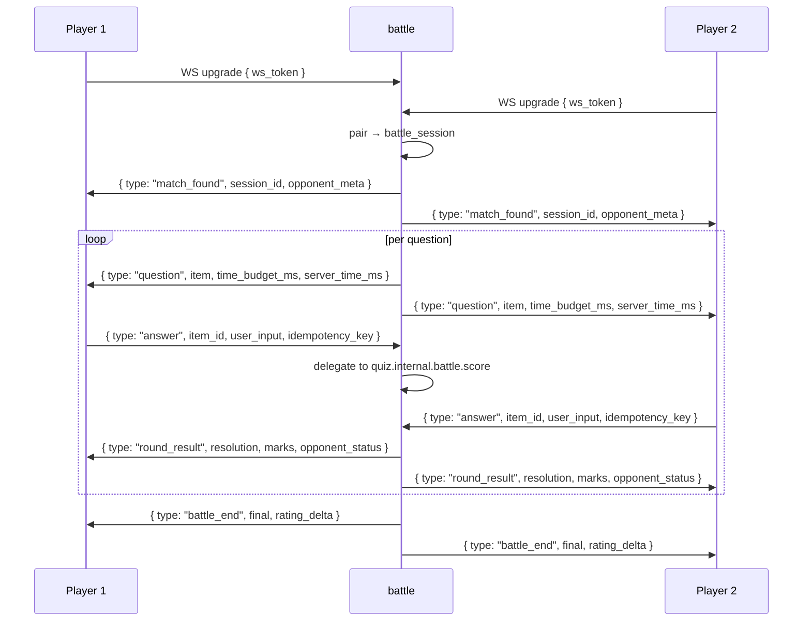

# User Stories — battle (service)

**Anchored to:** [Requirements](./02_requirements.md) · [BRD](./01_brd.md)

> Phase 1 is foundation only (~25 SP). Production launch ~265 SP in Phase 2.

---

## Epic Map

| Epic | Title | Stories | SP | Phase |
|------|-------|---------|----|-------|
| E-BT-01 | Foundation (Phase 1) | 5 | 25 | 1 |
| E-BT-02 | Matchmaking | 7 | 36 | 2 |
| E-BT-03 | WebSocket Session | 7 | 38 | 2 |
| E-BT-04 | Question Fanout | 4 | 22 | 2 |
| E-BT-05 | Answer + Race Scoring | 6 | 35 | 2 |
| E-BT-06 | Disconnect + Reconnect | 6 | 30 | 2 |
| E-BT-07 | Anti-Cheat | 5 | 22 | 2 |
| E-BT-08 | Rating + Ladder | 4 | 25 | 2 |
| E-BT-09 | Replay + History | 3 | 14 | 2 |
| E-BT-10 | Leaderboards | 3 | 13 | 2 |
| E-BT-11 | XP/Badge Events | 3 | 12 | 2 |
| E-BT-XC | Cross-cutting | 10 | 20 | 1 |
| **TOTAL** | | **63** | **292** | |

Phase 1 ≈ 45 SP · Phase 2 ≈ 247 SP.

---

## E-BT-03 — WebSocket Session (representative)

### S-BT-03.06 — Reconnect within grace

**P:** P0 · **SP:** 8

**As** a player **I want** to reconnect after a network blip and continue **so that** brief drops don't cost me the match.

**AC**
1. WS upgrade with same JWT + session_id query param.
2. Server checks `battle_sessions.status` and disconnect-grace deadline.
3. If within grace → resume; send current item + remaining time.
4. If grace expired → respond 410 `BATTLE_FORFEITED`.
5. Resume cannot bypass tick — server-authoritative time still ticking during grace.
6. Both players notified of reconnect.

**Negative:** wrong jwt, wrong session, grace expired.

### S-BT-03.05 — Graceful shutdown drain

**P:** P0 · **SP:** 8

**AC**
1. On SIGTERM, pod stops accepting new sessions.
2. Active sessions notified (msg: "server pausing, hold tight").
3. Hot state persisted to Postgres for resume on new pod.
4. After all active sessions complete or 60 s, exit.
5. Health check returns `not_ready` during drain (orchestrator routes away).

### Other stories (tables)

| ID | Story | P | SP |
|---|---|---|---|
| S-BT-03.01 | WS endpoint + JWT auth | P0 | 5 |
| S-BT-03.02 | Per-connection rate limit | P0 | 5 |
| S-BT-03.03 | Ping/pong heartbeat | P0 | 3 |
| S-BT-03.04 | Message protocol v1 | P0 | 5 |
| S-BT-03.07 | Message size cap | P0 | 4 |

---

## E-BT-05 — Answer + Race Scoring

### S-BT-05.02 — Delegate to quiz for scoring

**P:** P1 · **SP:** 8

(Battle calls `POST /v1/quiz/internal/battle/score` with item, user input, scoring profile. Receives Resolution + marks. Applies first-correct bonus on top.)

| ID | Story | P | SP |
|---|---|---|---|
| S-BT-05.01 | Answer via WS msg | P1 | 5 |
| S-BT-05.03 | First-correct bonus | P1 | 5 |
| S-BT-05.04 | Tie-break by server time | P1 | 3 |
| S-BT-05.05 | Late answer → 0 | P1 | 3 |
| S-BT-05.06 | Notify both players after both answer | P1 | 5 |
| S-BT-05.07 | Idempotency on answer | P0 | 6 |

---

## E-BT-01 — Foundation (Phase 1)

| ID | Story | P | SP |
|---|---|---|---|
| S-BT-01.01 | Go service scaffold + golang-migrate | P0 | 5 |
| S-BT-01.02 | `battle_schema` initial migration | P0 | 8 |
| S-BT-01.03 | Health/ready + OTel | P0 | 3 |
| S-BT-01.04 | JWT validate integration | P0 | 5 |
| S-BT-01.05 | NATS publish bootstrap | P0 | 4 |

---

## E-BT-02 — Matchmaking

7 stories per FA-01.

## E-BT-04 — Question Fanout

4 stories per FA-03.

## E-BT-06 — Disconnect

6 stories per FA-05.

## E-BT-07 — Anti-Cheat

5 stories per FA-06.

## E-BT-08 — Rating

4 stories per FA-07.

## E-BT-09 — Replay

3 stories per FA-08.

## E-BT-10 — Leaderboards

3 stories per FA-09.

## E-BT-11 — XP/Badge Events

3 stories per FA-10.

## E-BT-XC

10 cross-cutting stories.

---

## WebSocket Protocol (v1)

Embedded here for completeness. Full grammar in [05_api_contract.md](./05_api_contract.md).

