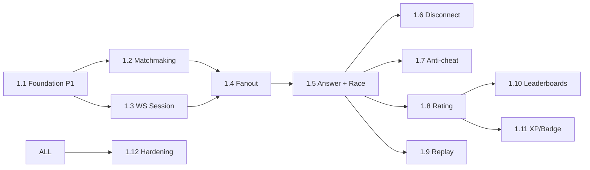

# Work Breakdown Structure — battle (service)

**Estimation basis:** 1 Go BE + 0.25 DevOps + 0.25 QA. Velocity: **18 SP / 2-wk sprint**.

**Phase 1:** ~45 SP foundation only (~3 sprints). Phase 2: ~247 SP → ~14 sprints.

---

## WBS Hierarchy

```
1.0 battle
├── 1.1 Phase 1 — Foundation
├── 1.2 Phase 2 — Matchmaking
├── 1.3 Phase 2 — WebSocket Session
├── 1.4 Phase 2 — Question Fanout
├── 1.5 Phase 2 — Answer + Race Scoring (delegates to quiz)
├── 1.6 Phase 2 — Disconnect + Reconnect
├── 1.7 Phase 2 — Anti-Cheat
├── 1.8 Phase 2 — Rating + Ladder (Glicko-2)
├── 1.9 Phase 2 — Replay + History
├── 1.10 Phase 2 — Leaderboards
├── 1.11 Phase 2 — XP/Badge Events
└── 1.12 Phase 2 — Hardening + Load Test
```

## Phase 1 (S0–S2) · 45 SP

| WP | Activity | SP |
|----|----------|----|
| WP-BT-1.1.1 | Go scaffold + golang-migrate | 5 |
| WP-BT-1.1.2 | `battle_schema` initial migration | 8 |
| WP-BT-1.1.3 | Health/ready + OTel | 3 |
| WP-BT-1.1.4 | JWT validate library integration | 5 |
| WP-BT-1.1.5 | NATS publish bootstrap | 4 |
| WP-BT-1.1.6 | Redis client | 3 |
| WP-BT-1.1.7 | OpenAPI scaffold | 2 |
| WP-BT-1.1.8 | WS endpoint placeholder + ping/pong proof of life | 5 |
| WP-BT-1.1.9 | Cross-cutting basics | 10 |

## Phase 2 (S3–S16) · 247 SP

| WP | Section | SP |
|----|---------|----|
| 1.2 Matchmaking | 36 |
| 1.3 WebSocket Session | 38 |
| 1.4 Question Fanout | 22 |
| 1.5 Answer + Race Scoring (delegate to quiz) | 35 |
| 1.6 Disconnect + Reconnect | 30 |
| 1.7 Anti-Cheat | 22 |
| 1.8 Rating + Ladder | 25 |
| 1.9 Replay + History | 14 |
| 1.10 Leaderboards | 13 |
| 1.11 XP/Badge Events | 12 |

## 1.12 Hardening (Phase 2 end) · 30 SP

| WP | Activity | SP |
|----|----------|----|
| WP-BT-1.12.1 | 1000-concurrent-battle load | 8 |
| WP-BT-1.12.2 | Chaos: kill pod mid-battle | 5 |
| WP-BT-1.12.3 | Anti-cheat heuristic integration | 5 |
| WP-BT-1.12.4 | Rating system replay determinism | 5 |
| WP-BT-1.12.5 | WS protocol fuzz test | 3 |
| WP-BT-1.12.6 | Sign-offs | 4 |

---

## Dependency DAG



---

## Capacity & Risk

| Item | Value |
|---|---|
| Team | 1 Go BE + 0.25 DevOps + 0.25 QA |
| Velocity | 18 SP / sprint |
| Phase 1 | 45 SP (~3 sprints) |
| Phase 2 | 247 SP (~14 sprints) |
| Buffer | 25% |
| Top risks | WS pod restart (R-BT-01) · Cheating (R-BT-03) · Matchmaking starvation (R-BT-04) | See [BRD §10](./01_brd.md#10-risks) |

---

## DoD

- ✅ All P0/P1 stories shipped + tests
- ✅ NFR-BT-* verified (esp p99 < 150 ms)
- ✅ 1000-concurrent-battle load test
- ✅ Chaos test (pod kill mid-battle) passed
- ✅ Anti-cheat baseline live
- ✅ Beta with feature flag → full rollout
