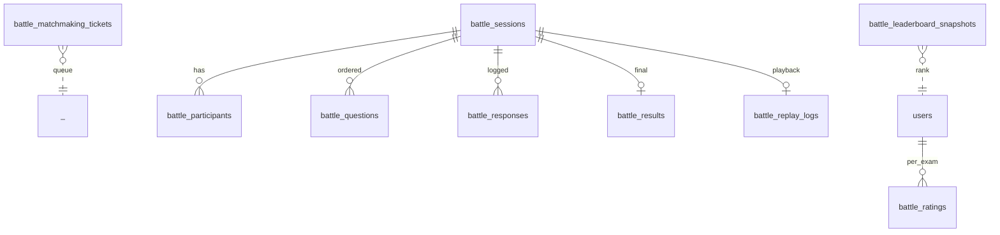

# Data Model — battle (service)

**Schema:** `battle_schema` (Aurora) + Redis (hot state)

---

## ERD



---

## Tables

### `battle_matchmaking_tickets`
Volatile; can also live in Redis primarily.

| Col | Type |
|-----|------|
| ticket_id | uuid PK |
| user_id | uuid |
| exam | text |
| topic_id | uuid nullable |
| difficulty_band | enum |
| rating_at_request | int |
| status | enum (waiting, matched, expired, cancelled) |
| created_at | timestamptz |
| expires_at | timestamptz |
| matched_session_id | uuid nullable |

### `battle_sessions`
| Col | Type |
|-----|------|
| id | uuid PK |
| exam | text |
| topic_id | uuid nullable |
| difficulty_band | enum |
| n_items | int |
| status | enum (active, ended, forfeited, abandoned) |
| started_at, ended_at | timestamptz |
| winner_user_id | uuid nullable |

### `battle_participants`
| Col | Type |
|-----|------|
| session_id | uuid FK |
| user_id | uuid |
| seat | int | 0 or 1 |
| rating_before | int |
| rating_after | int nullable |
| result | enum (won, lost, draw, forfeited) nullable |
| total_marks | numeric default 0 |
| PRIMARY KEY (session_id, user_id) |

### `battle_questions`
Ordered item sequence per session.

| Col | Type |
|-----|------|
| session_id | uuid FK |
| q_seq | int |
| item_id | uuid |
| time_budget_ms | int |
| started_at_server | timestamptz |
| PRIMARY KEY (session_id, q_seq) |

### `battle_responses`
| Col | Type |
|-----|------|
| id | uuid PK |
| session_id | uuid FK |
| q_seq | int |
| user_id | uuid |
| user_input | jsonb |
| resolution | jsonb | from quiz |
| marks | numeric |
| answered_at_server | timestamptz |
| time_taken_ms | int |
| was_first_correct | bool default false |
| idempotency_key | uuid |
| UNIQUE (session_id, q_seq, user_id, idempotency_key) |

### `battle_results`
| Col | Type |
|-----|------|
| session_id | uuid PK |
| winner_user_id | uuid nullable |
| loser_user_id | uuid nullable |
| draw | bool default false |
| marks_player_0 | numeric |
| marks_player_1 | numeric |
| rating_delta_0 | int |
| rating_delta_1 | int |
| computed_at | timestamptz |

### `battle_replay_logs`
Compressed event log for replay.

| Col | Type |
|-----|------|
| session_id | uuid PK |
| events | jsonb | array of WS-protocol events with server timestamps |
| compressed | bool |

### `battle_ratings`
Per-exam Glicko-2 state.

| Col | Type |
|-----|------|
| user_id | uuid |
| exam | text |
| rating | numeric |
| rd | numeric | Glicko deviation |
| volatility | numeric |
| n_battles | int |
| last_updated_at | timestamptz |
| PRIMARY KEY (user_id, exam) |

### `battle_leaderboard_snapshots`
Per-period snapshots.

| Col | Type |
|-----|------|
| period_type | enum (daily, weekly) |
| period | text | YYYY-MM-DD or YYYY-WW |
| exam | text |
| user_id | uuid |
| rank | int |
| rating | numeric |
| snapshot_at | timestamptz |
| PRIMARY KEY (period_type, period, exam, user_id) |

### `battle_anomalies`
Anti-cheat log.

| Col | Type |
|-----|------|
| id | uuid PK |
| session_id | uuid |
| user_id | uuid |
| kind | enum (fast_answer, tab_switch, rate_limit, suspicious_speed, ...) |
| details | jsonb |
| at | timestamptz |

---

## Redis Keys (Hot State)

| Key | Value | TTL |
|---|---|---|
| `battle:session:{id}:state` | JSON | until ended + 30s |
| `battle:mm:pool:{exam}:{band}` | sorted set by ticket created_at | until matched |
| `battle:ws:user:{user_id}` | connection metadata | session lifetime |
| `battle:rating:{user_id}:{exam}` | cached rating | TTL 5 min |

---

## Migrations (golang-migrate)

```
001_create_battle_schema.up.sql
002_matchmaking_tickets.up.sql
003_sessions_participants.up.sql
004_questions_responses.up.sql
005_results_and_replay.up.sql
006_ratings.up.sql
007_leaderboard_snapshots.up.sql
008_anomalies.up.sql
009_indexes.up.sql
```

---

## Retention

| Table | Retention |
|---|---|
| `battle_sessions` / `participants` / `responses` / `results` | indefinite |
| `battle_replay_logs` | 90 d |
| `battle_matchmaking_tickets` | 7 d (then purged) |
| `battle_anomalies` | 1 year |
| `battle_ratings` | indefinite |
| `battle_leaderboard_snapshots` | 1 year |
