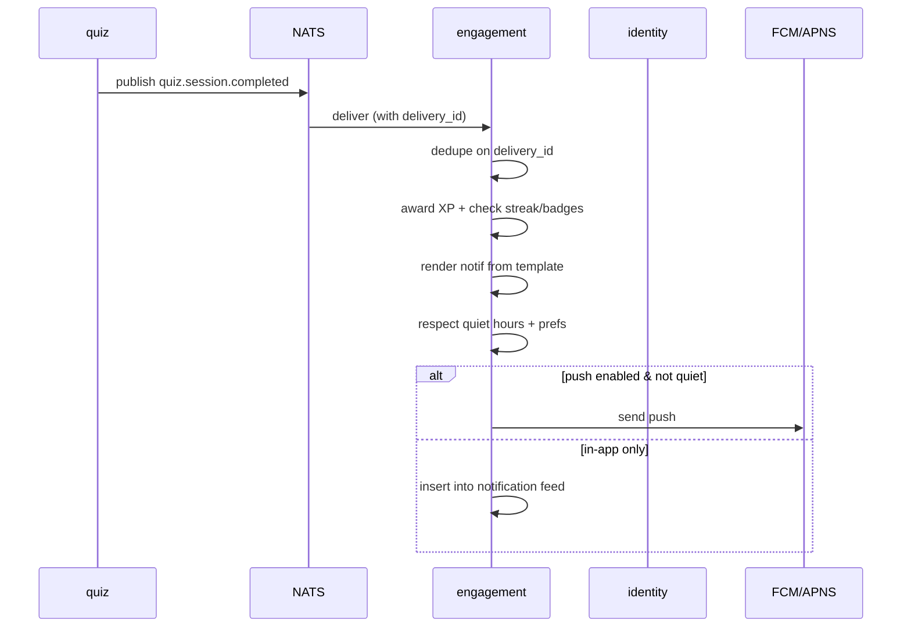

# User Stories — engagement (service)

**Anchored to:** [Requirements](./02_requirements.md) · [BRD](./01_brd.md)

---

## Epic Map

| Epic | Title | Stories | SP | Phase | P |
|------|-------|---------|----|-------|---|
| E-EN-01 | Channel Routing | 6 | 28 | 1 | P0 |
| E-EN-02 | User Notification Prefs | 5 | 16 | 1 | P0 |
| E-EN-03 | Templates + i18n | 6 | 24 | 1 | P0 |
| E-EN-04 | Delivery Tracking | 4 | 16 | 1 | P0 |
| E-EN-05 | Quiet Hours | 4 | 14 | 1 | P0 |
| E-EN-06 | Community Threads | 4 | 20 | 2 | P1 |
| E-EN-07 | Comments + Reactions + Reports | 6 | 26 | 2 | P1 |
| E-EN-08 | Moderation Handoff | 4 | 18 | 2 | P1 |
| E-EN-09 | Gamification | 7 | 32 | 1 | P1 |
| E-EN-10 | Leaderboards | 4 | 18 | 2 | P2 |
| E-EN-11 | Broadcasts | 6 | 28 | 2 | P1 |
| E-EN-12 | NATS Event Ingestion | 7 | 30 | 1 | P0 |
| E-EN-13 | In-App Messaging | 4 | 18 | 2 | P2 |
| E-EN-XC | Cross-cutting | 10 | 20 | 1 | P0 |
| **TOTAL** | | **77** | **308** | | |

Phase 1 ≈ 180 SP · Phase 2 ≈ 128 SP.

---

## E-EN-09 — Gamification (representative)

### S-EN-09.03 — Streak shield (1 missed day/month grace)

**P:** P1 · **SP:** 5 · **Maps to:** FR-EN-09-03

**As** an engaged user **I want** to miss one day a month without losing my streak **so that** illness/travel doesn't punish me.

**AC**
1. On daily streak roll-over job (per user TZ at midnight), compute previous-day activity.
2. If user did NOT log activity yesterday AND `streak_shields_used_this_month < 1` → consume shield, preserve streak.
3. If shield consumed → mark `streaks.shields_used += 1`, log event.
4. Calendar month boundary resets `shields_used = 0`.
5. UI surfaces shield availability (FR-EN-09-06).
6. If shield consumed → notif "Streak shield used; you have 0 left this month."
7. If no shield + no activity → streak resets to 0; notif "Streak broken — start a new one!"
8. Test: shield restore at month start.

**API:** `GET /v1/engagement/me/gamification`.

**Data:** `streaks (user_id PK, current_streak, longest_streak, last_active_at, shields_used_this_month, month)`.

**QA:** unit tests for boundary conditions; integration test with TZ shift.

### S-EN-09.01 — XP awards

**P:** P1 · **SP:** 5

(Event-driven XP table: e.g. quiz_complete = 10, perfect_score = 25, daily_login = 5; configurable via admin.)

| ID | Story | P | SP |
|---|---|---|---|
| S-EN-09.02 | Streak tracker | P1 | 5 |
| S-EN-09.04 | Badges catalogue | P1 | 5 |
| S-EN-09.05 | Badge unlock | P1 | 5 |
| S-EN-09.06 | Streak-broken UX | P1 | 3 |
| S-EN-09.07 | XP/streak history | P2 | 4 |

---

## E-EN-12 — NATS Event Ingestion (representative)

### S-EN-12.06 — Idempotent on delivery id

**P:** P0 · **SP:** 5

(Each NATS msg has a unique id; store in `processed_events` to dedupe. Exactly-once semantics.)

| ID | Story | P | SP |
|---|---|---|---|
| S-EN-12.01 | Consume quiz.session.completed | P0 | 5 |
| S-EN-12.02 | Consume payment.invoice.failed | P0 | 5 |
| S-EN-12.03 | Consume learning.kappa.paused | P1 | 3 |
| S-EN-12.04 | Consume marketplace.session.completed | P1 | 3 |
| S-EN-12.05 | Consume battle.match.completed | P1 | 3 |
| S-EN-12.07 | DLQ for poison events | P0 | 6 |

---

## Other Epics (table-form)

| Epic | Stories |
|------|---------|
| E-EN-01 | 6 stories per FA-01 (in-app, email, FCM, APNS, SMS, fallback) |
| E-EN-02 | 5 stories per FA-02 |
| E-EN-03 | 6 stories per FA-03 |
| E-EN-04 | 4 stories per FA-04 |
| E-EN-05 | 4 stories per FA-05 |
| E-EN-06 | 4 stories per FA-06 |
| E-EN-07 | 6 stories per FA-07 |
| E-EN-08 | 4 stories per FA-08 |
| E-EN-10 | 4 stories per FA-10 |
| E-EN-11 | 6 stories per FA-11 (incl 100k fan-out story) |
| E-EN-13 | 4 stories per FA-13 |
| E-EN-XC | 10 stories — standard |

---

## Flow Diagrams

### Quiz finished → XP + notif



### Daily streak shield job

```mermaid
sequenceDiagram
  participant Cron
  participant EN as engagement
  Cron->>EN: runStreakRollover(date)
  loop per user (sharded by TZ)
    EN->>EN: was user active yesterday?
    alt yes
      EN->>EN: streak += 1
    else no AND shields_used_this_month < 1
      EN->>EN: shields_used += 1; streak preserved
      EN->>EN: notif "shield used"
    else no
      EN->>EN: streak = 0
      EN->>EN: notif "streak broken"
    end
  end
```
