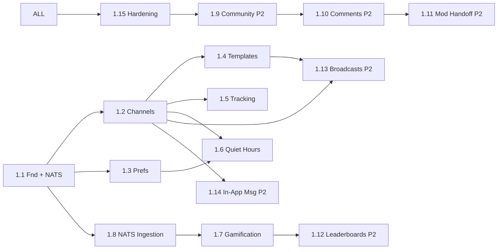

# Work Breakdown Structure — engagement (service)

**Estimation basis:** 1 BE + 0.25 DevOps + 0.25 QA. Velocity: **18 SP / 2-wk sprint**.

**Phase 1:** ~180 SP → ~10 sprints (~5 months). Phase 2: ~128 SP → ~7 sprints.

> Reminder: OQ-EN-00 service-ceiling decision must precede long-term commit.

---

## WBS Hierarchy

```
1.0 engagement
├── 1.1 Foundations + Schema + NATS bootstrap
├── 1.2 Channel Routing
├── 1.3 User Notif Prefs
├── 1.4 Templates + i18n
├── 1.5 Delivery Tracking
├── 1.6 Quiet Hours
├── 1.7 Gamification (XP/streak/shield/badges)
├── 1.8 NATS Event Ingestion
├── 1.9 Community Threads (Phase 2)
├── 1.10 Comments + Reactions + Reports (Phase 2)
├── 1.11 Moderation Handoff (Phase 2)
├── 1.12 Leaderboards (Phase 2)
├── 1.13 Broadcasts (Phase 2)
├── 1.14 In-App Messaging (Phase 2)
└── 1.15 Hardening + Compliance Review
```

## Phase 1 (S0–S10) ≈ 180 SP

| WP | Section | SP |
|----|---------|----|
| 1.1 Foundations + NATS consumer scaffold + OpenAPI + OTel | 25 |
| 1.2 Channel Routing (in-app + email + push) | 22 |
| 1.3 Prefs | 16 |
| 1.4 Templates + en/hi | 24 |
| 1.5 Delivery Tracking | 16 |
| 1.6 Quiet Hours | 14 |
| 1.7 Gamification | 32 |
| 1.8 NATS Ingestion (2 critical events + dedupe + DLQ) | 16 |
| 1.15 Hardening + compliance | 15 |

## Phase 2 (S11–S17) ≈ 128 SP

| WP | Section | SP |
|----|---------|----|
| 1.9 Community Threads | 20 |
| 1.10 Comments + Reports | 26 |
| 1.11 Moderation Handoff | 18 |
| 1.12 Leaderboards | 18 |
| 1.13 Broadcasts | 28 |
| 1.14 In-App Messaging | 18 |

## 1.15 Hardening · 15 SP

| WP | Activity | SP |
|----|----------|----|
| WP-EN-1.15.1 | Compliance: unsubscribe, opt-in, India spam law | 5 |
| WP-EN-1.15.2 | NATS exactly-once verification (chaos test) | 3 |
| WP-EN-1.15.3 | Quiet-hours cross-TZ test | 3 |
| WP-EN-1.15.4 | Fan-out 100k broadcast load test | 2 |
| WP-EN-1.15.5 | Sign-offs | 2 |

---

## Dependency DAG



---

## Capacity & Risk

| Item | Value | Note |
|---|---|---|
| Team | 1 BE + 0.25 DevOps + 0.25 QA | |
| Velocity | 18 SP / sprint | |
| Phase 1 SP | 180 | Excludes community/broadcasts/leaderboards |
| Phase 1 duration | ~10 sprints | |
| Buffer | 20% | NATS edge cases |
| Top risks | Spam complaints (R-EN-01) · Double credit streak (R-EN-02) · Service ceiling (R-EN-06) | See [BRD §10](./01_brd.md#10-risks) |

---

## Definition of Done

engagement Phase 1 **Done** when:

- ✅ All P0 stories shipped + tests
- ✅ NFR-EN-* verified
- ✅ Unsubscribe + opt-in compliance attested
- ✅ NATS exactly-once chaos test green
- ✅ Quiet hours verified across 5 TZs
- ✅ Streak shield month-boundary verified
- ✅ Delivery dashboards live
- ✅ **OQ-EN-00 ADR filed** (resolve service-ceiling decision)
