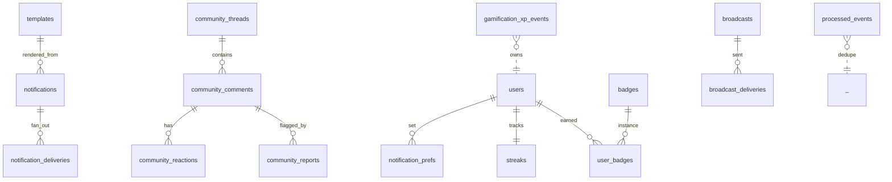

# Data Model — engagement (service)

**Schema:** `engagement_schema`

---

## ERD



---

## Tables

### `notifications`
| Col | Type |
|-----|------|
| id | uuid PK |
| user_id | uuid |
| category | enum (mission, payment, social, system, marketing, support) |
| template_key | text |
| params | jsonb |
| body_rendered | text | for in-app |
| priority | enum (low, normal, high, critical) |
| created_at | timestamptz |
| read_at | timestamptz nullable |

**Indexes:** `(user_id, created_at DESC)`, `(user_id, read_at) WHERE read_at IS NULL`.

### `notification_deliveries`
Per-channel attempt.

| Col | Type |
|-----|------|
| id | uuid PK |
| notification_id | uuid FK |
| channel | enum (in_app, email, push, sms) |
| status | enum (queued, sent, delivered, opened, clicked, bounced, failed, suppressed) |
| provider | text |
| provider_msg_id | text nullable |
| attempted_at | timestamptz |
| status_updated_at | timestamptz |
| failure_reason | text nullable |

### `notification_prefs`
| Col | Type |
|-----|------|
| user_id | uuid PK |
| matrix | jsonb | `{channel: {category: bool}}` |
| quiet_hours_start | time nullable |
| quiet_hours_end | time nullable |
| timezone | text default 'Asia/Kolkata' |
| paused | bool default false |
| updated_at | timestamptz |

### `templates`
| Col | Type |
|-----|------|
| key | text PK |
| version | int |
| locale | text |
| channel_variants | jsonb | `{in_app: "...", email_subject: "...", email_body: "...", push: "..."}` |
| schema | jsonb | variable types |
| created_at | timestamptz |

### `community_threads` (Phase 2)
| Col | Type |
|-----|------|
| id | uuid PK |
| author_id | uuid |
| topic_id | uuid nullable | learning topic ref |
| title | text |
| body | text |
| created_at, updated_at | timestamptz |
| status | enum (active, locked, deleted) |
| reply_count | int default 0 |

### `community_comments` (Phase 2)
| Col | Type |
|-----|------|
| id | uuid PK |
| thread_id | uuid FK |
| author_id | uuid |
| body | text |
| parent_comment_id | uuid nullable |
| created_at, updated_at | timestamptz |
| status | enum (active, hidden, deleted) |
| moderation_flag | bool default false |

### `community_reactions` (Phase 2)
| Col | Type |
|-----|------|
| target_id | uuid | (thread or comment) |
| target_type | enum |
| user_id | uuid |
| kind | enum (like, helpful, agree) |
| at | timestamptz |
| PRIMARY KEY (target_id, user_id, kind) |

### `community_reports` (Phase 2)
| Col | Type |
|-----|------|
| id | uuid PK |
| target_id | uuid |
| target_type | enum |
| reporter_id | uuid |
| reason | text |
| comment | text nullable |
| at | timestamptz |
| status | enum (open, resolved_kept, resolved_hidden, resolved_removed) |
| moderator_id | uuid nullable |

### `gamification_xp_events`
| Col | Type |
|-----|------|
| id | uuid PK |
| user_id | uuid |
| event_type | text |
| xp_awarded | int |
| source_event_id | text | NATS delivery id for dedupe |
| at | timestamptz |

**Indexes:** `(user_id, at DESC)`, UNIQUE `(source_event_id) WHERE source_event_id IS NOT NULL`.

### `streaks`
| Col | Type |
|-----|------|
| user_id | uuid PK |
| current_streak | int default 0 |
| longest_streak | int default 0 |
| last_active_date | date |
| shields_used_this_month | int default 0 |
| shields_month | text | YYYY-MM |
| timezone | text default 'Asia/Kolkata' |
| updated_at | timestamptz |

### `badges` (catalogue)
| Col | Type |
|-----|------|
| id | text PK |
| name | text |
| description | text |
| icon_url | text |
| criteria | jsonb | condition spec |

### `user_badges`
| Col | Type |
|-----|------|
| user_id | uuid |
| badge_id | text |
| earned_at | timestamptz |
| PRIMARY KEY (user_id, badge_id) |

### `leaderboards_snapshots` (Phase 2)
| Col | Type |
|-----|------|
| scope | text |
| period | text | YYYY-MM-DD or YYYY-WW |
| user_id | uuid |
| rank | int |
| score | numeric |
| snapshot_at | timestamptz |
| PRIMARY KEY (scope, period, user_id) |

### `broadcasts` (Phase 2)
| Col | Type |
|-----|------|
| id | uuid PK |
| subject | text |
| body | text |
| audience | jsonb |
| status | enum (scheduled, sending, sent, canceled) |
| scheduled_at | timestamptz nullable |
| sent_at | timestamptz nullable |
| created_by | uuid |

### `broadcast_deliveries` (Phase 2)
Per-user delivery.

### `processed_events`
NATS dedupe.

| Col | Type |
|-----|------|
| delivery_id | text PK |
| event_type | text |
| processed_at | timestamptz |
| outcome | text |

### `dlq_events`
For poison events.

| Col | Type |
|-----|------|
| id | uuid PK |
| delivery_id | text |
| event_type | text |
| payload | jsonb |
| error | text |
| at | timestamptz |

---

## Migrations

```
001_notifications_core.py
002_templates.py
003_notification_prefs.py
004_gamification.py
005_processed_events.py
006_dlq.py
007_community.py            -- Phase 2
008_leaderboards.py         -- Phase 2
009_broadcasts.py           -- Phase 2
010_messaging.py            -- Phase 2 (lightweight)
```

---

## Retention

| Table | Retention |
|---|---|
| `notifications` | 6 months (in-app) |
| `notification_deliveries` | 90 d |
| `gamification_xp_events` | indefinite (lifetime XP) |
| `processed_events` | 30 d |
| `dlq_events` | 90 d |
| `community_*` | indefinite (subject to legal hold) |
| `broadcasts` | indefinite |
| `templates` | indefinite (versioned) |
