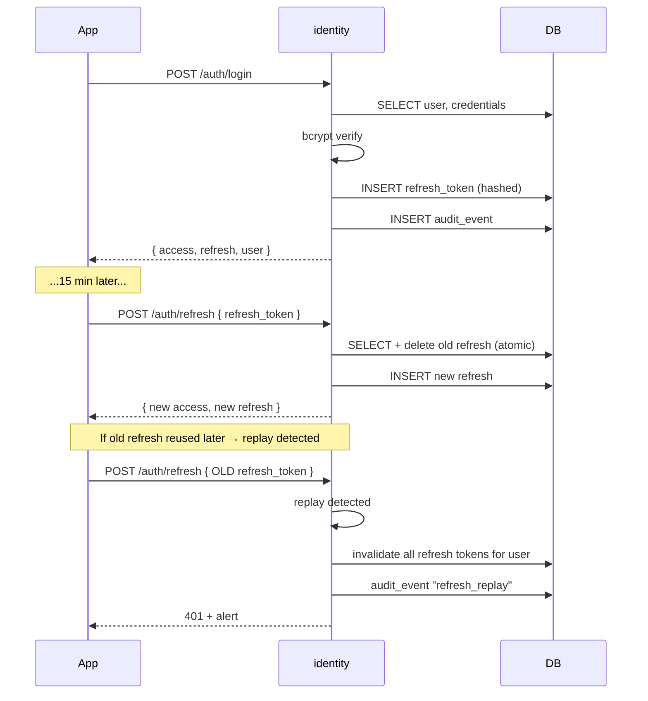
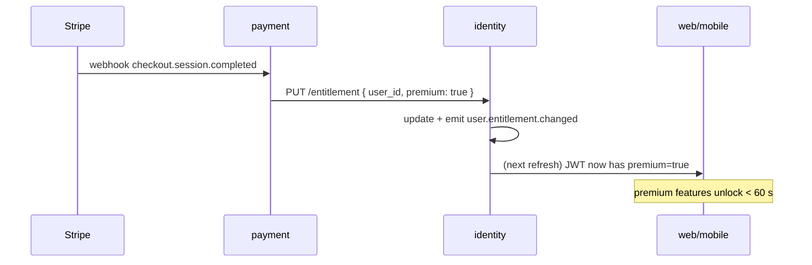

# User Stories — identity (service)

**Anchored to:** [Requirements](./02_requirements.md) · [BRD](./01_brd.md)

---

## Epic Map

| Epic | Title | Stories | SP | Phase | P |
|------|-------|---------|----|-------|---|
| E-ID-01 | Account Lifecycle | 12 | 50 | 1 | P0 |
| E-ID-02 | Authentication (multi-method) | 14 | 70 | 1 | P0 |
| E-ID-03 | Session & Token | 11 | 55 | 1 | P0 |
| E-ID-04 | RBAC & Entitlements | 8 | 40 | 1 | P0 |
| E-ID-05 | MFA | 5 | 25 | 1–2 | P0/P2 |
| E-ID-06 | Device Mgmt | 4 | 18 | 1–2 | P1 |
| E-ID-07 | Audit & Security Events | 6 | 30 | 1 | P0 |
| E-ID-08 | DPDPA Compliance | 7 | 33 | 1 | P0 |
| E-ID-09 | Admin Operations | 7 | 30 | 1–2 | P0/P1 |
| E-ID-10 | Federation | 4 | 22 | 1.5–3 | P1/P2 |
| E-ID-XC | Cross-cutting | 10 | 25 | 1 | P0 |
| **TOTAL** | | **88** | **398** | | |

Phase 1 ≈ 290 SP · Phase 2 ≈ 90 SP · Phase 3 ≈ 18 SP.

---

## E-ID-02 — Authentication (representative epic — full detail)

### S-ID-02.01 — Login with email + password

**P:** P0 · **SP:** 5 · **Maps to:** FR-ID-02-01

**As** a consuming app **I want** to authenticate users by email + password **so that** I can establish a session.

**AC**
1. `POST /v1/identity/auth/login { email, password }` returns 200 with `{ access_token, refresh_token, user, expires_in }`.
2. Email normalised to lowercase.
3. bcrypt verify (constant-time).
4. On wrong password → 401 with same error shape as wrong-email (no enumeration).
5. Failed-login counter (per identifier, sliding 15 min); 5 fails → 401 `RATE_LIMITED` with `retry_after_sec`.
6. CAPTCHA token validated after 3 failed attempts (front-end sends).
7. Audit event `login_success` or `login_fail`.
8. User in `suspended` status → 403 `SUSPENDED`.
9. User in `pending_otp` status → 403 `NOT_VERIFIED` with OTP resend hint.
10. User in `deleted_pending` status (within grace) → 410 `DELETION_PENDING`.

**API:** see [05_api_contract.md](./05_api_contract.md) `POST /v1/identity/auth/login`.

**Data:** read `auth_schema.users` + `auth_schema.credentials`; write `auth_schema.refresh_tokens`, `auth_schema.audit_events`.

**Negative:** suspended · deleted-pending · pending-otp · wrong-password · rate-limited · invalid-CAPTCHA.

**QA:**
- Unit: hashing, normalisation, status branches.
- Integration: full happy + 5 negatives.
- Load: 1000 concurrent logins p95 < 300 ms.

**DoD:** OpenAPI updated; OTel spans; metrics emitted; doc'd in README.

### S-ID-02.05 — Biometric bind (device-bound refresh proof)

**P:** P0 · **SP:** 8 · **Maps to:** FR-ID-02-05

**As** a mobile app **I want** to bind a biometric to a device-specific refresh proof **so that** users can unlock without password.

**AC**
1. `POST /v1/identity/auth/biometric/bind { device_id, public_key, attestation? }` (only with authenticated session).
2. Stores `auth_schema.biometric_factors { user_id, device_id, public_key, created_at }`.
3. Server signs a per-device challenge for unlock flow.
4. Unlock: `POST /v1/identity/auth/biometric/unlock { device_id, challenge_signature }` → returns tokens if verified.
5. Failed unlock: increment device-specific counter; lock after 5 fails.
6. Unbind on logout-everywhere; unbind on password change.
7. Public key never exposed externally.

**Negative:** invalid signature · revoked device · stale challenge.

**QA:** Patrol on iOS + Android; key rotation test.

### S-ID-02.10 — Forgot password

**P:** P0 · **SP:** 5

(Standard: rate-limited link send, 30-min token, invalidates sessions on reset.)

| ID | Story | P | SP |
|---|---|---|---|
| S-ID-02.02 | Login phone OTP | P0 | 5 |
| S-ID-02.03 | Google OAuth | P0 | 5 |
| S-ID-02.04 | Apple Sign In | P0 | 5 |
| S-ID-02.06 | Biometric unlock | P0 | 5 |
| S-ID-02.07 | Send OTP email | P0 | 3 |
| S-ID-02.08 | Send OTP SMS (Twilio) | P0 | 5 |
| S-ID-02.09 | OTP verify | P0 | 3 |
| S-ID-02.11 | Reset password | P0 | 5 |
| S-ID-02.12 | Login rate-limit + lockout | P0 | 5 |
| S-ID-02.13 | CAPTCHA gating | P0 | 3 |
| S-ID-02.14 | Password breach check | P1 | 5 |

---

## E-ID-01 — Account Lifecycle

| ID | Story | P | SP |
|---|---|---|---|
| S-ID-01.01 | Signup email + password | P0 | 5 |
| S-ID-01.02 | Signup phone + OTP | P0 | 5 |
| S-ID-01.03 | OTP verify → activate | P0 | 3 |
| S-ID-01.04 | Email/phone uniqueness | P0 | 3 |
| S-ID-01.05 | Soft delete | P0 | 5 |
| S-ID-01.06 | Daily purge job | P0 | 5 |
| S-ID-01.07 | Suspend | P0 | 3 |
| S-ID-01.08 | Unsuspend | P0 | 2 |
| S-ID-01.09 | Email-change verify-new | P0 | 5 |
| S-ID-01.10 | Phone-change OTP-new | P0 | 5 |
| S-ID-01.11 | Reactivate within grace | P1 | 3 |
| S-ID-01.12 | Email reservation 30 d | P0 | 3 |

---

## E-ID-03 — Session & Token

| ID | Story | P | SP |
|---|---|---|---|
| S-ID-03.01 | Issue access JWT (RS256) | P0 | 5 |
| S-ID-03.02 | Issue refresh token | P0 | 3 |
| S-ID-03.03 | Refresh rotation endpoint | P0 | 5 |
| S-ID-03.04 | Replay detection + alert | P0 | 8 |
| S-ID-03.05 | Logout (revoke refresh) | P0 | 3 |
| S-ID-03.06 | Logout-everywhere | P1 | 5 |
| S-ID-03.07 | Shared JWT validate lib | P0 | 8 |
| S-ID-03.08 | JWKS endpoint | P0 | 3 |
| S-ID-03.09 | Signing-key rotation | P0 | 5 |
| S-ID-03.10 | Refresh token hashed at rest | P0 | 3 |
| S-ID-03.11 | Single-flight refresh dedup | P0 | 7 |

---

## E-ID-04 — RBAC & Entitlements

| ID | Story | P | SP |
|---|---|---|---|
| S-ID-04.01 | Roles + permissions matrix | P0 | 5 |
| S-ID-04.02 | JWT carries role+entitlement claims | P0 | 5 |
| S-ID-04.03 | Entitlement update from payment | P0 | 8 |
| S-ID-04.04 | Entitlement flip < 60 s | P0 | 5 |
| S-ID-04.05 | Marketplace payouts_enabled | P0 | 3 |
| S-ID-04.06 | Institution-admin scope | P1 | 5 |
| S-ID-04.07 | Role escalation flow | P0 | 5 |
| S-ID-04.08 | RBAC documented + tested | P0 | 4 |

---

## E-ID-05 — MFA

| ID | Story | P | SP |
|---|---|---|---|
| S-ID-05.01 | TOTP enrollment (admin Phase 1) | P0 | 8 |
| S-ID-05.02 | TOTP verify | P0 | 5 |
| S-ID-05.03 | Remove TOTP | P1 | 3 |
| S-ID-05.04 | FIDO2/WebAuthn admin | P1 | 5 |
| S-ID-05.05 | Backup codes | P0 | 4 |

---

## E-ID-06 — Device Mgmt

| ID | Story | P | SP |
|---|---|---|---|
| S-ID-06.01 | Record device on session | P0 | 3 |
| S-ID-06.02 | List my devices | P1 | 5 |
| S-ID-06.03 | Revoke device | P1 | 5 |
| S-ID-06.04 | Trust-device (Phase 2) | P2 | 5 |

---

## E-ID-07 — Audit & Security Events

| ID | Story | P | SP |
|---|---|---|---|
| S-ID-07.01 | Emit audit events on all key actions | P0 | 8 |
| S-ID-07.02 | Append-only + hash chain | P0 | 5 |
| S-ID-07.03 | Search audit | P0 | 5 |
| S-ID-07.04 | Export audit | P1 | 3 |
| S-ID-07.05 | Retention enforcement | P0 | 5 |
| S-ID-07.06 | Hash-chain integrity verifier (daily job) | P0 | 4 |

---

## E-ID-08 — DPDPA Compliance

| ID | Story | P | SP |
|---|---|---|---|
| S-ID-08.01 | Download-my-data orchestrator | P0 | 8 |
| S-ID-08.02 | Async export job + email link | P0 | 5 |
| S-ID-08.03 | Soft delete | P0 | 3 |
| S-ID-08.04 | Cancel deletion in grace | P0 | 3 |
| S-ID-08.05 | Cross-service `user.purged` event | P0 | 5 |
| S-ID-08.06 | Legal hold override | P0 | 5 |
| S-ID-08.07 | Parental consent (under-18) | P1 | 4 |

---

## E-ID-09 — Admin Operations

| ID | Story | P | SP |
|---|---|---|---|
| S-ID-09.01 | Search users API | P0 | 5 |
| S-ID-09.02 | View user (read-only admin API) | P0 | 3 |
| S-ID-09.03 | Force password reset (admin) | P0 | 3 |
| S-ID-09.04 | Suspend / unsuspend (admin) | P0 | 3 |
| S-ID-09.05 | Impersonate (with audit, OQ) | P1 | 8 |
| S-ID-09.06 | Force logout-everywhere | P0 | 3 |
| S-ID-09.07 | Initiate deletion on behalf | P0 | 5 |

---

## E-ID-10 — Federation

| ID | Story | P | SP |
|---|---|---|---|
| S-ID-10.01 | OIDC IdP integration (admin) | P0 | 8 |
| S-ID-10.02 | SAML for institutions | P1 | 8 |
| S-ID-10.03 | JIT provisioning | P1 | 3 |
| S-ID-10.04 | Per-tenant IdP | P2 | 3 |

---

## E-ID-XC — Cross-Cutting

10 stories, 25 SP — health/ready, logs, OTel, idempotency, OpenAPI, migrations, etc.

---

## Flow Diagrams

### Login + refresh rotation

### Entitlement flip from payment webhook

