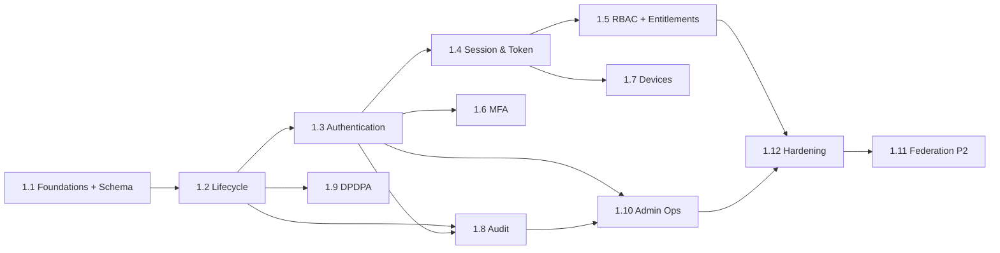

# Work Breakdown Structure — identity (service)

**Anchored to:** [Stories](./03_user_stories.md) · [BRD](./01_brd.md)

**Estimation basis:** 1.5 BE + 0.25 DevOps + 0.25 QA. Velocity: **18 SP / 2-wk sprint**.

**Phase 1:** ~290 SP → **~16 sprints (~8 months)**. Phase 2: ~90 SP → ~5 sprints.

---

## WBS Hierarchy

```
1.0 identity
├── 1.1 Foundations + Schema
├── 1.2 Account Lifecycle
├── 1.3 Authentication
├── 1.4 Session & Token
├── 1.5 RBAC & Entitlements
├── 1.6 MFA (admin Phase 1, student Phase 2)
├── 1.7 Device Mgmt
├── 1.8 Audit & Security Events
├── 1.9 DPDPA Compliance
├── 1.10 Admin Operations
├── 1.11 Federation (Phase 2)
└── 1.12 Hardening + DR rehearsal
```

---

## 1.1 Foundations + Schema (S0–S1) · 35 SP

| WP | Activity | SP |
|----|----------|----|
| WP-ID-1.1.1 | FastAPI scaffold + uv + ruff | 3 |
| WP-ID-1.1.2 | `auth_schema` Alembic — initial migration (users, credentials, refresh_tokens, otps, audit_events, roles, permissions, user_roles, entitlements, devices, password_reset_tokens, biometric_factors, mfa_factors) | 8 |
| WP-ID-1.1.3 | Redis client + OTP cache | 3 |
| WP-ID-1.1.4 | KMS integration for JWT signing | 5 |
| WP-ID-1.1.5 | OTel SDK + structured logs | 3 |
| WP-ID-1.1.6 | Health/ready endpoints | 2 |
| WP-ID-1.1.7 | API client to engagement (email) + Twilio (SMS) | 3 |
| WP-ID-1.1.8 | OpenAPI 3.1 spec scaffold + pre-commit | 3 |
| WP-ID-1.1.9 | Pen-test harness baseline | 3 |
| WP-ID-1.1.10 | Sentry SDK | 2 |

## 1.2 Account Lifecycle (S1–S3) · 50 SP

Per E-ID-01.

## 1.3 Authentication (S3–S6) · 70 SP — largest

Per E-ID-02. Multi-method (password, OTP, Google, Apple, biometric) + rate-limiting + CAPTCHA + breach.

## 1.4 Session & Token (S6–S8) · 55 SP

Per E-ID-03. **JWT validate library** (FA-03 / S-ID-03.07) is published as `libs/auth-go` + `libs/auth-py` + `libs/auth-ts` + `libs/auth-dart`. Every other service integrates this.

## 1.5 RBAC & Entitlements (S8–S9) · 40 SP

Per E-ID-04. Payment webhook integration critical (S-ID-04.03).

## 1.6 MFA (S9–S10) · 17 SP Phase 1 (admin)

Per E-ID-05; rest Phase 2.

## 1.7 Device Mgmt (S10) · 13 SP Phase 1

Per E-ID-06.

## 1.8 Audit & Security Events (S10–S11) · 30 SP

Per E-ID-07. Hash chain + retention enforcement.

## 1.9 DPDPA Compliance (S11–S12) · 33 SP

Per E-ID-08. Cross-service export orchestrator.

## 1.10 Admin Operations (S12–S13) · 22 SP Phase 1 (impersonation deferred)

Per E-ID-09.

**Phase 1 milestone — end of S14:** Foundation + all auth methods + sessions + RBAC + audit + DPDPA + admin basics. ~290 SP.

## 1.11 Federation (Phase 2 — S15–S17) · 22 SP

OIDC for admin + SAML for institutions.

## 1.12 Hardening + DR Rehearsal (S14) · 30 SP

| WP | Activity | SP |
|----|----------|----|
| WP-ID-1.12.1 | Full pen-test (CRITICAL) | 8 |
| WP-ID-1.12.2 | Load test (1000 concurrent login) | 5 |
| WP-ID-1.12.3 | DR rehearsal: kill primary + failover | 5 |
| WP-ID-1.12.4 | Restore from snapshot drill | 5 |
| WP-ID-1.12.5 | JWT signing-key rotation drill | 3 |
| WP-ID-1.12.6 | Audit hash-chain verifier | 2 |
| WP-ID-1.12.7 | Sign-offs | 2 |

---

## Timeline

```
Sprint   1  2  3  4  5  6  7  8  9 10 11 12 13 14 15 16 17 18
Phase    1  1  1  1  1  1  1  1  1  1  1  1  1  1  2  2  2  2
1.1 Foun ▓▓
1.2 Life    ▓▓ ▓▓
1.3 Auth         ▓▓ ▓▓ ▓▓ ▓▓
1.4 Tok                    ▓▓ ▓▓ ▓▓
1.5 RBAC                            ▓▓ ▓▓
1.6 MFA                                   ▓▓
1.7 Dev                                   ▓▓
1.8 Aud                                      ▓▓
1.9 DPDP                                        ▓▓
1.10 Adm                                              ▓▓
1.12 Har                                                  ▓▓
1.11 Fed                                                     ▓▓ ▓▓ ▓▓
```

---

## Dependency DAG



---

## Capacity & Risk

| Item | Value | Note |
|---|---|---|
| Team | 1.5 BE + 0.25 DevOps + 0.25 QA | |
| Velocity | 18 SP / sprint | |
| Phase 1 SP | 290 | |
| Phase 1 duration | ~16 sprints (~8 months) | |
| Buffer | 25% | Security review + DR rehearsals |
| Top risks | Token theft (R-ID-01) · Signing key leak (R-ID-02) · DDoS (R-ID-04) | See [BRD §10](./01_brd.md#10-risks) |

---

## Definition of Done

identity Phase 1 is **Done** when:

- ✅ All P0 stories implemented + tested
- ✅ NFR-ID-* verified
- ✅ Pen-test passed
- ✅ Load test: 1000 concurrent login p95 < 300 ms
- ✅ JWT validate library published + adopted by every service
- ✅ Audit log + hash chain verified
- ✅ DPDPA export + delete grace + purge job tested
- ✅ DR rehearsal complete
- ✅ Signing-key rotation drill complete
