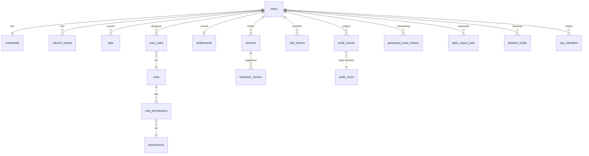

# Data Model — identity (service)

**Schema:** `auth_schema` (Aurora Postgres 15)
**Migration tool:** Alembic (async)
**Anchored to:** [API contract](./05_api_contract.md) · [BRD](./01_brd.md)

---

## ERD (Mermaid)



---

## Tables

### `users`
The canonical account record.

| Col | Type | Constraints | Notes |
|-----|------|------------|-------|
| `id` | uuid | PK | random uuid v4 |
| `email` | citext | unique non-null when not deleted | normalised lowercase |
| `email_hash` | bytea | indexed | sha256(email) — used for fast lookup without revealing index |
| `phone` | text | unique non-null when not deleted | E.164 normalised |
| `status` | enum | not null | `pending_otp`, `active`, `suspended`, `deleted_pending` |
| `intent` | enum | nullable | `student`, `expert` (at signup) |
| `locale` | text | default `en` | |
| `tos_accepted_at` | timestamptz | not null | |
| `created_at` / `updated_at` | timestamptz | not null | |
| `deleted_at` | timestamptz | nullable | for soft-delete grace |
| `purge_after` | timestamptz | nullable | for daily purge job |
| `suspension_reason` | text | nullable | |
| `suspension_until` | timestamptz | nullable | |
| `parental_consent_at` | timestamptz | nullable | DPDPA §9 |
| `dob` | date | nullable | for age gating |

**Indexes**: `email_hash`, `phone`, `status`, `purge_after WHERE purge_after IS NOT NULL`.
**Retention**: hard delete at `purge_after`; legal-hold rows kept (see `deletion_holds`).

### `credentials`
Password hash, separated from `users` for least privilege.

| Col | Type | Notes |
|-----|------|-------|
| `user_id` | uuid | PK + FK users.id |
| `password_hash` | text | bcrypt cost 12 |
| `password_changed_at` | timestamptz | |
| `failed_login_count` | int | resets on success/lockout reset |
| `locked_until` | timestamptz | nullable |
| `breach_check_at` | timestamptz | last HIBP check |

### `refresh_tokens`
| Col | Type | Notes |
|-----|------|-------|
| `id` | uuid | PK |
| `user_id` | uuid | FK |
| `token_hash` | bytea | sha256 of the actual token; raw never stored |
| `chain_id` | uuid | links rotated tokens in a chain; on replay, invalidate whole chain |
| `device_id` | uuid | nullable; FK devices.id |
| `issued_at` / `last_used_at` / `expires_at` | timestamptz | |
| `revoked_at` | timestamptz | nullable |
| `replay_detected` | bool | flag |

**Indexes:** `token_hash` unique, `chain_id`, `user_id, expires_at`.

### `otps`
Short-lived OTP codes stored hashed + in-memory cache (Redis primary).

| Col | Type |
|-----|------|
| `id` | uuid PK |
| `user_id` | uuid (nullable for first-time-not-yet-created flows; ties to identifier) |
| `identifier` | text |
| `code_hash` | bytea |
| `purpose` | enum (`signup`, `login`, `change_email`, `change_phone`, `password_reset`) |
| `channel` | enum (`email`, `sms`) |
| `attempts` | int |
| `max_attempts` | int default 5 |
| `expires_at` | timestamptz |
| `consumed_at` | timestamptz nullable |

### `roles` / `permissions` / `role_permissions` / `user_roles`
Standard RBAC.

```
roles(id, name UNIQUE, description)
permissions(id, key UNIQUE, description)
role_permissions(role_id, permission_id, PRIMARY KEY)
user_roles(user_id, role_id, scope JSONB nullable, granted_at, granted_by)
```

Initial seed roles: `student`, `expert_applicant`, `expert`, `tutor`, `moderator`, `admin`, `super_admin`, `institution_admin`.

### `entitlements`
| Col | Type | Notes |
|-----|------|-------|
| `user_id` | uuid PK + FK |
| `premium` | bool default false |
| `premium_until` | timestamptz nullable |
| `marketplace_payouts_enabled` | bool default false |
| `extras` | jsonb default '{}' | future-proof for plan addons |
| `updated_at` | timestamptz |
| `updated_by_service` | text |

### `devices`
| Col | Type |
|-----|------|
| `id` | uuid PK |
| `user_id` | uuid FK |
| `label` | text |
| `ua` | text |
| `ip` | inet |
| `country` | text (geo-IP) |
| `last_used_at` | timestamptz |
| `created_at` | timestamptz |
| `trusted` | bool default false |
| `revoked_at` | timestamptz nullable |

### `biometric_factors`
| Col | Type |
|-----|------|
| `id` | uuid PK |
| `user_id` | uuid FK |
| `device_id` | uuid FK devices.id |
| `public_key` | bytea |
| `attestation` | bytea nullable |
| `created_at` | timestamptz |
| `revoked_at` | timestamptz nullable |

### `mfa_factors`
| Col | Type |
|-----|------|
| `id` | uuid PK |
| `user_id` | uuid FK |
| `type` | enum (`totp`, `webauthn`, `backup_codes`) |
| `secret` (encrypted) or `credential_id` for webauthn | bytea |
| `backup_codes_remaining` | int nullable |
| `created_at` / `last_used_at` | timestamptz |
| `disabled_at` | timestamptz nullable |

### `password_reset_tokens`
| Col | Type |
|-----|------|
| `id` | uuid PK |
| `user_id` | uuid FK |
| `token_hash` | bytea |
| `expires_at` | timestamptz (30 min) |
| `consumed_at` | timestamptz nullable |

### `audit_events`
Append-only.

| Col | Type | Notes |
|-----|------|-------|
| `id` | bigint PK (sequence) | monotonic for chaining |
| `actor_user_id` | uuid nullable | null for anonymous (e.g. unauthenticated failed login) |
| `impersonated_by` | uuid nullable | for impersonate sessions |
| `target_user_id` | uuid nullable | |
| `action` | text not null | e.g. `login_success`, `password_change`, `impersonate_start` |
| `before` | jsonb nullable | |
| `after` | jsonb nullable | |
| `ip` | inet | |
| `ua` | text | |
| `request_id` | text | OpenTelemetry trace id |
| `at` | timestamptz default now() | |
| `prev_hash` | bytea | sha256(prev row canonical-serialised) |
| `row_hash` | bytea | sha256(canonical(self) + prev_hash) |

**Indexes:** `(target_user_id, at DESC)`, `(actor_user_id, at DESC)`, `(action, at DESC)`.

**Retention:** governed by `OQ-ID-02`. Default 1 year; bumped to 7 years for `payment_*`, `impersonate_*`, `delete_*` actions (legal hold).

### `audit_chain`
Snapshot of latest hash for quick integrity verification.

```
audit_chain(stream_id text PRIMARY KEY, last_id bigint, last_row_hash bytea, last_at timestamptz)
```

A nightly job recomputes the hash chain and alerts on mismatch.

### `data_export_jobs`
| Col | Type |
|-----|------|
| `id` | uuid PK |
| `user_id` | uuid FK |
| `status` | enum (`queued`, `running`, `ready`, `failed`) |
| `download_url` | text nullable | signed S3 URL (7-day expiry) |
| `created_at` / `completed_at` | timestamptz |
| `failure_reason` | text nullable |

### `deletion_holds`
For users under legal hold (e.g. active investigation).

```
deletion_holds(user_id, reason, placed_by, placed_at, expires_at nullable)
```

### `sso_identities`
For federation (Phase 2).

| Col | Type |
|-----|------|
| `id` | uuid PK |
| `user_id` | uuid FK |
| `provider` | text (`okta`, `google_ws`, `saml:<tenant>`) |
| `subject` | text |
| `linked_at` | timestamptz |
| UNIQUE (provider, subject) | | |

---

## Encryption & Secrets

| Asset | Strategy |
|-------|----------|
| JWT signing key | AWS KMS asymmetric; never exported; rotated quarterly |
| Email PII | Field-level AES-256 with KMS data-key envelope (Phase 2 — Phase 1 stored plaintext + Aurora KMS at-rest) |
| TOTP secrets | AES-256 with separate KMS key |
| Refresh tokens | SHA-256 hash only |
| OTP codes | SHA-256 hash only |
| Audit log | hash chain + write to immutable S3 nightly (immutability bucket policy) |

## Migrations Plan

Alembic versions:

```
001_create_auth_schema.py        -- users, credentials, refresh_tokens, otps, audit_events
002_rbac.py                       -- roles, permissions, role_permissions, user_roles
003_entitlements.py               -- entitlements
004_devices_and_biometric.py      -- devices, biometric_factors
005_mfa.py                        -- mfa_factors
006_password_reset.py             -- password_reset_tokens
007_audit_chain.py                -- audit_chain snapshot table
008_data_export.py                -- data_export_jobs
009_deletion_holds.py             -- deletion_holds
010_sso_identities.py             -- sso_identities (Phase 2)
```

All migrations: append-only, always include downgrade, no destructive ALTER on existing columns (use add-then-backfill-then-drop).

## Retention & Purge Jobs

| Job | Schedule | Action |
|-----|----------|--------|
| `purge_deleted_users` | daily 02:00 IST | delete rows in `users` where `purge_after < now()` (and no `deletion_holds`) |
| `purge_expired_otps` | hourly | delete `otps` past `expires_at + 1h` |
| `purge_expired_refresh_tokens` | daily | delete `refresh_tokens` past `expires_at + 7d` |
| `purge_expired_reset_tokens` | daily | delete `password_reset_tokens` past `expires_at + 1d` |
| `audit_hash_chain_verify` | daily | recompute from latest checkpoint; alert on mismatch |
| `audit_retention_purge` | daily | purge `audit_events` past per-action retention floor (excludes legal-hold) |
| `data_export_expiry` | hourly | mark export jobs whose `download_url` expired |
