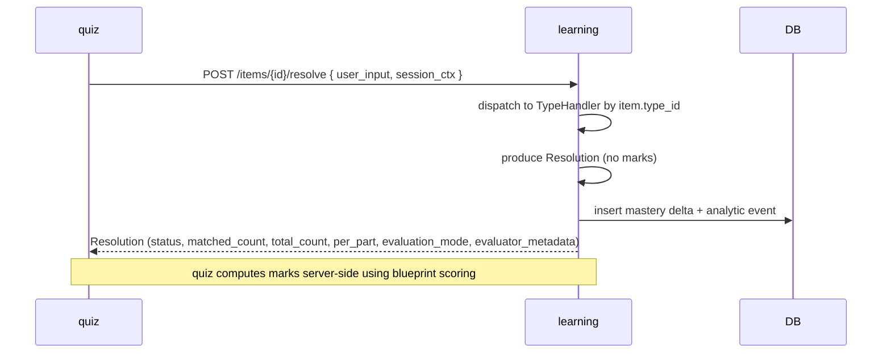
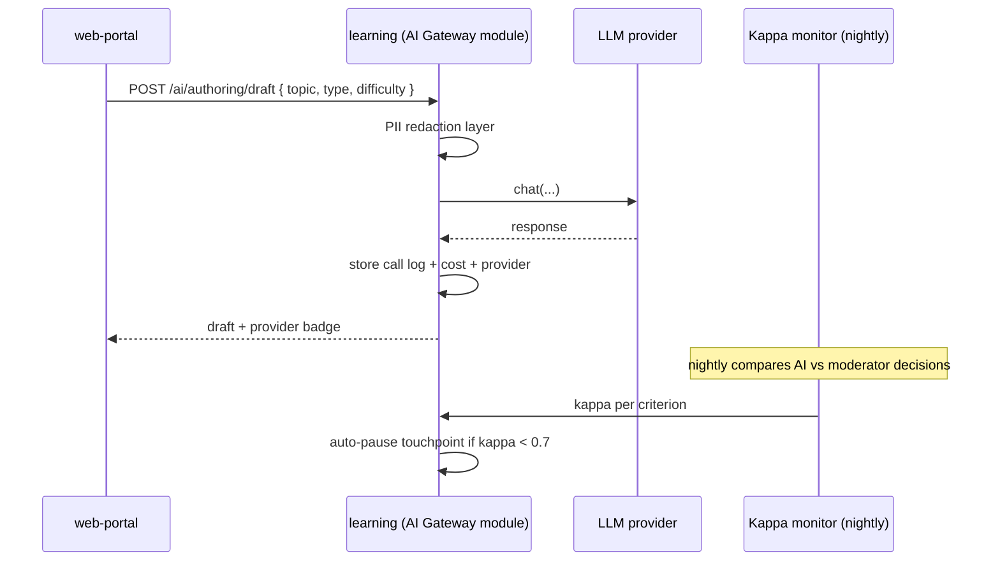

# User Stories — learning (service)

**Anchored to:** [Requirements](./02_requirements.md) · [BRD](./01_brd.md)

---

## Epic Map

| Epic | Title | Stories | SP | Phase | P |
|------|-------|---------|----|-------|---|
| E-LR-01 | Catalog | 8 | 38 | 1 | P0 |
| E-LR-02 | Content Items + Type Handlers | 15 | 105 | 1–2 | P0 |
| E-LR-03 | Blueprints + PYQs | 7 | 35 | 1 | P0 |
| E-LR-04 | Adaptive Engine (9-dim) | 7 | 50 | 1–3 | P0/P1/P2 |
| E-LR-05 | Screening | 6 | 26 | 1 | P0 |
| E-LR-06 | Spaced Repetition | 4 | 22 | 2 | P1 |
| E-LR-07 | Error Patterns | 3 | 16 | 2 | P1 |
| E-LR-08 | Recommendation + Today's Mission | 6 | 38 | 1 | P0 |
| E-LR-09 | Rank Prediction | 3 | 18 | 2 | P2 |
| E-LR-10 | AI Gateway | 13 | 70 | 1–3 | P0/P1/P2 |
| E-LR-11 | Localisation | 5 | 22 | 3 | P2 |
| E-LR-12 | Analytics | 7 | 32 | 1–2 | P0 |
| E-LR-13 | Authoring API | 5 | 22 | 1 | P0 |
| E-LR-14 | Moderation API | 6 | 26 | 1 | P0 |
| E-LR-15 | User Learning Profile | 3 | 12 | 1 | P0 |
| E-LR-16 | Institution Context | 4 | 20 | 2 | P1 |
| E-LR-XC | Cross-cutting | 12 | 30 | 1 | P0 |
| **TOTAL** | | **114** | **582** | | |

Phase 1 ≈ 320 SP · Phase 2 ≈ 210 SP · Phase 3 ≈ 52 SP.

---

## E-LR-02 — Content Items + Type Handlers (representative, full detail)

### S-LR-02.01 — Implement Type Handler Protocol

**P:** P0 · **SP:** 13 · **Maps to:** FR-LR-02-01

**As** the learning service **I want** a single protocol every question type implements **so that** new types are additive and the resolution contract stays consistent.

**AC**
1. Define abstract base: `interface TypeHandler { authoring_schema; render_schema; evaluate(user_input, item) → Resolution; bloom_default? }`.
2. `Resolution` Pydantic model with exactly these fields: `{ status: ResolutionStatus, matched_count: int, total_count: int, per_part: list[PartResult], evaluation_mode: EvaluationMode, evaluator_metadata: dict }`.
3. `ResolutionStatus` enum: `correct, partial, incorrect, no_answer, evaluation_pending`.
4. `EvaluationMode` enum: `deterministic, ai_assisted, hybrid, human`.
5. Contract test: any Resolution serialised over HTTP must NOT contain the field `marks` (assertion in CI on every PR).
6. Registry: types registered by string id; resolve by id at runtime.
7. Versioning: Type Handler Protocol version in OpenAPI; consumers pin version.
8. Phase 1 ships handlers for: `mcq_single`, `mcq_multiple`, `numeric`, `fill_blank`, `match`.
9. Phase 2 ships remaining 17.

**API:** see [05_api_contract.md](./05_api_contract.md) `/types/registry`, `/items/resolve`.

**Negative:** unknown type id → 404; resolution with `marks` field → fail at boundary.

**Data:** `content_schema.items.type_id`, `content_schema.item_parts`.

**QA:** golden-resolution tests per type; boundary-test asserts no marks; load test for 1000 RPS resolve.

**DoD:** Protocol documented in ADR-cross-link; registry tested; CI guard live.

### S-LR-02.09 — Resolution contract boundary test

**P:** P0 · **SP:** 5 · **Maps to:** FR-LR-02-09

(CI lint that grep'd for `"marks"` in any Resolution JSON over HTTP fails the build.)

| ID | Story | P | SP |
|---|---|---|---|
| S-LR-02.02 | Handler — MCQ-single | P0 | 5 |
| S-LR-02.03 | Handler — MCQ-multiple | P0 | 5 |
| S-LR-02.04 | Handler — Numeric (with tolerance) | P0 | 8 |
| S-LR-02.05 | Handler — Fill-in-blank | P0 | 5 |
| S-LR-02.06 | Handler — Match-the-following | P0 | 8 |
| S-LR-02.07 | Remaining 17 handlers | P1 | 30 |
| S-LR-02.08 | Gated stub types (6) | P2 | 8 |
| S-LR-02.10 | Per-part resolution | P0 | 5 |
| S-LR-02.11 | Evaluation modes | P1 | 8 |
| S-LR-02.12 | Item status FSM | P0 | 5 |
| S-LR-02.13 | Shared authoring schema | P0 | 5 |
| S-LR-02.14 | Bloom + difficulty tagging | P0 | 3 |
| S-LR-02.15 | Concept refs (1..N) | P0 | 5 |

---

## E-LR-01 — Catalog

| ID | Story | P | SP |
|---|---|---|---|
| S-LR-01.01 | CRUD Subject | P0 | 5 |
| S-LR-01.02 | CRUD Topic | P0 | 5 |
| S-LR-01.03 | CRUD Concept | P0 | 5 |
| S-LR-01.04 | Tree read with etag + Redis cache | P0 | 8 |
| S-LR-01.05 | Versioning (effective_from) | P1 | 5 |
| S-LR-01.06 | Map syllabus → exam | P0 | 3 |
| S-LR-01.07 | OpenSearch indexing | P1 | 5 |
| S-LR-01.08 | CBSE class 8+9 split (ADR-0025) | P1 | 2 |

---

## E-LR-03 — Blueprints + PYQs

| ID | Story | P | SP |
|---|---|---|---|
| S-LR-03.01 | Blueprint CRUD | P0 | 5 |
| S-LR-03.02 | Sections + distribution | P0 | 5 |
| S-LR-03.03 | Validate weights sum | P0 | 3 |
| S-LR-03.04 | PYQ ingestion (CSV/JSON) | P0 | 8 |
| S-LR-03.05 | PYQ metadata (exam/year/paper/section) | P0 | 3 |
| S-LR-03.06 | PYQ→blueprint linking | P1 | 3 |
| S-LR-03.07 | Blueprint assembly for session | P0 | 8 |

---

## E-LR-04 — Adaptive Engine (9-dim)

| ID | Story | P | SP |
|---|---|---|---|
| S-LR-04.01 | 9-dim substrate model + storage | P0 | 13 |
| S-LR-04.02 | Update on response | P0 | 8 |
| S-LR-04.03 | Heuristic estimator v1 | P0 | 8 |
| S-LR-04.04 | Daily mastery snapshot | P1 | 5 |
| S-LR-04.05 | Difficulty agency (ADR-0022) | P1 | 5 |
| S-LR-04.06 | Per-concept IRT (gated; Phase 2) | P2 | 8 |
| S-LR-04.07 | Concept transfer (Phase 3) | P2 | 3 |

---

## E-LR-05 — Screening

| ID | Story | P | SP |
|---|---|---|---|
| S-LR-05.01 | 12-item blueprint Phase 1 | P0 | 5 |
| S-LR-05.02 | θ heuristic per subject | P0 | 5 |
| S-LR-05.03 | Labels (Foundational/Building/Strong) | P0 | 3 |
| S-LR-05.04 | Persist screening_result | P0 | 3 |
| S-LR-05.05 | Resume mid-session | P0 | 5 |
| S-LR-05.06 | Bayesian θ (Phase 2+) | P2 | 5 |

---

## E-LR-06 — Spaced Repetition (Phase 2)

| ID | Story | P | SP |
|---|---|---|---|
| S-LR-06.01 | SM-2 scheduling | P1 | 8 |
| S-LR-06.02 | EWA blend | P1 | 5 |
| S-LR-06.03 | Due queue API | P1 | 5 |
| S-LR-06.04 | Forgetting curve telemetry | P2 | 4 |

---

## E-LR-07 — Error Patterns (Phase 2)

| ID | Story | P | SP |
|---|---|---|---|
| S-LR-07.01 | Classifier per ADR-0016 | P1 | 8 |
| S-LR-07.02 | Aggregation per user | P1 | 5 |
| S-LR-07.03 | Surface in analytics | P1 | 3 |

---

## E-LR-08 — Recommendation + Today's Mission

| ID | Story | P | SP |
|---|---|---|---|
| S-LR-08.01 | Content embeddings pipeline | P0 | 13 |
| S-LR-08.02 | Daily embedding refresh | P0 | 5 |
| S-LR-08.03 | Today's Mission selector (ADR-0024) | P0 | 8 |
| S-LR-08.04 | Mission diversity + recency bias | P0 | 5 |
| S-LR-08.05 | Explainability surface | P1 | 3 |
| S-LR-08.06 | Cold-start strategy | P0 | 4 |

---

## E-LR-09 — Rank Prediction (Phase 2)

| ID | Story | P | SP |
|---|---|---|---|
| S-LR-09.01 | Calibrated model per ADR-0015 | P2 | 8 |
| S-LR-09.02 | Confidence interval | P2 | 5 |
| S-LR-09.03 | Per-exam model | P2 | 5 |

---

## E-LR-10 — AI Gateway

### S-LR-10.01 — Provider abstraction

**P:** P0 · **SP:** 8 · **Maps to:** FR-LR-10-01

**As** the AI Gateway module **I want** a provider-agnostic interface **so that** we can swap providers without callers changing.

**AC**
1. Interface `LlmProvider { chat(messages, model, params) → Response }`.
2. Implementations: Anthropic, OpenAI, Google, Llama (self-hosted).
3. Provider selection: per-touchpoint config + cost/latency-aware failover.
4. Standard params: temperature, max_tokens, response_format (json schema).
5. Streaming supported where downstream needs it.
6. Errors normalised: `RateLimited`, `Auth`, `ContextTooLong`, `Unknown`.
7. Provider keys via KMS-encrypted secrets; never logged.
8. Per-call trace with cost estimate emitted.

### S-LR-10.07 — Kappa monitoring

**P:** P0 · **SP:** 8

(Per-criterion kappa computed daily against moderator decisions; auto-pause < 0.7 with admin override; dashboard.)

| ID | Story | P | SP |
|---|---|---|---|
| S-LR-10.02 | Touchpoint: authoring | P1 | 8 |
| S-LR-10.03 | Touchpoint: quality_check | P1 | 5 |
| S-LR-10.04 | Touchpoint: evaluation | P1 | 8 |
| S-LR-10.05 | Touchpoint: translation | P2 | 8 |
| S-LR-10.06 | Touchpoint: vision | P2 | 5 |
| S-LR-10.08 | Auto-pause < 0.7 | P0 | 5 |
| S-LR-10.09 | Provider failover < 5 s | P0 | 5 |
| S-LR-10.10 | Per-tenant + per-touchpoint cost caps | P0 | 5 |
| S-LR-10.11 | PII redaction layer | P0 | 5 |
| S-LR-10.12 | Call log retention | P1 | 3 |
| S-LR-10.13 | Admin override of auto-pause | P0 | 3 |

---

## E-LR-11 — Localisation (Phase 3)

5 stories, 22 SP.

## E-LR-12 — Analytics

| ID | Story | P | SP |
|---|---|---|---|
| S-LR-12.01 | Readiness score (0–100 + confidence) | P0 | 8 |
| S-LR-12.02 | Recompute on response or on-demand | P0 | 5 |
| S-LR-12.03 | Weak-areas ranked by impact | P0 | 5 |
| S-LR-12.04 | Accuracy trends | P0 | 3 |
| S-LR-12.05 | Time-per-question (ADR-0013) | P1 | 5 |
| S-LR-12.06 | Cohort percentile | P2 | 3 |
| S-LR-12.07 | Daily trend snapshot | P1 | 3 |

## E-LR-13 — Authoring API

| ID | Story | P | SP |
|---|---|---|---|
| S-LR-13.01 | Save draft | P0 | 5 |
| S-LR-13.02 | Submit for moderation | P0 | 5 |
| S-LR-13.03 | Bulk CSV ingest | P0 | 5 |
| S-LR-13.04 | AI Draft | P1 | 5 |
| S-LR-13.05 | Status events emitted | P0 | 2 |

## E-LR-14 — Moderation API

| ID | Story | P | SP |
|---|---|---|---|
| S-LR-14.01 | Take next item (lock) | P0 | 5 |
| S-LR-14.02 | Approve | P0 | 3 |
| S-LR-14.03 | Reject with reason | P0 | 3 |
| S-LR-14.04 | Request revision | P0 | 5 |
| S-LR-14.05 | Kappa per criterion | P1 | 5 |
| S-LR-14.06 | Re-assign | P1 | 5 |

## E-LR-15 — User Learning Profile

| ID | Story | P | SP |
|---|---|---|---|
| S-LR-15.01 | Profile CRUD | P0 | 5 |
| S-LR-15.02 | Mastery snapshot ref | P0 | 3 |
| S-LR-15.03 | Change exam → re-screen | P0 | 4 |

## E-LR-16 — Institution Context (Phase 2)

4 stories, 20 SP.

## E-LR-XC — Cross-Cutting

12 stories, 30 SP.

---

## Flow Diagrams

### Quiz answer → resolution + mastery update

### AI Gateway authoring with kappa monitor

