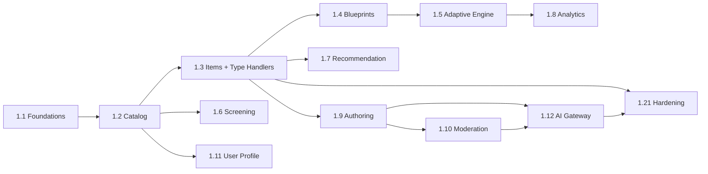

# Work Breakdown Structure — learning (service)

**Anchored to:** [Stories](./03_user_stories.md) · [BRD](./01_brd.md)

**Estimation basis:** 2 BE + 1 ML + 0.25 DevOps + 0.25 QA. Velocity: **24 SP / 2-wk sprint**.

**Phase 1:** ~320 SP → **~14 sprints (~7 months)**. Phase 2: ~210 SP → ~9 sprints. Phase 3: ~52 SP → ~3 sprints.

**This is the largest service** by SP. The team should explicitly consider whether 1 ML + 2 BE is enough, especially for the adaptive engine + AI Gateway work in Phase 2.

---

## WBS Hierarchy

```
1.0 learning
├── 1.1 Foundations + Schema
├── 1.2 Catalog
├── 1.3 Content Items + Type Handlers + Resolution Contract
├── 1.4 Blueprints + PYQs
├── 1.5 Adaptive Engine (9-dim)
├── 1.6 Screening
├── 1.7 Recommendation + Today's Mission
├── 1.8 Analytics
├── 1.9 Authoring API
├── 1.10 Moderation API
├── 1.11 User Learning Profile
├── 1.12 AI Gateway (provider abstraction + monitoring)
├── 1.13 Spaced Repetition (Phase 2)
├── 1.14 Error Patterns (Phase 2)
├── 1.15 AI Gateway Touchpoints (Phase 2)
├── 1.16 Rank Prediction (Phase 2)
├── 1.17 Difficulty Agency + Constrained Plan (Phase 2)
├── 1.18 Institution Context (Phase 2)
├── 1.19 Localisation (Phase 3)
├── 1.20 Per-concept IRT + Vision (Phase 3)
└── 1.21 Hardening
```

---

## Phase 1 (S0–S14) ≈ 320 SP

| WP | Section | SP | Critical |
|----|---------|----|----------|
| 1.1 | Foundations + Schema (`content_schema` + `adaptive_schema` + AI gw tables) | 30 | Yes |
| 1.2 | Catalog (E-LR-01) | 38 | Yes |
| 1.3 | Content Items + 5 Type Handlers + Resolution Contract (E-LR-02 Phase 1 subset) | 55 | **CRITICAL** |
| 1.4 | Blueprints + PYQs (E-LR-03) | 35 | Yes |
| 1.5 | Adaptive Engine heuristic v1 (E-LR-04 Phase 1) | 34 | Yes |
| 1.6 | Screening Phase 1 (E-LR-05 P0) | 21 | Yes |
| 1.7 | Recommendation + Today's Mission v1 (E-LR-08 P0) | 35 | Yes |
| 1.8 | Analytics v1 (readiness + weak areas + accuracy) (E-LR-12 P0) | 24 | Yes |
| 1.9 | Authoring API basic (E-LR-13 P0) | 17 | Yes |
| 1.10 | Moderation API basic (E-LR-14 P0) | 16 | Yes |
| 1.11 | User Learning Profile (E-LR-15) | 12 | Yes |
| 1.12 | AI Gateway scaffolding (provider abstraction + kappa monitor + auto-pause; one touchpoint live) (E-LR-10 P0) | 35 | Yes |
| 1.21 | Hardening + load test | 20 | Yes |

## Phase 2 (S15–S23) ≈ 210 SP

| WP | Section | SP |
|----|---------|----|
| 1.3 cont | Remaining 17 Type Handlers (E-LR-02 P1) | 30 |
| 1.5 cont | Difficulty agency · daily snapshot · transfer model | 13 |
| 1.13 | SM-2 + EWA (E-LR-06) | 22 |
| 1.14 | Error patterns (E-LR-07) | 16 |
| 1.15 | AI Gateway touchpoints — authoring/quality/evaluation (E-LR-10 P1) | 38 |
| 1.16 | Rank prediction (E-LR-09) | 18 |
| 1.17 | Constrained plan co-editing | 13 |
| 1.7 cont | Explainability + advanced selection | 8 |
| 1.8 cont | Time-per-question + cohort percentile + daily snapshots | 12 |
| 1.18 | Institution context (E-LR-16) | 20 |
| 1.10 cont | Kappa per criterion · re-assign | 10 |
| 1.12 cont | Cost dashboards + per-tenant caps | 10 |

## Phase 3 (S24–S26) ≈ 52 SP

| WP | Section | SP |
|----|---------|----|
| 1.19 | Localisation (E-LR-11) | 22 |
| 1.20 | Per-concept IRT · vision touchpoint · gated stub types | 23 |
| 1.15 cont | Translation + vision touchpoints | 7 |

## 1.21 Hardening (S14 + S23) · 30 SP

| WP | Activity | SP |
|----|----------|----|
| WP-LR-1.21.1 | Load test (1000 RPS resolution, 200 authors) | 8 |
| WP-LR-1.21.2 | Resolution contract boundary test (CI) | 3 |
| WP-LR-1.21.3 | Kappa drift simulation + alert verification | 5 |
| WP-LR-1.21.4 | AI Gateway provider failover drill | 5 |
| WP-LR-1.21.5 | Cost-cap enforcement test | 5 |
| WP-LR-1.21.6 | Sign-offs + docs | 4 |

---

## Timeline (Phase 1 detail)

```
Sprint   1  2  3  4  5  6  7  8  9 10 11 12 13 14
1.1 Fnd ▓▓
1.2 Cat    ▓▓ ▓▓
1.3 Item        ▓▓ ▓▓ ▓▓ ▓▓ (longest Phase 1 chunk)
1.4 BP                       ▓▓ ▓▓
1.5 Eng                            ▓▓ ▓▓
1.6 Scr                                  ▓▓
1.7 Rec                                  ▓▓ ▓▓
1.8 Ana                                        ▓▓
1.9 Aut                                          ▓▓
1.10 Mod                                         ▓▓
1.11 Pro                                          ▓▓
1.12 AI                                       ▓▓ ▓▓
1.21 Hrd                                              ▓▓
```

---

## Dependency DAG



---

## Capacity & Risk

| Item | Value | Note |
|---|---|---|
| Team | 2 BE + 1 ML + 0.25 DevOps + 0.25 QA | Largest team allocation |
| Velocity | 24 SP / sprint | Higher due to bigger team |
| Phase 1 SP | 320 | |
| Phase 1 duration | ~14 sprints | |
| Phase 2 SP | 210 | |
| Buffer | 25% | ML uncertainty + AI Gateway complexity |
| Top risks | LLM outage (R-LR-01) · Kappa drift (R-LR-02) · Cost overrun (R-LR-03) · Resolution contract leak (R-LR-04) | See [BRD §10](./01_brd.md#10-risks) |

---

## Definition of Done

learning Phase 1 is **Done** when:

- ✅ All P0 stories shipped
- ✅ NFR-LR-* verified (esp resolution-contract boundary, kappa monitor, cost caps)
- ✅ 5 Type Handlers integration-tested with quiz
- ✅ Resolution contract CI gate green (no `marks` field ever returned)
- ✅ Catalog seed loaded + indexed in OpenSearch
- ✅ Adaptive engine heuristic v1 producing readiness scores
- ✅ Recommendation v1 returning Today's Mission < 100 ms p95
- ✅ AI Gateway scaffolded with one touchpoint live + kappa monitor + auto-pause
- ✅ Cost telemetry visible in admin AI Gateway control panel
- ✅ Load test passes 1000 RPS resolution
