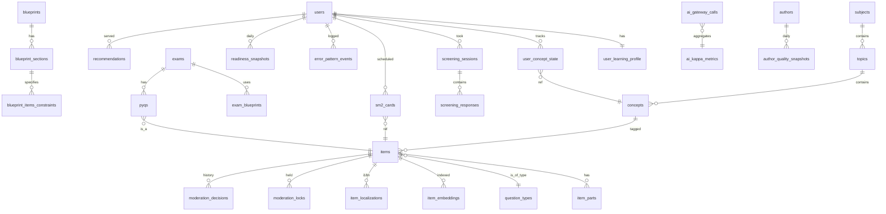

# Data Model — learning (service)

**Schemas:** `content_schema`, `adaptive_schema`
**Anchored to:** [API contract](./05_api_contract.md) · [BRD](./01_brd.md)

---

## ERD (Mermaid)



---

## `content_schema` Tables

### `subjects`
| Col | Type | Notes |
|-----|------|-------|
| id | uuid PK |
| exam_ids | text[] | which exams it appears in |
| code, name, description | text |
| order | int | display order |
| created_at, updated_at | timestamptz |

### `topics`
| Col | Type |
|-----|------|
| id | uuid PK |
| subject_id | uuid FK |
| code, name, description | text |
| weight_in_subject | numeric(4,3) |
| order | int |

### `concepts`
| Col | Type |
|-----|------|
| id | uuid PK |
| topic_id | uuid FK |
| code, name, description | text |
| bloom_default | enum (remember, understand, apply, analyze, evaluate, create) |
| order | int |

### `question_types`
| Col | Type |
|-----|------|
| id | text PK | (e.g. `mcq_single`) |
| handler_class | text | dotted path |
| protocol_version | text |
| status | enum (active, gated, deprecated) |

### `items`
| Col | Type | Notes |
|-----|------|-------|
| id | uuid PK |
| type_id | text FK question_types.id |
| status | enum (draft, submitted, in_moderation, accepted, revise, rejected) |
| author_id | uuid (identity user_id) |
| body | jsonb | type-specific payload (stem, options, answer key, explanation, etc.) |
| concept_ids | uuid[] | tags |
| bloom_level | enum |
| difficulty_estimate | numeric | initial; updated as IRT data accrues |
| exam_ids | text[] |
| is_pyq | bool | flag |
| pyq_year | int | nullable |
| pyq_paper | text | nullable |
| pyq_section | text | nullable |
| ai_drafted | bool | flag for kappa analytics |
| ai_provider, ai_model | text nullable |
| created_at, updated_at | timestamptz |
| accepted_at, moderated_by | timestamptz, uuid nullable |
| revision_of | uuid nullable | for revision chains |

**Indexes:** `type_id`, `status`, `(status, created_at)`, `GIN(concept_ids)`, `(is_pyq, exam_ids, pyq_year)`, `(author_id, status)`.

### `item_parts`
For multi-part items.

| Col | Type |
|-----|------|
| id | uuid PK |
| item_id | uuid FK |
| order | int |
| body | jsonb |
| answer_key | jsonb |

### `blueprints` / `blueprint_sections` / `blueprint_items_constraints` / `exam_blueprints`
Per ADR-0012.

```
blueprints(id, name, exam_id, scoring_profile JSONB, total_items int, duration_min int, created_at)
blueprint_sections(blueprint_id, section_code, weight, item_count, allowed_types text[], allowed_topics uuid[])
blueprint_items_constraints(section_id, difficulty_dist JSONB, bloom_dist JSONB)
exam_blueprints(exam_id, blueprint_id, is_default, effective_from)
```

### `pyqs` (view or column on items)
PYQs are `items` with `is_pyq=true` and PYQ metadata columns populated.

### `item_localizations`
For en/hi launch + Phase 3 multi-language.

```
item_localizations(item_id, locale, body JSONB, status enum, translator_id, translated_via enum(human, ai, post-edited), kappa numeric nullable, created_at)
```

### `moderation_locks`
Optimistic locks for queue.

```
moderation_locks(item_id PK, moderator_id, locked_at, expires_at)
```

### `moderation_decisions`
Audit of every approve/reject/revise.

```
moderation_decisions(id, item_id, moderator_id, decision enum, reason text, criteria_scores JSONB, decided_at)
```

### `author_quality_snapshots`
Daily roll-up per author for dashboards.

```
author_quality_snapshots(author_id, day date, items_submitted int, items_accepted int, items_revised int, items_rejected int, ai_drafted_share numeric, kappa_per_criterion JSONB)
```

---

## `adaptive_schema` Tables

### `user_learning_profile`
| Col | Type |
|-----|------|
| user_id | uuid PK (mirror identity.users.id) |
| exam_id | text |
| grade | text nullable |
| locale | text default 'en' |
| screening_result | jsonb nullable | per-subject θ + label |
| onboarded_at | timestamptz |

### `user_concept_state`
The 9-dim substrate (per ADR-0017).

| Col | Type |
|-----|------|
| user_id | uuid |
| concept_id | uuid |
| mastery | numeric | 0..1 |
| bloom_depth | numeric |
| fluency | numeric | speed-adjusted accuracy |
| accuracy | numeric |
| retention | numeric | decay-adjusted |
| confidence | numeric |
| transfer | numeric |
| procedural | numeric |
| strategic | numeric |
| n_attempts | int |
| last_attempt_at | timestamptz |
| PRIMARY KEY (user_id, concept_id) | | |

### `screening_sessions` / `screening_responses`
```
screening_sessions(id, user_id, started_at, finalized_at nullable, blueprint_version, status enum(in_progress, finalized, abandoned))
screening_responses(session_id, item_id, response JSONB, resolution JSONB, time_ms, ordered_at)
```

### `sm2_cards` (per ADR-0014, Phase 2)
| Col | Type |
|-----|------|
| user_id | uuid |
| item_id | uuid |
| ef | numeric default 2.5 |
| interval_days | int default 1 |
| reps | int default 0 |
| ewa_factor | numeric default 1.0 |
| due_at | timestamptz |
| PRIMARY KEY (user_id, item_id) | | |

### `error_pattern_events`
| Col | Type |
|-----|------|
| id | uuid PK |
| user_id | uuid |
| item_id | uuid |
| pattern_code | text | per ADR-0016 taxonomy |
| at | timestamptz |

### `readiness_snapshots`
Daily snapshot for trend lines.
| Col | Type |
|-----|------|
| user_id | uuid |
| day | date |
| readiness | numeric |
| confidence_low | numeric |
| confidence_high | numeric |
| subject_breakdown | jsonb |
| PRIMARY KEY (user_id, day) | | |

### `recommendations`
Served-recommendation log for explainability.

```
recommendations(id, user_id, served_at, kind enum(today_mission, item_set, weak_area), payload JSONB, signals JSONB)
```

### `item_embeddings`
| Col | Type |
|-----|------|
| item_id | uuid PK FK |
| vector | vector(1536) | (pgvector or external store) |
| model | text |
| refreshed_at | timestamptz |

---

## AI Gateway Tables

### `ai_gateway_calls`
Per-call log for observability + cost.

| Col | Type |
|-----|------|
| id | uuid PK |
| at | timestamptz |
| touchpoint | enum (authoring, quality_check, evaluation, translation, vision) |
| provider | enum (anthropic, openai, google, llama) |
| model | text |
| caller_user_id | uuid nullable |
| caller_service | text nullable |
| input_tokens, output_tokens | int |
| cost_usd_cents | int |
| latency_ms | int |
| status | enum (success, error_rate, error_ctx, error_auth, error_unknown) |
| request_redacted | jsonb | post-redaction body for audit |
| response_redacted | jsonb |
| trace_id | text |

**Indexes:** `(touchpoint, at DESC)`, `(provider, status, at)`, `(caller_user_id, at)`.

### `ai_kappa_metrics`
Daily aggregate per touchpoint × criterion.

| Col | Type |
|-----|------|
| day | date |
| touchpoint | enum |
| criterion | text | (e.g. `factual_correctness`, `difficulty_calibration`) |
| sample_size | int |
| kappa | numeric |
| paused | bool default false |
| paused_at | timestamptz nullable |
| paused_reason | text nullable |
| PRIMARY KEY (day, touchpoint, criterion) | | |

### `ai_cost_caps`
| Col | Type |
|-----|------|
| id | uuid PK |
| tenant_id | uuid nullable | null = global |
| touchpoint | enum |
| daily_cap_usd_cents | int |
| period_cap_usd_cents | int |
| period_start | timestamptz |
| period_end | timestamptz |

---

## Migrations Plan (Alembic)

```
001_create_content_schema_core.py     -- subjects, topics, concepts, question_types
002_items_and_parts.py                 -- items, item_parts
003_blueprints_and_pyq.py              -- blueprints, sections, constraints, exam_blueprints
004_moderation.py                       -- moderation_locks, moderation_decisions
005_authoring_quality.py                -- author_quality_snapshots
006_localisation.py                     -- item_localizations
007_create_adaptive_schema_core.py     -- user_learning_profile, user_concept_state
008_screening.py                        -- screening_sessions, screening_responses
009_sm2.py                              -- sm2_cards
010_error_patterns.py                   -- error_pattern_events
011_readiness_snapshots.py              -- readiness_snapshots
012_recommendations.py                  -- recommendations, item_embeddings
013_ai_gateway.py                       -- ai_gateway_calls, ai_kappa_metrics, ai_cost_caps
```

---

## Indexes & Performance

Hot-path indexes:

- `user_concept_state(user_id)` — covers all mastery reads
- `items(status, created_at DESC) WHERE status = 'in_moderation'` — moderation queue
- `recommendations(user_id, served_at DESC)` — explainability
- `readiness_snapshots(user_id, day DESC)` — trend
- `item_embeddings` HNSW index (pgvector) for nearest-neighbour

## Retention

| Table | Retention | Reason |
|-------|-----------|--------|
| `ai_gateway_calls.request_redacted` / `.response_redacted` | 90 d | LLM debug; storage cost |
| `recommendations` | 1 yr | explainability + audit |
| `error_pattern_events` | 1 yr | analytics |
| `screening_responses` | indefinite (user life) | profile |
| `moderation_decisions` | indefinite | audit |
| `author_quality_snapshots` | indefinite | author trust signal |
