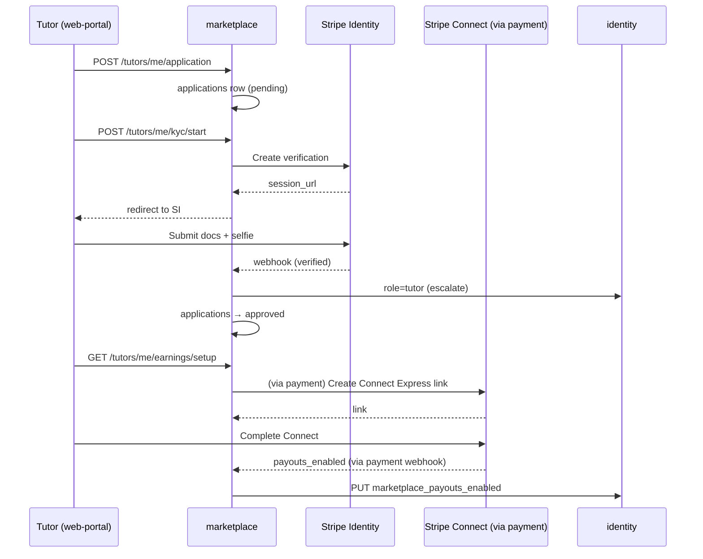
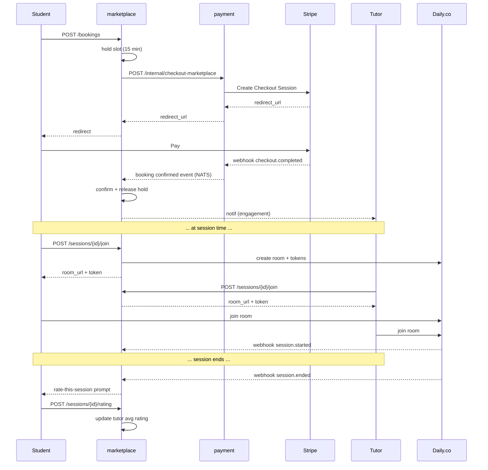

# User Stories — marketplace (service)

**Anchored to:** [Requirements](./02_requirements.md) · [BRD](./01_brd.md)

> Phase 1 = foundation only (~25 SP). Production launch in Phase 2.

---

## Epic Map

| Epic | Title | Stories | SP | Phase |
|------|-------|---------|----|-------|
| E-MK-01 | Tutor Onboarding + KYC | 9 | 45 | 2 |
| E-MK-02 | Tutor Profile | 8 | 28 | 2 |
| E-MK-03 | Availability + Calendar | 6 | 22 | 2 |
| E-MK-04 | Catalog + Search | 6 | 28 | 2 |
| E-MK-05 | Booking + Hold (CRITICAL: atomic) | 8 | 38 | 2 |
| E-MK-06 | Live Session Integration | 8 | 38 | 2 |
| E-MK-07 | Post-Session Rating + Review | 6 | 22 | 2 |
| E-MK-08 | Refund Policy | 4 | 16 | 2 |
| E-MK-09 | Earnings + Payouts | 5 | 22 | 2 |
| E-MK-10 | Pricing Bands | 3 | 12 | 2 |
| E-MK-11 | Disputes | 5 | 22 | 2 |
| E-MK-12 | Creator Analytics | 4 | 14 | 2 |
| E-MK-13 | Admin Tutor Approval API | 4 | 14 | 2 |
| E-MK-14 | Foundation (Phase 1) | 5 | 25 | 1 |
| E-MK-XC | Cross-cutting | 10 | 20 | 1–2 |
| **TOTAL** | | **91** | **366** | |

Phase 1 ≈ 35 SP foundation · Phase 2 ≈ 331 SP.

---

## E-MK-05 — Booking + Hold (representative; CRITICAL: race-safety)

### S-MK-05.02 — Atomic inventory hold

**P:** P0 · **SP:** 13 · **Maps to:** FR-MK-05-02

**As** the marketplace service **I want** to guarantee no two students book the same slot **so that** tutors never face double bookings.

**AC**
1. Booking attempt acquires a Redis lease on `slot:{tutor_id}:{slot_iso}` for 15 min OR DB row lock.
2. Insert `bookings` row in pending status atomically.
3. Concurrent same-slot booking → second receives `SLOT_HELD`.
4. Lease auto-expires; if checkout not completed, slot released.
5. On payment.webhook.checkout_completed → mark booking `confirmed` + release lease.
6. On hold expiry → mark booking `expired`.
7. DB constraint: UNIQUE `(tutor_id, slot_iso, status='confirmed')` prevents double-confirm.
8. Idempotent: same (tutor_id, slot_iso, student_id) booking attempt within 60 s → return existing hold.

**API:** `POST /v1/marketplace/bookings`.

**Data:** `bookings`, `booking_inventory_holds`.

**Negative:** slot taken, tutor inactive, KYC pending tutor, rate-out-of-band, hold expired during checkout.

**QA:** load test — 100 concurrent attempts on same slot → exactly 1 confirms.

### S-MK-05.04 — Payment webhook → confirm

**P:** P0 · **SP:** 5

(payment.webhook fires `marketplace.booking.payment_complete` → marketplace confirms; idempotent on `payment_event_id`.)

| ID | Story | P | SP |
|---|---|---|---|
| S-MK-05.01 | Create booking with hold | P1 | 8 |
| S-MK-05.03 | Initiate checkout via payment | P1 | 5 |
| S-MK-05.05 | Confirmation notification | P1 | 3 |
| S-MK-05.06 | ICS calendar invite | P2 | 5 |
| S-MK-05.07 | Hold expiry releases slot | P0 | 5 |
| S-MK-05.08 | Booking in tutor's today panel | P1 | 3 |

---

## E-MK-01 — Tutor Onboarding + KYC

| ID | Story | P | SP |
|---|---|---|---|
| S-MK-01.01 | Submit application | P0 | 8 |
| S-MK-01.02 | Application status | P0 | 3 |
| S-MK-01.03 | Start KYC | P0 | 5 |
| S-MK-01.04 | Poll KYC | P0 | 3 |
| S-MK-01.05 | Stripe Identity webhook → UI within 60 s | P0 | 5 |
| S-MK-01.06 | KYC rejection actionable reason + retry | P0 | 3 |
| S-MK-01.07 | Admin approval transition | P0 | 5 |
| S-MK-01.08 | Role escalation to tutor | P0 | 5 |
| S-MK-01.09 | Annual KYC re-verify | P1 | 8 |

---

## E-MK-02 — Tutor Profile

8 stories, 28 SP.

## E-MK-03 — Availability + Calendar

6 stories, 22 SP.

## E-MK-04 — Catalog + Search

6 stories, 28 SP.

## E-MK-06 — Live Session Integration

| ID | Story | P | SP |
|---|---|---|---|
| S-MK-06.01 | Pre-session window | P1 | 5 |
| S-MK-06.02 | Server-signed Daily.co room | P0 | 8 |
| S-MK-06.03 | Both parties join via SDK | P1 | 5 |
| S-MK-06.04 | Heartbeat 30 s | P1 | 3 |
| S-MK-06.05 | Daily.co session-end webhook | P0 | 5 |
| S-MK-06.06 | Duration + status recorded | P0 | 3 |
| S-MK-06.07 | No-show detection | P1 | 5 |
| S-MK-06.08 | NATS publish session events | P1 | 4 |

---

## E-MK-07..13 — Tables

| Epic | Stories | SP |
|------|---------|----|
| E-MK-07 Rating + Review | 6 | 22 |
| E-MK-08 Refund Policy | 4 | 16 |
| E-MK-09 Earnings + Payouts | 5 | 22 |
| E-MK-10 Pricing Bands | 3 | 12 |
| E-MK-11 Disputes | 5 | 22 |
| E-MK-12 Creator Analytics | 4 | 14 |
| E-MK-13 Admin Approval API | 4 | 14 |
| E-MK-14 Foundation P1 | 5 | 25 |
| E-MK-XC Cross-cutting | 10 | 20 |

---

## Flow Diagrams

### KYC + Connect onboarding (end-to-end)

### Booking → live session → rating

