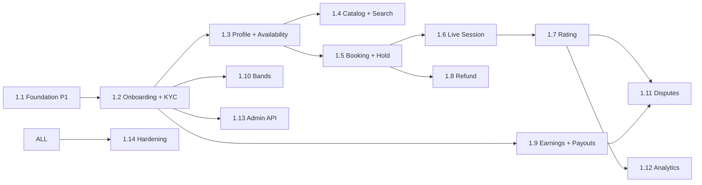

# Work Breakdown Structure — marketplace (service)

**Estimation basis:** 1 BE + 0.25 DevOps + 0.25 QA. Velocity: **18 SP / 2-wk sprint**.

**Phase 1:** ~35 SP (foundation). Phase 2: ~331 SP → ~19 sprints.

---

## WBS Hierarchy

```
1.0 marketplace
├── 1.1 Phase 1 — Foundation
├── 1.2 Phase 2 — Tutor Onboarding + KYC
├── 1.3 Phase 2 — Profile + Availability
├── 1.4 Phase 2 — Catalog + Search
├── 1.5 Phase 2 — Booking + Hold (CRITICAL race-safety)
├── 1.6 Phase 2 — Live Session (Daily.co + NATS)
├── 1.7 Phase 2 — Rating + Review
├── 1.8 Phase 2 — Refund Policy
├── 1.9 Phase 2 — Earnings + Payouts (with payment)
├── 1.10 Phase 2 — Pricing Bands
├── 1.11 Phase 2 — Disputes
├── 1.12 Phase 2 — Creator Analytics
├── 1.13 Phase 2 — Admin Tutor Approval API
└── 1.14 Phase 2 — Hardening + Reconciliation
```

## Phase 1 (S0–S2) · 35 SP

| WP | Activity | SP |
|----|----------|----|
| WP-MK-1.1.1 | FastAPI scaffold + Alembic | 3 |
| WP-MK-1.1.2 | `marketplace_schema` initial migration | 8 |
| WP-MK-1.1.3 | Redis client | 3 |
| WP-MK-1.1.4 | NATS client | 3 |
| WP-MK-1.1.5 | OpenAPI scaffold | 2 |
| WP-MK-1.1.6 | OTel + structured logs | 3 |
| WP-MK-1.1.7 | Stripe Identity client (no flows yet) | 5 |
| WP-MK-1.1.8 | Daily.co client wrapper (no flows yet) | 5 |
| WP-MK-1.1.9 | Health/ready | 1 |
| WP-MK-1.1.10 | JWT validate integration | 2 |

## Phase 2 (S3–S21) ≈ 331 SP

| WP | Section | SP |
|----|---------|----|
| 1.2 KYC + onboarding | 45 |
| 1.3 Profile + Availability | 50 (28+22) |
| 1.4 Catalog + Search | 28 |
| 1.5 Booking + Hold | 38 |
| 1.6 Live Session (Daily.co + NATS) | 38 |
| 1.7 Rating + Review | 22 |
| 1.8 Refund Policy | 16 |
| 1.9 Earnings + Payouts | 22 |
| 1.10 Pricing Bands | 12 |
| 1.11 Disputes | 22 |
| 1.12 Creator Analytics | 14 |
| 1.13 Admin Approval API | 14 |
| 1.14 Hardening | 20 |

## 1.14 Hardening · 20 SP

| WP | Activity | SP |
|----|----------|----|
| WP-MK-1.14.1 | Booking race load test (100 concurrent same slot) | 5 |
| WP-MK-1.14.2 | KYC webhook chaos | 3 |
| WP-MK-1.14.3 | Daily.co session-end webhook idempotency | 3 |
| WP-MK-1.14.4 | Payout reconciliation drill | 5 |
| WP-MK-1.14.5 | Compliance attestation (PII handling, tax) | 2 |
| WP-MK-1.14.6 | Sign-offs | 2 |

---

## Dependency DAG



---

## Capacity & Risk

| Item | Value |
|---|---|
| Team | 1 BE + 0.25 DevOps + 0.25 QA |
| Velocity | 18 SP / sprint |
| Phase 1 SP | 35 (foundation) |
| Phase 2 SP | 331 |
| Phase 2 duration | ~19 sprints (~9 months) |
| Buffer | 30% | KYC + Connect + Daily.co + tax all interact |
| Top risks | KYC rejection (R-MK-01) · Double-booking (R-MK-02) · Daily.co outage (R-MK-03) · Payout error (R-MK-04) | See [BRD §10](./01_brd.md#10-risks) |

---

## DoD

marketplace Phase 2 launch **Done** when:

- ✅ All P0/P1 stories shipped + tests
- ✅ NFR-MK-* verified
- ✅ 10 pilot tutors end-to-end (KYC → first payout)
- ✅ Booking race load test passes (100 concurrent same slot → 1 confirm)
- ✅ Daily reconciliation green for 1 week
- ✅ Daily.co outage simulation handled gracefully
- ✅ Disputes process tested
- ✅ Compliance attestation (PII, tax)
