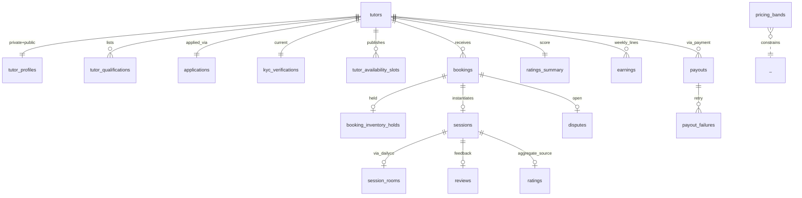

# Data Model — marketplace (service)

**Schema:** `marketplace_schema` (Aurora) + Redis (booking leases)

---

## ERD



---

## Tables

### `tutors`
| Col | Type |
|-----|------|
| user_id | uuid PK | mirror of identity |
| application_status | enum (`draft`, `submitted`, `under_review`, `approved`, `rejected`) |
| status | enum (`active`, `suspended`, `banned`, `inactive`) |
| activated_at, banned_at | timestamptz |
| created_at, updated_at | timestamptz |

### `tutor_profiles`
| Col | Type |
|-----|------|
| user_id | uuid PK FK |
| display_name | text |
| bio | text |
| subjects_taught | text[] |
| languages | text[] |
| hourly_rate_paise | bigint |
| photo_url | text |
| profile_complete | numeric (0..1) |
| public_visible | bool default false |
| updated_at | timestamptz |

### `tutor_qualifications`
| Col | Type |
|-----|------|
| id | uuid PK |
| user_id | uuid FK |
| title | text |
| institution | text nullable |
| year | int nullable |
| evidence_url | text nullable |
| order | int |

### `applications`
| Col | Type |
|-----|------|
| id | uuid PK |
| user_id | uuid FK |
| subjects_proposed | text[] |
| qualifications_summary | text |
| sample_work_urls | text[] |
| motivation | text |
| submitted_at | timestamptz |
| reviewed_by | uuid nullable |
| reviewed_at | timestamptz nullable |
| outcome | enum nullable |
| reason | text nullable |

### `kyc_verifications`
| Col | Type |
|-----|------|
| user_id | uuid PK FK |
| stripe_verification_id | text UNIQUE |
| status | enum (`not_started`, `in_progress`, `verified`, `rejected`, `expired`) |
| started_at, completed_at | timestamptz |
| rejection_reason | text nullable |
| last_webhook_at | timestamptz |

### `tutor_availability_slots`
| Col | Type |
|-----|------|
| id | uuid PK |
| user_id | uuid FK |
| kind | enum (`recurring`, `exception`) |
| day_of_week | int nullable | for recurring |
| start_time | time | local in user_tz |
| end_time | time |
| date | date nullable | for exception |
| slot_minutes | int |
| lead_time_minutes | int |

### `pricing_bands`
| Col | Type |
|-----|------|
| id | uuid PK |
| exam | text |
| subject | text nullable |
| min_paise | bigint |
| max_paise | bigint |
| effective_from, effective_to | timestamptz |

### `bookings`
| Col | Type |
|-----|------|
| id | uuid PK |
| student_user_id | uuid |
| tutor_user_id | uuid |
| slot_start_at | timestamptz |
| slot_end_at | timestamptz |
| rate_paise | bigint | locked at booking time |
| status | enum (`pending`, `confirmed`, `cancelled`, `expired`, `completed`, `no_show_student`, `no_show_tutor`) |
| payment_event_id | text nullable |
| created_at, updated_at | timestamptz |

**Indexes / Constraints:**
- UNIQUE `(tutor_user_id, slot_start_at) WHERE status IN ('confirmed', 'completed')` — prevents double-confirm.
- `(student_user_id, status)`, `(tutor_user_id, slot_start_at)`.

### `booking_inventory_holds`
| Col | Type |
|-----|------|
| booking_id | uuid PK FK |
| held_until | timestamptz |
| redis_lease_id | text |
| created_at | timestamptz |

### `sessions`
| Col | Type |
|-----|------|
| id | uuid PK |
| booking_id | uuid FK UNIQUE |
| started_at, ended_at | timestamptz |
| duration_sec | int nullable |
| outcome | enum (`completed`, `no_show_student`, `no_show_tutor`, `tech_failure`) |
| created_at | timestamptz |

### `session_rooms`
| Col | Type |
|-----|------|
| session_id | uuid PK FK |
| dailyco_room_name | text UNIQUE |
| dailyco_room_url | text |
| student_token | text |
| tutor_token | text |
| created_at | timestamptz |
| destroyed_at | timestamptz nullable |

### `ratings`
| Col | Type |
|-----|------|
| session_id | uuid PK FK |
| stars | int (1..5) |
| created_at | timestamptz |

### `reviews`
| Col | Type |
|-----|------|
| id | uuid PK |
| session_id | uuid FK |
| author_user_id | uuid |
| body | text |
| status | enum (active, hidden, deleted) |
| created_at | timestamptz |

### `ratings_summary`
Materialised; updated post-rating.

| Col | Type |
|-----|------|
| tutor_user_id | uuid PK |
| avg_rating | numeric |
| count | int |
| updated_at | timestamptz |

### `earnings`
Weekly line items.

| Col | Type |
|-----|------|
| id | uuid PK |
| tutor_user_id | uuid |
| session_id | uuid FK nullable |
| amount_paise | bigint | net (after 15% platform take) |
| period_start, period_end | timestamptz |
| status | enum (pending, paid, held_dispute) |
| created_at | timestamptz |

### `payouts`
Mirrors payment service for marketplace view.

| Col | Type |
|-----|------|
| id | uuid PK |
| tutor_user_id | uuid |
| payment_payout_id | text |
| amount_paise | bigint |
| period | text |
| status | enum |
| paid_at | timestamptz nullable |

### `payout_failures`
For retry workflow.

### `disputes`
| Col | Type |
|-----|------|
| id | uuid PK |
| booking_id | uuid FK |
| opener_user_id | uuid |
| reason | text |
| status | enum (open, under_review, resolved_tutor, resolved_student, withdrawn) |
| opened_at | timestamptz |
| resolved_at | timestamptz nullable |
| resolution_notes | text nullable |
| resolution_action | enum (no_action, partial_refund, full_refund, tutor_strike) nullable |

### `dispute_evidence`
| Col | Type |
|-----|------|
| id | uuid PK |
| dispute_id | uuid FK |
| submitter_user_id | uuid |
| text | text nullable |
| file_url | text nullable |
| at | timestamptz |

### `tutor_strikes`
| Col | Type |
|-----|------|
| id | uuid PK |
| tutor_user_id | uuid |
| reason | text |
| linked_dispute_id | uuid nullable |
| at | timestamptz |

---

## Redis Keys

| Key | Value | TTL |
|---|---|---|
| `mk:hold:{tutor_id}:{slot_iso}` | booking_id | 15 min |
| `mk:tutor:{id}:search-card` | cached search payload | 60 s |

---

## Migrations

```
001_tutors_core.py
002_applications_kyc.py
003_availability_pricing.py
004_bookings_holds.py
005_sessions_rooms.py
006_ratings_reviews.py
007_earnings_payouts.py
008_disputes.py
009_strikes.py
010_indexes.py
```

---

## Retention

| Table | Retention |
|---|---|
| Most tables (financial-adjacent) | indefinite (7 yr min legal floor) |
| `dispute_evidence.file_url` (S3) | indefinite |
| `booking_inventory_holds` | purged after expiry |
| `session_rooms.*_token` | redacted from logs |
