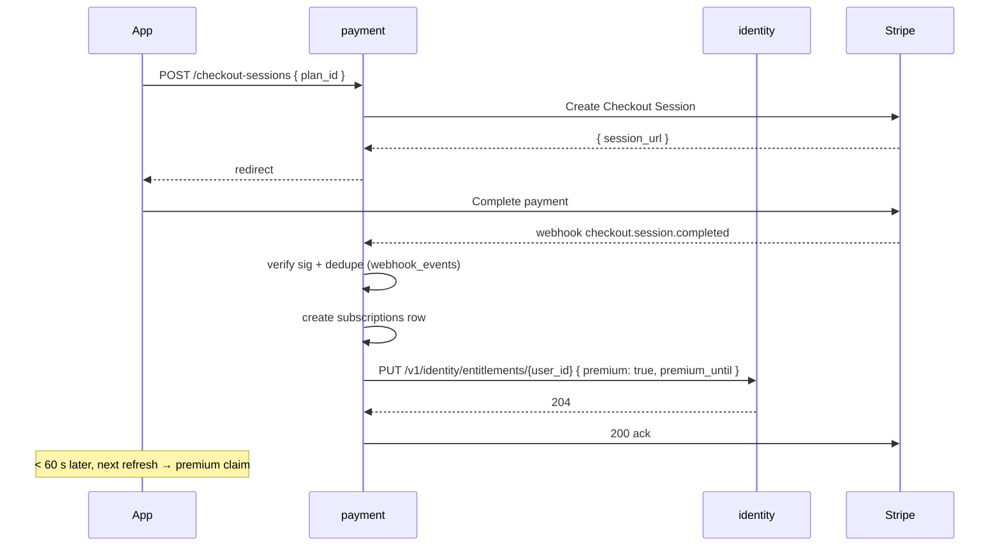
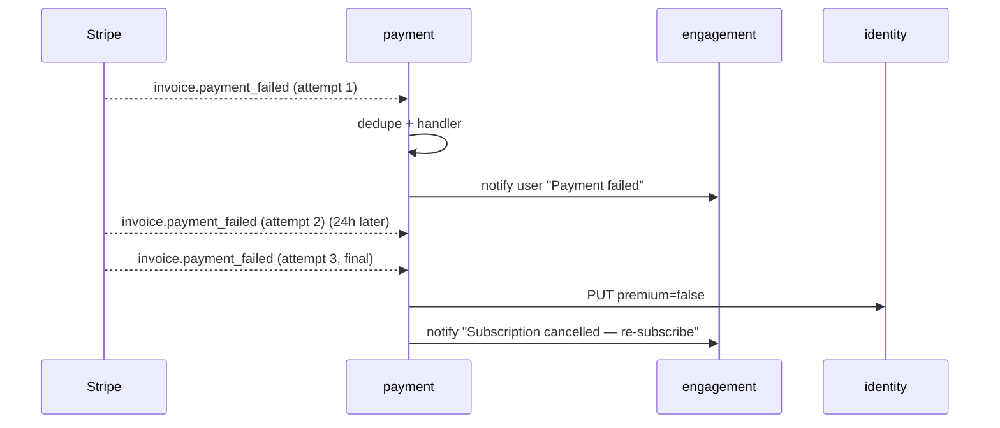

# User Stories — payment (service)

**Anchored to:** [Requirements](./02_requirements.md) · [BRD](./01_brd.md)

---

## Epic Map

| Epic | Title | Stories | SP | Phase | P |
|------|-------|---------|----|-------|---|
| E-PY-01 | Customer + Payment Method | 5 | 18 | 1 | P0 |
| E-PY-02 | Subscription Lifecycle | 5 | 28 | 1 | P0 |
| E-PY-03 | Stripe Checkout | 6 | 30 | 1 | P0 |
| E-PY-04 | Webhook Handler (7 events) | 12 | 60 | 1 | P0 |
| E-PY-05 | Entitlement Events | 5 | 30 | 1 | P0 |
| E-PY-06 | Proration | 3 | 13 | 1 | P0 |
| E-PY-07 | Cancel + Resume | 3 | 12 | 1 | P0 |
| E-PY-08 | Failed Charge Retry | 4 | 18 | 1 | P0 |
| E-PY-09 | Invoices | 3 | 10 | 1 | P1 |
| E-PY-10 | Refunds | 6 | 26 | 1 | P0 |
| E-PY-11 | Disputes | 3 | 16 | 1–2 | P0/P1 |
| E-PY-12 | Marketplace Payouts (Connect) | 6 | 32 | 2 | P1 |
| E-PY-13 | Tax (GST) | 3 | 18 | 2 | P2 |
| E-PY-14 | Revenue Reporting | 5 | 16 | 1–2 | P0 |
| E-PY-15 | Currency | 2 | 6 | 1–2 | P0/P2 |
| E-PY-XC | Cross-cutting | 10 | 20 | 1 | P0 |
| **TOTAL** | | **81** | **353** | | |

Phase 1 ≈ 260 SP · Phase 2 ≈ 93 SP.

---

## E-PY-04 — Webhook Handler (representative, critical)

### S-PY-04.01 — Verify + dedupe webhook

**P:** P0 · **SP:** 8

**As** the payment service **I want** to verify Stripe signatures and dedupe by event id **so that** I never double-process.

**AC**
1. `POST /webhooks/stripe` accepts Stripe events.
2. Verify signature using `STRIPE_WEBHOOK_SECRET` (from KMS).
3. Reject 400 if signature invalid.
4. Check `webhook_events` table for `stripe_event_id` — if present, return 200 (idempotent ack).
5. Else: insert `webhook_events` row + dispatch to handler.
6. Both DB ops in one transaction (atomic).
7. On handler error: don't insert — Stripe retries.
8. Log latency + event type + outcome.
9. Forward-compat: unknown event types are inserted (recorded) + 200 ack.

**API:** `POST /v1/payment/webhooks/stripe`.

**Data:** `webhook_events (stripe_event_id PK, event_type, payload, received_at, processed_at nullable, error nullable)`.

**Negative:** invalid signature · duplicate id · payload too large.

**QA:** replay test — send same event 10× → exactly one entitlement update.

### S-PY-04.03..09 — Per-event handlers

| ID | Story | P | SP |
|---|---|---|---|
| S-PY-04.03 | checkout.session.completed → subscription create + entitlement | P0 | 5 |
| S-PY-04.04 | customer.subscription.created | P0 | 5 |
| S-PY-04.05 | customer.subscription.updated | P0 | 5 |
| S-PY-04.06 | customer.subscription.deleted (period end) → entitlement off | P0 | 5 |
| S-PY-04.07 | invoice.paid | P0 | 3 |
| S-PY-04.08 | invoice.payment_failed → dunning + retry | P0 | 5 |
| S-PY-04.09 | charge.dispute.created → admin notify | P0 | 5 |

| ID | Story | P | SP |
|---|---|---|---|
| S-PY-04.02 | Per-event-type latency dashboard | P0 | 3 |
| S-PY-04.10 | Unknown event type — log + ack | P0 | 3 |
| S-PY-04.11 | Webhook secret rotation drill | P0 | 5 |
| S-PY-04.12 | Connect-account webhooks (Phase 2) | P1 | 8 |

---

## E-PY-05 — Entitlement Events

### S-PY-05.01 — PUT entitlement to identity

**P:** P0 · **SP:** 8 · **Maps to:** FR-PY-05-01, 04

**As** the payment service **I want** to publish `premium=true` to identity within 60 s of a successful checkout **so that** the user's app reflects the upgrade immediately.

**AC**
1. On `checkout.session.completed` handler completion → `PUT /v1/identity/entitlements/{user_id}` with `{ premium: true, premium_until: <period_end> }`.
2. PUT is idempotent at identity (FR-PY-07 on identity).
3. Retry with backoff (1 s, 4 s, 15 s) on failure.
4. After 3 fails → alert + retry job (eventually consistent).
5. Telemetry: histogram of (webhook receipt → entitlement update) latency.
6. Alert if p95 > 60 s.

**Negative:** identity down → retry queue; eventual delivery.

| ID | Story | P | SP |
|---|---|---|---|
| S-PY-05.02 | On sub deleted → premium=false | P0 | 5 |
| S-PY-05.03 | On payment_failed past grace → premium=false | P0 | 5 |
| S-PY-05.04 | < 60 s SLA + alert | P0 | 5 |
| S-PY-05.05 | Retry queue for identity-down | P0 | 7 |

---

## E-PY-01 — Customer + Payment Method

5 stories, 18 SP — see FA-01.

## E-PY-02 — Subscription Lifecycle

5 stories, 28 SP — see FA-02.

## E-PY-03 — Stripe Checkout

| ID | Story | P | SP |
|---|---|---|---|
| S-PY-03.01 | Create checkout session | P0 | 5 |
| S-PY-03.02 | Success/cancel URLs with return_to | P0 | 3 |
| S-PY-03.03 | Attach existing customer | P0 | 5 |
| S-PY-03.04 | INR Phase 1 | P0 | 3 |
| S-PY-03.05 | Idempotent | P0 | 5 |
| S-PY-03.06 | Marketplace booking checkout (Phase 2) | P1 | 9 |

## E-PY-06 — Proration

3 stories, 13 SP.

## E-PY-07 — Cancel + Resume

3 stories, 12 SP.

## E-PY-08 — Failed Charge Retry

4 stories, 18 SP.

## E-PY-09 — Invoices

3 stories, 10 SP.

## E-PY-10 — Refunds

| ID | Story | P | SP |
|---|---|---|---|
| S-PY-10.01 | Admin full refund | P0 | 5 |
| S-PY-10.02 | Admin partial refund | P1 | 3 |
| S-PY-10.03 | 2-step admin confirm | P0 | 3 |
| S-PY-10.04 | Reason recorded | P0 | 2 |
| S-PY-10.05 | Refund propagates to entitlement | P0 | 5 |
| S-PY-10.06 | Policy-driven refund (marketplace cancel-24h) | P1 | 8 |

## E-PY-11 — Disputes

3 stories, 16 SP.

## E-PY-12 — Marketplace Payouts (Phase 2)

6 stories, 32 SP. Connect Express, 15% take, weekly schedule.

## E-PY-13 — Tax

3 stories, 18 SP.

## E-PY-14 — Revenue Reporting

5 stories, 16 SP.

## E-PY-15 — Currency

2 stories, 6 SP.

## E-PY-XC — Cross-cutting

10 stories, 20 SP.

---

## Flow Diagrams

### Subscribe + entitlement flip

### Failed charge retry + dunning

