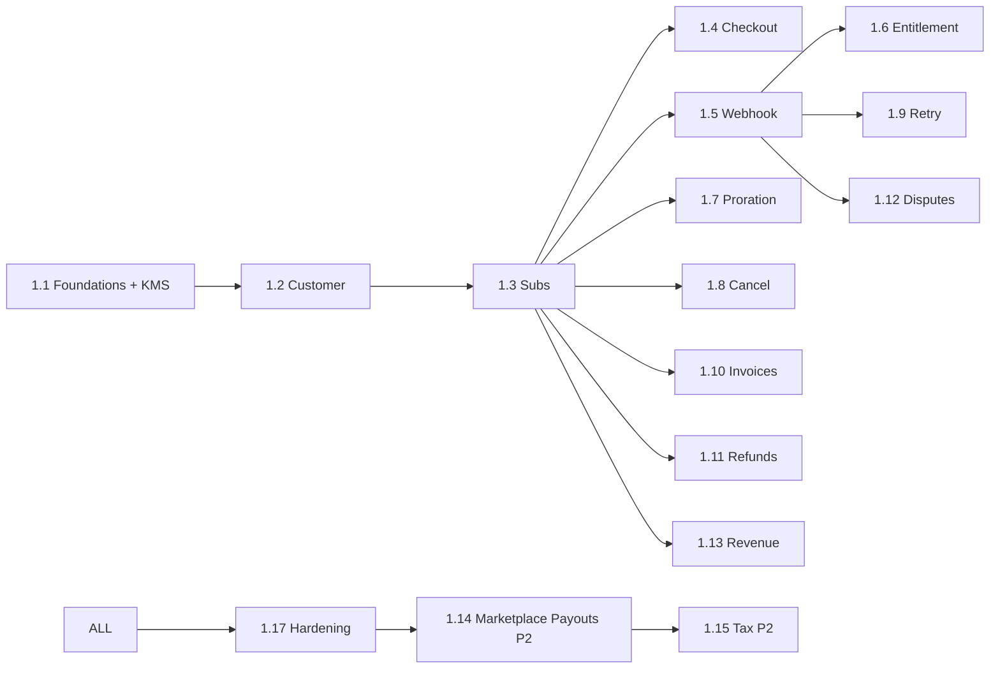

# Work Breakdown Structure — payment (service)

**Estimation basis:** 1 BE + 0.25 DevOps + 0.25 QA. Velocity: **18 SP / 2-wk sprint**.

**Phase 1:** ~260 SP → ~15 sprints (~7.5 months). Phase 2: ~93 SP → ~6 sprints.

---

## WBS Hierarchy

```
1.0 payment
├── 1.1 Foundations + Schema + Stripe SDK + KMS
├── 1.2 Customer + Payment Method
├── 1.3 Subscription Lifecycle
├── 1.4 Stripe Checkout
├── 1.5 Webhook Handler (CRITICAL — dedupe + 7 events)
├── 1.6 Entitlement Events to identity (CRITICAL — < 60 s)
├── 1.7 Proration
├── 1.8 Cancel + Resume
├── 1.9 Failed Charge Retry + Dunning
├── 1.10 Invoices
├── 1.11 Refunds
├── 1.12 Disputes
├── 1.13 Revenue Reporting v1
├── 1.14 Marketplace Payouts (Phase 2)
├── 1.15 Tax (Phase 2)
├── 1.16 Multi-currency (Phase 2)
└── 1.17 Hardening + Reconciliation Drill
```

## Phase 1 (S0–S15) ≈ 260 SP

| WP | Section | SP |
|----|---------|----|
| 1.1 Foundations + KMS + Stripe SDK + OpenAPI | 30 |
| 1.2 Customer | 18 |
| 1.3 Subs | 28 |
| 1.4 Checkout (P0 subset) | 21 |
| 1.5 Webhook handler (7 events + dedupe + secret rotation) | 50 |
| 1.6 Entitlement events (+ retry queue, alert) | 30 |
| 1.7 Proration | 13 |
| 1.8 Cancel + Resume | 12 |
| 1.9 Failed retry + dunning | 18 |
| 1.10 Invoices P1 subset | 6 |
| 1.11 Refunds P0 subset | 13 |
| 1.12 Disputes P0 subset | 8 |
| 1.13 Revenue v1 (MRR/ARR/failed-charge) | 8 |
| 1.17 Hardening | 25 |

## Phase 2 (S16–S21) ≈ 93 SP

| WP | Section | SP |
|----|---------|----|
| 1.14 Marketplace Payouts (Connect Express + 15% + weekly + reconciliation) | 32 |
| 1.15 Tax (Stripe Tax + GST + B2B) | 18 |
| 1.16 Multi-currency | 6 |
| 1.11 cont | Partial refund + policy-driven | 13 |
| 1.12 cont | Evidence submission | 8 |
| 1.13 cont | Cohort retention + refund volume | 8 |
| 1.10 cont | Tax breakdown on invoice | 3 |
| 1.9 cont | Dunning escalation tuning | 5 |

## 1.17 Hardening · 25 SP

| WP | Activity | SP |
|----|----------|----|
| WP-PY-1.17.1 | Webhook replay test (10× same event) | 5 |
| WP-PY-1.17.2 | Entitlement-flip latency soak test | 5 |
| WP-PY-1.17.3 | Stripe sandbox reconciliation (1 week) | 5 |
| WP-PY-1.17.4 | Webhook secret rotation drill | 3 |
| WP-PY-1.17.5 | Refund chaos (Stripe down mid-refund) | 3 |
| WP-PY-1.17.6 | Sign-offs + compliance attestation | 4 |

---

## Timeline (Phase 1)

```
Sprint 1  2  3  4  5  6  7  8  9 10 11 12 13 14 15
1.1 Fnd  ▓▓ ▓▓
1.2 Cust       ▓▓
1.3 Sub        ▓▓ ▓▓
1.4 Co               ▓▓ ▓▓
1.5 WH                      ▓▓ ▓▓ ▓▓
1.6 Ent                              ▓▓ ▓▓
1.7 Pro                                    ▓▓
1.8 Can                                       ▓▓
1.9 Ret                                          ▓▓
1.10 Inv                                          ▓▓
1.11 Ref                                             ▓▓
1.12 Dis                                                ▓▓
1.13 Rev                                                ▓▓
1.17 Har                                                    ▓▓
```

---

## Dependency DAG



---

## Capacity & Risk

| Item | Value | Note |
|---|---|---|
| Team | 1 BE + 0.25 DevOps + 0.25 QA | |
| Velocity | 18 SP / sprint | |
| Phase 1 SP | 260 | |
| Phase 1 duration | ~15 sprints | |
| Buffer | 25% | Webhook complexity + Stripe edge cases |
| Top risks | Double webhook (R-PY-01) · Entitlement > 60 s (R-PY-02) · Stripe outage (R-PY-03) | See [BRD §10](./01_brd.md#10-risks) |

---

## Definition of Done

payment Phase 1 is **Done** when:

- ✅ All P0 stories shipped + tests
- ✅ NFR-PY-* verified
- ✅ Webhook replay test passes (idempotent)
- ✅ Entitlement-flip p95 < 60 s
- ✅ Refund end-to-end on Stripe sandbox
- ✅ Failed-charge retry verified
- ✅ 1-week reconciliation report clean
- ✅ Webhook secret rotation drill complete
- ✅ Compliance attestation (PCI-DSS scope minimal)
