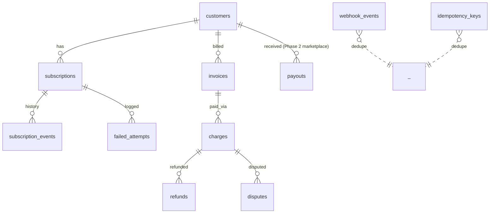

# Data Model — payment (service)

**Schema:** `payment_schema` (Aurora Postgres 15)

---

## ERD



---

## Tables

### `customers`
| Col | Type |
|-----|------|
| user_id | uuid PK | mirror of identity.users.id |
| stripe_customer_id | text UNIQUE |
| default_currency | text default 'INR' |
| created_at | timestamptz |

### `subscriptions`
| Col | Type |
|-----|------|
| id | uuid PK |
| user_id | uuid |
| stripe_subscription_id | text UNIQUE |
| plan_id | text | e.g. `premium_monthly_inr` |
| status | enum (`incomplete`, `active`, `past_due`, `canceled`, `unpaid`) |
| current_period_start, current_period_end | timestamptz |
| cancel_at_period_end | bool default false |
| canceled_at | timestamptz nullable |
| created_at, updated_at | timestamptz |

**Indexes:** `(user_id, status)`, `(stripe_subscription_id) UNIQUE`.

### `subscription_events`
| Col | Type |
|-----|------|
| id | uuid PK |
| subscription_id | uuid FK |
| event | enum (created, activated, upgraded, downgraded, canceled, resumed, period_end, ...) |
| from_status, to_status | enum nullable |
| stripe_event_id | text nullable |
| at | timestamptz |

### `invoices`
| Col | Type |
|-----|------|
| stripe_invoice_id | text PK |
| subscription_id | uuid FK |
| amount_paise | bigint |
| currency | text |
| status | enum (draft, open, paid, uncollectible, void) |
| hosted_invoice_url | text |
| pdf_url | text |
| billing_reason | text |
| period_start, period_end | timestamptz |
| paid_at | timestamptz nullable |
| created_at | timestamptz |

### `charges`
| Col | Type |
|-----|------|
| stripe_charge_id | text PK |
| invoice_id | text FK |
| amount_paise | bigint |
| currency | text |
| status | enum (pending, succeeded, failed) |
| receipt_url | text |
| created_at | timestamptz |

### `refunds`
| Col | Type |
|-----|------|
| id | uuid PK |
| stripe_refund_id | text UNIQUE |
| charge_id | text FK |
| amount_paise | bigint |
| reason | text |
| status | enum (pending, succeeded, failed) |
| initiated_by | uuid | admin user_id |
| created_at | timestamptz |

### `disputes`
| Col | Type |
|-----|------|
| id | uuid PK |
| stripe_dispute_id | text UNIQUE |
| charge_id | text FK |
| amount_paise | bigint |
| reason | text |
| status | enum (needs_response, under_review, won, lost) |
| evidence_due_by | timestamptz |
| created_at, updated_at | timestamptz |

### `failed_attempts`
Per-failure log for dunning.

| Col | Type |
|-----|------|
| id | uuid PK |
| subscription_id | uuid FK |
| attempt_no | int |
| failure_reason | text |
| failed_at | timestamptz |
| next_retry_at | timestamptz nullable |

### `payouts` (Phase 2 — marketplace)
| Col | Type |
|-----|------|
| id | uuid PK |
| tutor_user_id | uuid |
| stripe_payout_id | text UNIQUE |
| amount_paise | bigint |
| currency | text |
| period_start, period_end | timestamptz |
| status | enum (pending, paid, failed) |
| failure_reason | text nullable |
| created_at, paid_at | timestamptz |

### `payout_failures` (Phase 2)
For retry workflow.

### `webhook_events`
Dedupe + audit.

| Col | Type |
|-----|------|
| stripe_event_id | text PK |
| event_type | text |
| api_version | text |
| payload | jsonb | full event |
| received_at | timestamptz |
| processed_at | timestamptz nullable |
| error | text nullable |
| handler_version | text |

**Indexes:** `(event_type, received_at DESC)`, `(processed_at) WHERE processed_at IS NULL` (retry queue).

### `idempotency_keys`
| Col | Type |
|-----|------|
| user_id | uuid (or service id) |
| key | uuid |
| endpoint | text |
| created_at | timestamptz |
| ttl_at | timestamptz |
| response_blob | jsonb |
| PRIMARY KEY (user_id, key) |

### `revenue_snapshots`
Daily MRR / ARR.

| Col | Type |
|-----|------|
| day | date PK |
| mrr_paise | bigint |
| arr_paise | bigint |
| active_subs | int |
| new_subs_today | int |
| canceled_today | int |
| failed_charges_today | int |
| breakdown | jsonb |

---

## Migrations

```
001_customers_subscriptions.py
002_invoices_charges.py
003_refunds_disputes.py
004_failed_attempts.py
005_webhook_events.py            -- CRITICAL idempotency table
006_idempotency_keys.py
007_revenue_snapshots.py
008_payouts.py                    -- Phase 2
009_payout_failures.py            -- Phase 2
```

---

## Retention

| Table | Retention |
|-------|-----------|
| `webhook_events` | indefinite (compliance + audit) |
| `subscription_events` | indefinite |
| `invoices` / `charges` / `refunds` / `disputes` | indefinite (tax/legal: 7 yr min) |
| `failed_attempts` | 2 yr |
| `idempotency_keys` | 24 h |
| `revenue_snapshots` | indefinite |

## Money-Correctness Invariants

- Amounts in **paise** (integer) — never floats.
- Currency codes ISO 4217 (`INR`, etc.).
- Stripe is source of truth; our DB reconciles.
- Every status transition flows through `subscription_events` (audit).
- Webhook handlers are idempotent on `stripe_event_id`.
- Reconciliation job daily: compare our `subscriptions.status` vs Stripe API; alert on drift.
