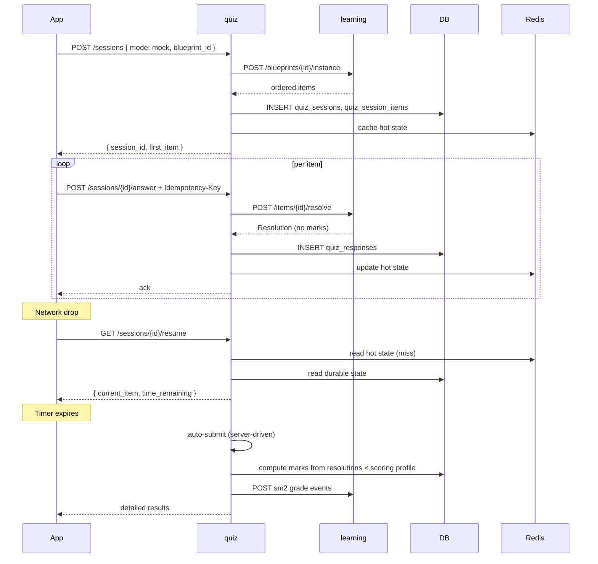

# User Stories — quiz (service)

**Anchored to:** [Requirements](./02_requirements.md) · [BRD](./01_brd.md)

---

## Epic Map

| Epic | Title | Stories | SP | Phase | P |
|------|-------|---------|----|-------|---|
| E-QZ-01 | Session Lifecycle | 10 | 50 | 1 | P0 |
| E-QZ-02 | Item Delivery | 5 | 22 | 1 | P0 |
| E-QZ-03 | Answer Acceptance + Resolution | 7 | 40 | 1 | P0 |
| E-QZ-04 | Scoring | 7 | 30 | 1 | P0 |
| E-QZ-05 | Mock Test Engine | 8 | 50 | 1 | P0 |
| E-QZ-06 | PYQ Drill | 3 | 13 | 1 | P0 |
| E-QZ-07 | Revision Queue Integration | 2 | 12 | 2 | P1 |
| E-QZ-08 | History + Detailed Results | 5 | 22 | 1 | P0 |
| E-QZ-09 | Time Tracking | 5 | 20 | 1–2 | P0/P2 |
| E-QZ-10 | Anti-Cheat | 5 | 22 | 1–2 | P0/P1 |
| E-QZ-11 | Battle Scoring Delegate | 2 | 13 | 2 | P1 |
| E-QZ-12 | Idempotency + Reliability | 5 | 30 | 1 | P0 |
| E-QZ-XC | Cross-cutting | 10 | 22 | 1 | P0 |
| **TOTAL** | | **74** | **346** | | |

Phase 1 ≈ 270 SP · Phase 2 ≈ 76 SP.

---

## E-QZ-03 — Answer Acceptance + Resolution (representative)

### S-QZ-03.01 — Idempotent answer submit

**P:** P0 · **SP:** 8 · **Maps to:** FR-QZ-03-01, FR-QZ-12-01

**As** the quiz service **I want** to accept an answer exactly once per (session, item, idempotency-key) **so that** network retries don't double-count.

**AC**
1. `POST /v1/quiz/sessions/{id}/answer` with `Idempotency-Key` header (UUID v4 from client).
2. Check `idempotency_keys` table; if seen, return cached response.
3. Else: store raw input + call learning.resolve.
4. Persist atomically: response row + idempotency-key row.
5. 24 h TTL on idempotency keys; cleanup job daily.
6. Concurrent same-key request: second waits for first or sees cached result.
7. Per-user scoping (key collisions across users impossible).
8. Idempotency-Key absent → 400 `IDEMPOTENCY_REQUIRED`.

**API:** `POST /v1/quiz/sessions/{id}/answer` (see [05_api_contract.md](./05_api_contract.md)).

**Data:** `quiz_responses`, `quiz_idempotency_keys`.

**QA:** chaos test — kill mid-request, retry, verify single insert. Load test — 1000 concurrent same key → all see same result.

### S-QZ-03.04 — Resolution contract assertion

**P:** P0 · **SP:** 3

(CI test: receive Resolution from learning, assert no `marks` field at JSON level. Fails build on regression.)

| ID | Story | P | SP |
|---|---|---|---|
| S-QZ-03.02 | Call learning.resolve | P0 | 5 |
| S-QZ-03.03 | Store raw input + resolution | P0 | 5 |
| S-QZ-03.05 | Retry with backoff (3x) on learning timeout | P0 | 5 |
| S-QZ-03.06 | Degraded mode when learning down | P1 | 8 |
| S-QZ-03.07 | Answer revision before submit | P0 | 6 |

---

## E-QZ-01 — Session Lifecycle

| ID | Story | P | SP |
|---|---|---|---|
| S-QZ-01.01 | Start session with mode | P0 | 5 |
| S-QZ-01.02 | Start session from blueprint id | P0 | 5 |
| S-QZ-01.03 | Session FSM | P0 | 5 |
| S-QZ-01.04 | Pause (non-mock) | P0 | 5 |
| S-QZ-01.05 | Resume | P0 | 8 |
| S-QZ-01.06 | Submit (idempotent) | P0 | 5 |
| S-QZ-01.07 | Abandon explicit | P1 | 3 |
| S-QZ-01.08 | 24 h resumable | P0 | 5 |
| S-QZ-01.09 | Mock auto-submit on timeout | P0 | 5 |
| S-QZ-01.10 | Confirm protocol | P0 | 4 |

---

## E-QZ-02 — Item Delivery

5 stories, 22 SP — see FA-02.

---

## E-QZ-04 — Scoring

| ID | Story | P | SP |
|---|---|---|---|
| S-QZ-04.01 | Apply blueprint scoring profile | P0 | 8 |
| S-QZ-04.02 | Negative marks support | P0 | 3 |
| S-QZ-04.03 | Server-side only | P0 | 2 |
| S-QZ-04.04 | Determinism test | P0 | 3 |
| S-QZ-04.05 | Section totals | P0 | 5 |
| S-QZ-04.06 | Topic breakdown | P0 | 5 |
| S-QZ-04.07 | Historic immutability | P0 | 4 |

---

## E-QZ-05 — Mock Test Engine

| ID | Story | P | SP |
|---|---|---|---|
| S-QZ-05.01 | Server-side countdown | P0 | 8 |
| S-QZ-05.02 | Sectional time limits | P1 | 5 |
| S-QZ-05.03 | No-pause enforcement | P0 | 3 |
| S-QZ-05.04 | Auto-submit on timeout | P0 | 5 |
| S-QZ-05.05 | Nav state model | P0 | 8 |
| S-QZ-05.06 | Detailed results | P0 | 8 |
| S-QZ-05.07 | Section+topic breakdown | P0 | 5 |
| S-QZ-05.08 | Rank prediction surface | P2 | 8 |

---

## E-QZ-06 — PYQ Drill

3 stories, 13 SP.

## E-QZ-07 — Revision (Phase 2)

2 stories, 12 SP.

## E-QZ-08 — History + Detailed Results

| ID | Story | P | SP |
|---|---|---|---|
| S-QZ-08.01 | List past sessions | P0 | 5 |
| S-QZ-08.02 | Filter | P1 | 3 |
| S-QZ-08.03 | Continue-where-left-off | P0 | 5 |
| S-QZ-08.04 | Detailed results view | P0 | 8 |
| S-QZ-08.05 | Export PDF | P3 | 1 |

## E-QZ-09 — Time Tracking

5 stories, 20 SP.

## E-QZ-10 — Anti-Cheat

5 stories, 22 SP. Server-authoritative everything.

## E-QZ-11 — Battle Scoring Delegate (Phase 2)

2 stories, 13 SP.

## E-QZ-12 — Idempotency + Reliability

5 stories, 30 SP. Idempotency + dual-store (Redis hot, Postgres durable).

## E-QZ-XC — Cross-cutting

10 stories, 22 SP.

---

## Flow Diagrams

### Mock test — start to finish (with resume)

