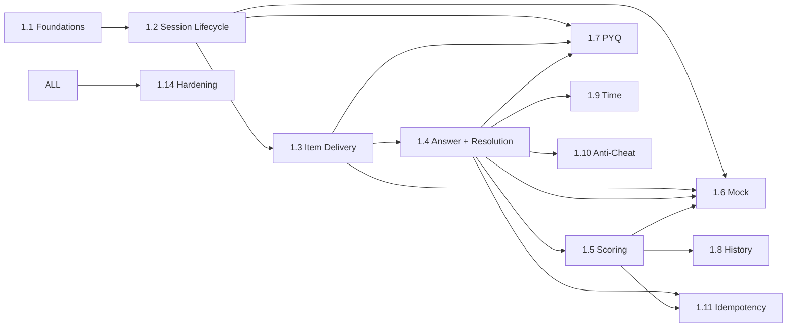

# Work Breakdown Structure — quiz (service)

**Anchored to:** [Stories](./03_user_stories.md) · [BRD](./01_brd.md)

**Estimation basis:** 1 Go BE + 0.25 DevOps + 0.25 QA. Velocity: **18 SP / 2-wk sprint**.

**Phase 1:** ~270 SP → **~15 sprints (~7.5 months)**. Phase 2: ~76 SP → ~5 sprints.

---

## WBS Hierarchy

```
1.0 quiz
├── 1.1 Foundations + Schema (Go + golang-migrate)
├── 1.2 Session Lifecycle
├── 1.3 Item Delivery
├── 1.4 Answer Acceptance + Resolution Caller
├── 1.5 Scoring
├── 1.6 Mock Test Engine
├── 1.7 PYQ Drill
├── 1.8 History + Detailed Results
├── 1.9 Time Tracking
├── 1.10 Anti-Cheat
├── 1.11 Idempotency + Reliability (Redis + Postgres dual-store)
├── 1.12 Revision Integration (Phase 2)
├── 1.13 Battle Scoring Delegate (Phase 2)
└── 1.14 Hardening + Load Test
```

---

## Phase 1 (S0–S14) ≈ 270 SP

| WP | Section | SP |
|----|---------|----|
| 1.1 Foundations | Go scaffold, pgx, migrations, Redis client, OTel, slog, OpenAPI, health/ready, JWT validate lib | 30 |
| 1.2 Lifecycle | E-QZ-01 (10 stories) | 48 |
| 1.3 Delivery | E-QZ-02 (5) | 22 |
| 1.4 Answer + Resolution | E-QZ-03 P0 (5) | 27 |
| 1.5 Scoring | E-QZ-04 (7) | 30 |
| 1.6 Mock | E-QZ-05 P0 (7) | 42 |
| 1.7 PYQ | E-QZ-06 (3) | 13 |
| 1.8 History | E-QZ-08 P0 (4) | 21 |
| 1.9 Time | E-QZ-09 Phase 1 (3) | 12 |
| 1.10 Anti-Cheat | E-QZ-10 Phase 1 (3) | 12 |
| 1.11 Idempotency | E-QZ-12 (5) | 30 |
| 1.14 Hardening | Load + chaos | 25 |

## Phase 2 (S15–S19) ≈ 76 SP

| WP | Section | SP |
|----|---------|----|
| 1.4 cont | Degraded mode when learning down | 8 |
| 1.12 | Revision queue integration | 12 |
| 1.13 | Battle scoring delegate | 13 |
| 1.5 cont | Rank prediction surface | 8 |
| 1.9 cont | Tab-switch + emit analytics | 13 |
| 1.10 cont | Suspicious pattern detection | 10 |
| 1.6 cont | Sectional time limits | 5 |
| 1.8 cont | Export PDF stub | 1 |
| 1.11 cont | Snapshot frequency tuning | 6 |

## 1.14 Hardening · 25 SP

| WP | Activity | SP |
|----|----------|----|
| WP-QZ-1.14.1 | 10K concurrent answer-ack load | 5 |
| WP-QZ-1.14.2 | 1000 concurrent mock test load | 5 |
| WP-QZ-1.14.3 | Chaos: kill pod mid-quiz, verify resume | 5 |
| WP-QZ-1.14.4 | Resolution contract CI gate | 3 |
| WP-QZ-1.14.5 | Idempotency dup-key chaos | 3 |
| WP-QZ-1.14.6 | Sign-offs | 4 |

---

## Timeline (Phase 1)

```
Sprint  1   2   3   4   5   6   7   8   9  10  11  12  13  14
1.1 Fnd ▓▓ ▓▓
1.2 Life       ▓▓ ▓▓ ▓▓
1.3 Del              ▓▓ ▓▓
1.4 Ans                    ▓▓ ▓▓
1.5 Sc                          ▓▓ ▓▓
1.6 Mck                              ▓▓ ▓▓
1.7 PYQ                                    ▓▓
1.8 His                                       ▓▓
1.9 Tm                                          ▓▓
1.10 AC                                          ▓▓
1.11 Idm                                            ▓▓
1.14 Hr                                                ▓▓
```

---

## Dependency DAG



---

## Capacity & Risk

| Item | Value | Note |
|---|---|---|
| Team | 1 Go BE + 0.25 DevOps + 0.25 QA | Tight |
| Velocity | 18 SP / sprint | |
| Phase 1 SP | 270 | |
| Phase 1 duration | ~15 sprints (~7.5 months) | |
| Buffer | 20% | Resilience + chaos work |
| Top risks | Session desync (R-QZ-01) · learning down (R-QZ-02) · clock drift (R-QZ-03) | See [BRD §10](./01_brd.md#10-risks) |

---

## Definition of Done

quiz Phase 1 is **Done** when:

- ✅ All P0 stories shipped
- ✅ NFR-QZ-* verified
- ✅ Load test passes 10K concurrent answer-ack p95 < 100 ms
- ✅ Mock-test load test 1000 concurrent
- ✅ Chaos test: kill pod mid-quiz, resume verified
- ✅ Resolution contract CI gate green (no marks ever)
- ✅ Idempotency tested under network duplication
- ✅ 24 h state preservation verified
