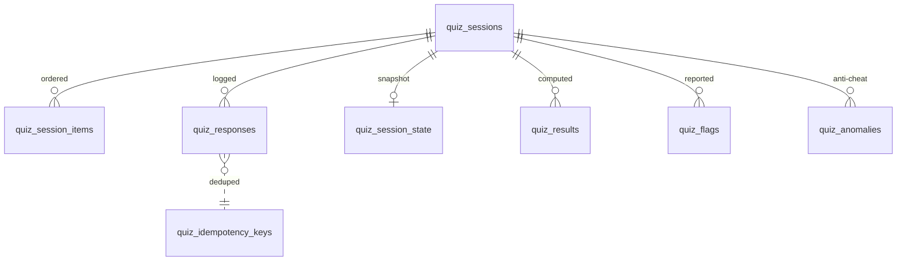

# Data Model — quiz (service)

**Schema:** `quiz_schema` (Aurora Postgres 15) + Redis 7 (hot state)
**Anchored to:** [API contract](./05_api_contract.md) · [BRD](./01_brd.md)

---

## ERD (Mermaid)



---

## Tables

### `quiz_sessions`
| Col | Type | Notes |
|-----|------|-------|
| id | uuid PK |
| user_id | uuid | identity ref |
| mode | enum (`quick`, `focused`, `mock`, `pyq`, `revision`) |
| blueprint_id | uuid nullable | for mock |
| exam_id | text |
| status | enum (`created`, `in_progress`, `paused`, `submitted`, `abandoned`, `timed_out`) |
| started_at_server | timestamptz |
| time_limit_sec | int nullable |
| submitted_at | timestamptz nullable |
| total_items | int |
| current_item_seq | int default 0 |
| scoring_profile_id | uuid | from learning's blueprint scoring profile |
| created_at, updated_at | timestamptz |

**Indexes:** `(user_id, status)`, `(user_id, started_at_server DESC)`, `(status, started_at_server) WHERE status IN ('in_progress','paused')`.

### `quiz_session_items`
Ordered item sequence for the session.

| Col | Type |
|-----|------|
| session_id | uuid FK |
| seq | int |
| item_id | uuid | learning ref |
| section_code | text nullable |
| answered_at_server | timestamptz nullable |
| time_ms | int nullable |
| marked_for_review | bool default false |
| PRIMARY KEY (session_id, seq) |

### `quiz_responses`
Raw input + resolution. **Resolution NEVER contains marks.**

| Col | Type |
|-----|------|
| id | uuid PK |
| session_id | uuid FK |
| item_id | uuid |
| user_input | jsonb |
| resolution | jsonb | { status, matched_count, total_count, per_part, evaluation_mode, evaluator_metadata } |
| answered_at_server | timestamptz |
| latency_resolve_ms | int | learning round-trip |
| revised_count | int default 0 |
| idempotency_key | uuid |
| UNIQUE (session_id, item_id, idempotency_key) |

**Indexes:** `(session_id, item_id)`, `(idempotency_key)`.

### `quiz_session_state`
Latest snapshot for fast resume; redundant with the above but indexed for resume in one read.

| Col | Type |
|-----|------|
| session_id | uuid PK FK |
| current_item_seq | int |
| time_remaining_sec | int |
| state_blob | jsonb | per-item answer states for nav UI |
| snapshot_at | timestamptz |

Redis mirror: key `quiz:session:{id}:state` TTL 24 h. On miss, read from Postgres.

### `quiz_results`
Computed on submit. Immutable.

| Col | Type |
|-----|------|
| session_id | uuid PK FK |
| total_marks | numeric |
| max_marks | numeric |
| section_breakdown | jsonb | `[ { section, marks, max, correct, attempted, time_ms } ]` |
| topic_breakdown | jsonb |
| time_total_ms | int |
| computed_at | timestamptz |
| scoring_profile_id | uuid | snapshot |
| scoring_profile_version | text |

### `quiz_idempotency_keys`
For dedupe of answer + submit requests.

| Col | Type |
|-----|------|
| key | uuid |
| user_id | uuid |
| endpoint | text |
| created_at | timestamptz |
| ttl_at | timestamptz |
| response_blob | jsonb | cached response |
| PRIMARY KEY (user_id, key) |

Daily purge of expired keys.

### `quiz_flags`
| Col | Type |
|-----|------|
| id | uuid PK |
| session_id | uuid FK |
| item_id | uuid |
| user_id | uuid |
| reason | text |
| comment | text nullable |
| at | timestamptz |

Forwarded async to learning's item-flag endpoint.

### `quiz_anomalies`
Anti-cheat anomalies (Phase 2).

| Col | Type |
|-----|------|
| id | uuid PK |
| session_id | uuid |
| user_id | uuid |
| anomaly_type | enum (`fast_answer`, `tab_switch`, `concurrent_session`, ...) |
| details | jsonb |
| at | timestamptz |

---

## Redis Keys (Hot State)

| Key | Value | TTL |
|---|---|---|
| `quiz:session:{id}:state` | JSON of `quiz_session_state` | 24 h |
| `quiz:user:{user_id}:active_sessions` | set of session ids | until last submit |
| `quiz:idem:{user_id}:{key}` | cached response | 24 h |
| `quiz:mock:{id}:countdown` | remaining seconds | until timeout |

---

## Migrations (golang-migrate)

```
001_create_quiz_schema.up.sql        -- quiz_sessions, quiz_session_items
002_quiz_responses.up.sql             -- quiz_responses
003_quiz_state_snapshot.up.sql        -- quiz_session_state
004_quiz_results.up.sql               -- quiz_results
005_quiz_idempotency.up.sql           -- quiz_idempotency_keys
006_quiz_flags.up.sql                 -- quiz_flags
007_quiz_anomalies.up.sql             -- quiz_anomalies (Phase 2)
008_indexes.up.sql                    -- composite indexes for queue + history
```

Every migration has matching `.down.sql`.

---

## Performance Notes

- `quiz_sessions` partitioned by month (Phase 2) when volume warrants.
- `quiz_responses` partitioned by month (Phase 2).
- Hot reads of session state go to Redis; misses warm Redis from `quiz_session_state`.
- `quiz_results` aggregates are computed in a single transaction at submit; no separate batch job.
- Idempotency lookup uses `(user_id, key)` composite PK — O(1) lookup.

## Retention

| Table | Retention | Why |
|---|---|---|
| `quiz_sessions` | indefinite | history is product surface |
| `quiz_responses` | indefinite | learner analytics base |
| `quiz_session_state` | purged 7 d post-submit | redundant once results computed |
| `quiz_idempotency_keys` | 24 h | dedupe window |
| `quiz_flags` | indefinite | content quality signal |
| `quiz_anomalies` | 1 year | security review |
